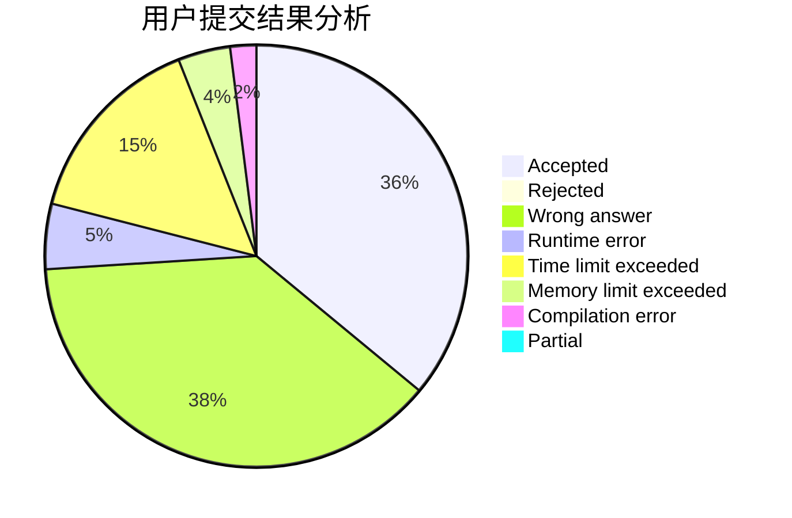
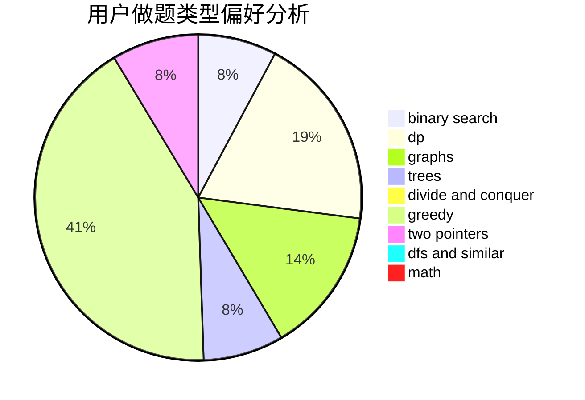

# 7ripleS

<!-- tabs:start -->

#### **用户提交结果分析**

#### **用户做题类型偏好分析**

<!-- tabs:end -->
# 推荐题目
[1408C](https://codeforces.com/contest/1408/problem/C)
[1324B](https://codeforces.com/contest/1324/problem/B)
[1060F](https://codeforces.com/contest/1060/problem/F)
[1437F](https://codeforces.com/contest/1437/problem/F)
[1257E](https://codeforces.com/contest/1257/problem/E)
[1285B](https://codeforces.com/contest/1285/problem/B)
[1272E](https://codeforces.com/contest/1272/problem/E)
[1436F](https://codeforces.com/contest/1436/problem/F)
[1106B](https://codeforces.com/contest/1106/problem/B)
[1148D](https://codeforces.com/contest/1148/problem/D)
