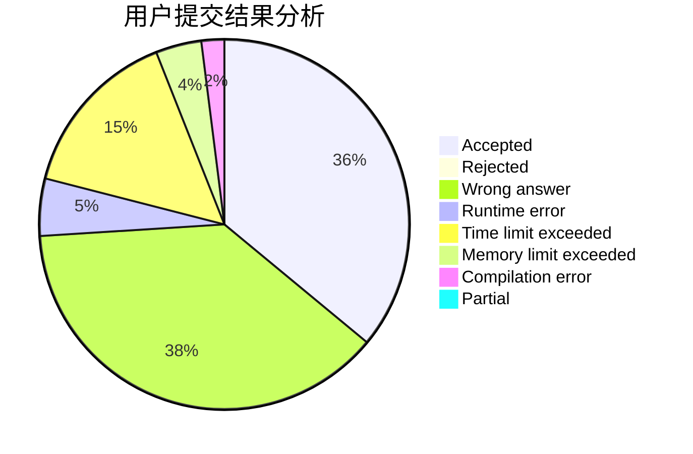
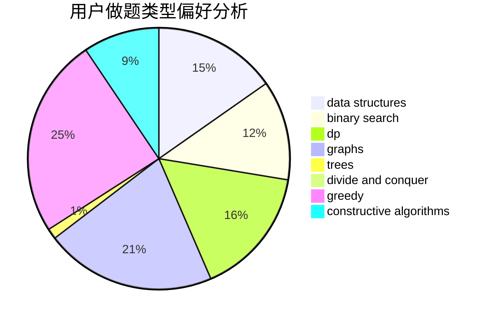
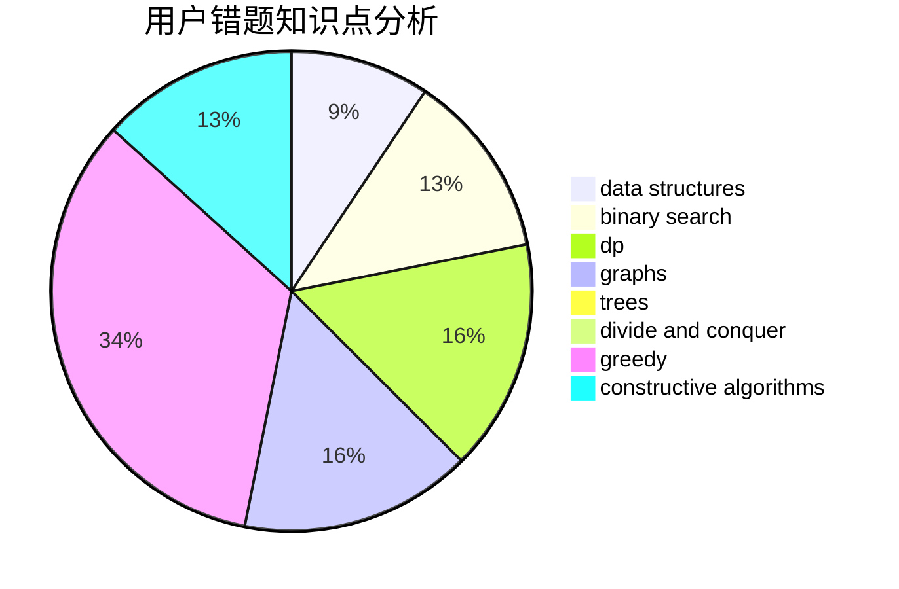

# 7ripleS

<!-- tabs:start -->

#### **用户提交结果分析**

#### **用户做题类型偏好分析**

#### **用户错题知识点分析**

<!-- tabs:end -->
# 推荐题目
[1399B](https://codeforces.com/contest/1399/problem/B)		greedy		  
[1314C](https://codeforces.com/contest/1314/problem/C)		dsu,graphs,sortings,trees		  
[1060C](https://codeforces.com/contest/1060/problem/C)		binary search,
                        implementation,
                        two pointers		  
[1428F](https://codeforces.com/contest/1428/problem/F)		binary search,
                        data structures,
                        divide and conquer,
                        dp,
                        two pointers		  
[1252D](https://codeforces.com/contest/1252/problem/D)		data structures,
                        dp,
                        strings,
                        trees		  
[1279A](https://codeforces.com/contest/1279/problem/A)		math		  
[1267B](https://codeforces.com/contest/1267/problem/B)		nan		  
[1427H](https://codeforces.com/contest/1427/problem/H)		binary search,
                        games,
                        geometry,
                        ternary search		  
[1105D](https://codeforces.com/contest/1105/problem/D)		dfs and similar,
                        graphs,
                        implementation,
                        shortest paths		  
[1146D](https://codeforces.com/contest/1146/problem/D)		dfs and similar,
                        math,
                        number theory		  
