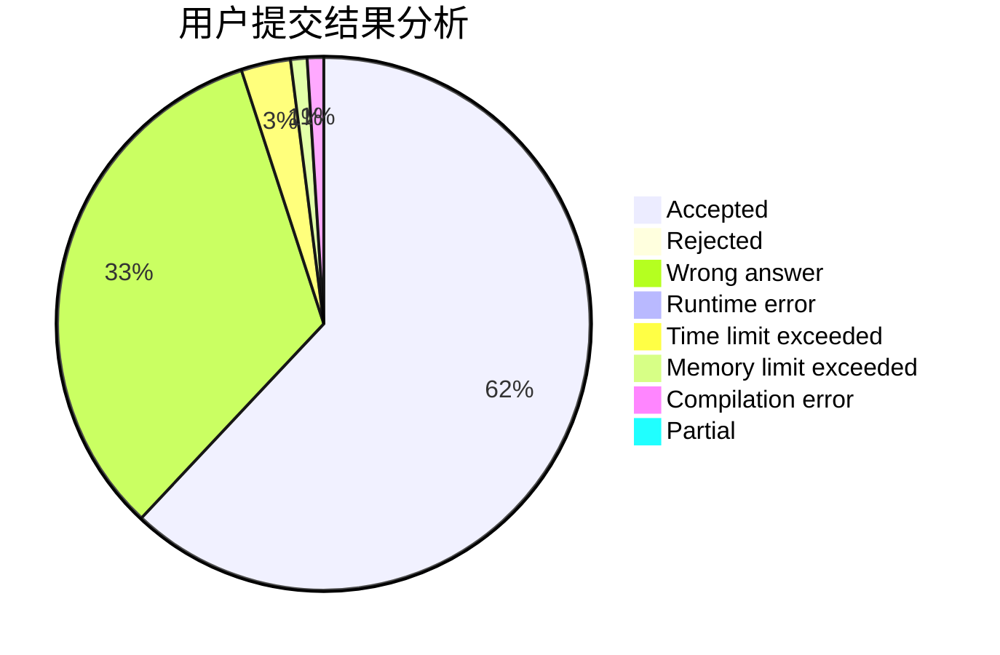
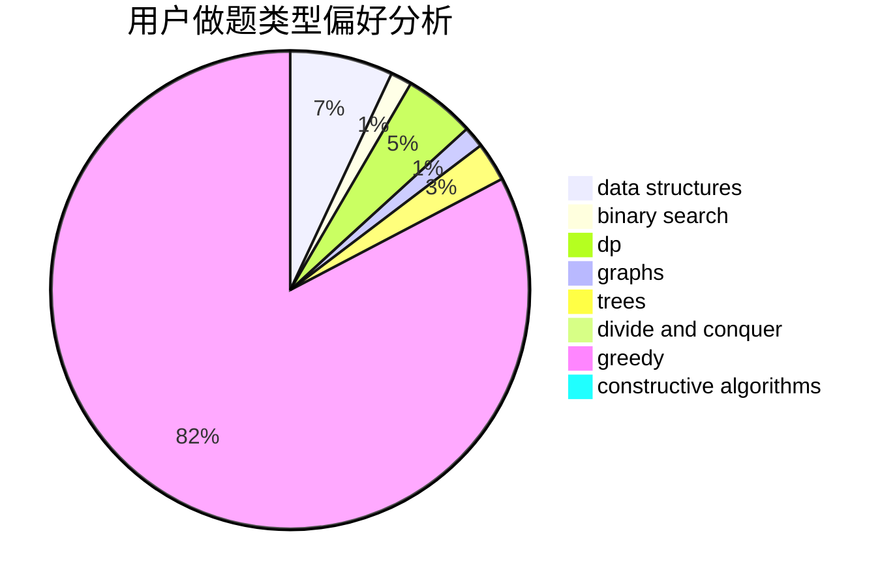
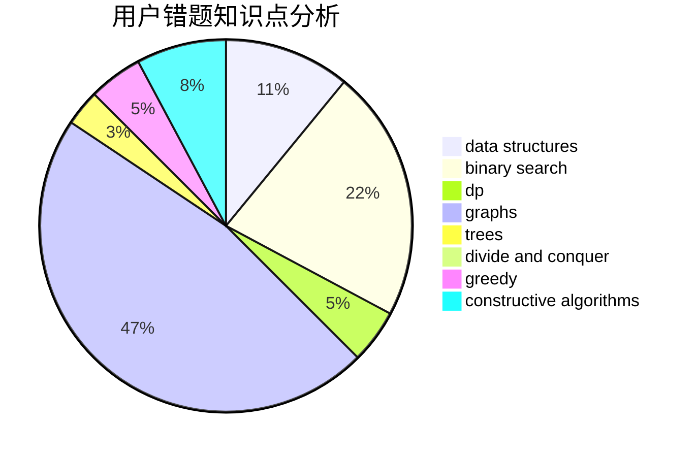

# MicroMaker

<!-- tabs:start -->

#### **用户提交结果分析**

#### **用户做题类型偏好分析**

#### **用户错题知识点分析**

<!-- tabs:end -->
# 推荐题目
[960B](https://codeforces.com/contest/960/problem/B)		data structures,
                        greedy,
                        sortings		  
[955C](https://codeforces.com/contest/955/problem/C)		binary search,
                        math,
                        number theory		  
[1139E](https://codeforces.com/contest/1139/problem/E)		flows,
                        graph matchings,
                        graphs		  
[1144D](https://codeforces.com/contest/1144/problem/D)		constructive algorithms,
                        greedy		  
[812E](https://codeforces.com/contest/812/problem/E)		games,
                        trees		  
[865A](https://codeforces.com/contest/865/problem/A)		constructive algorithms		  
[254D](https://codeforces.com/contest/254/problem/D)		brute force,
                        dfs and similar,
                        graphs,
                        implementation,
                        shortest paths		  
[596A](https://codeforces.com/contest/596/problem/A)		geometry,
                        implementation		  
[347A](https://codeforces.com/contest/347/problem/A)		constructive algorithms,
                        implementation,
                        sortings		  
[482C](https://codeforces.com/contest/482/problem/C)		bitmasks,
                        dp,
                        probabilities		  
