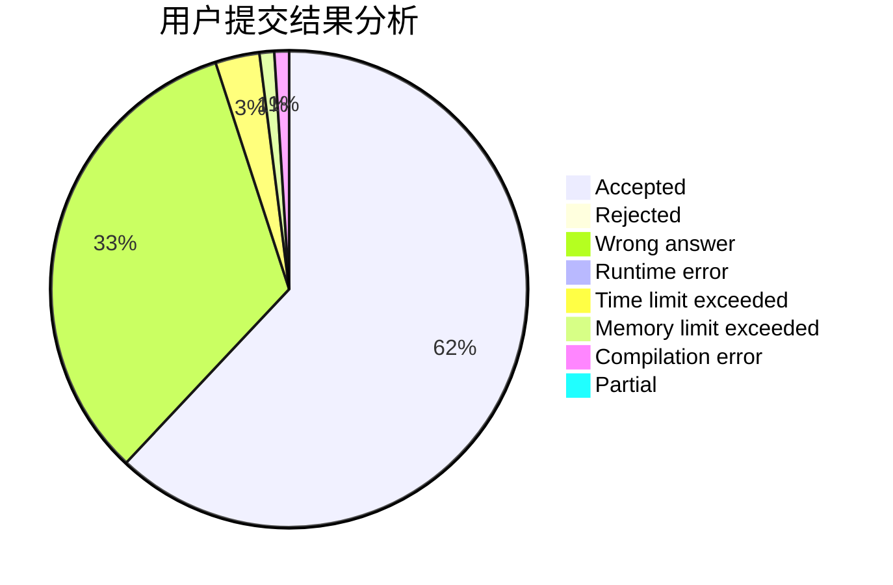
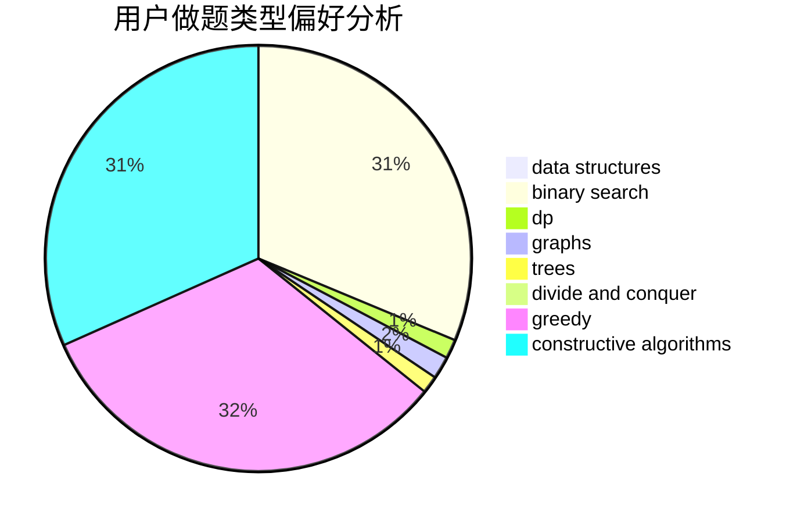
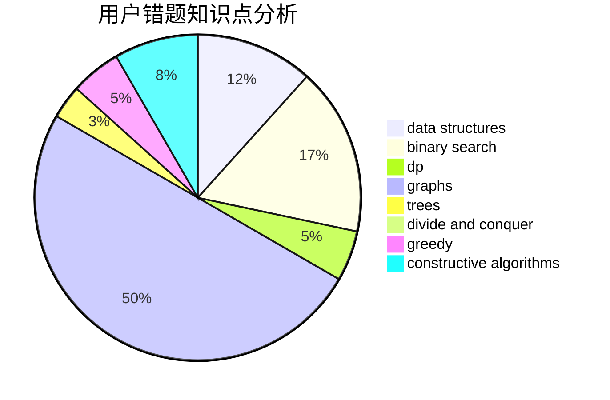

# MicroMaker

<!-- tabs:start -->

#### **用户提交结果分析**

#### **用户做题类型偏好分析**

#### **用户错题知识点分析**

<!-- tabs:end -->
# 推荐题目
[982A](https://codeforces.com/contest/982/problem/A)		brute force,
                        constructive algorithms		  
[977C](https://codeforces.com/contest/977/problem/C)		sortings		  
[11412](https://codeforces.com/contest/1141/problem/2)		dsu,graphs,sortings,trees		  
[1146E](https://codeforces.com/contest/1146/problem/E)		bitmasks,
                        data structures,
                        divide and conquer,
                        implementation		  
[831B](https://codeforces.com/contest/831/problem/B)		implementation,
                        strings		  
[884D](https://codeforces.com/contest/884/problem/D)		data structures,
                        greedy		  
[273D](https://codeforces.com/contest/273/problem/D)		dp		  
[613A](https://codeforces.com/contest/613/problem/A)		binary search,
                        geometry,
                        ternary search		  
[372C](https://codeforces.com/contest/372/problem/C)		data structures,
                        dp,
                        math		  
[501A](https://codeforces.com/contest/501/problem/A)		implementation		  
