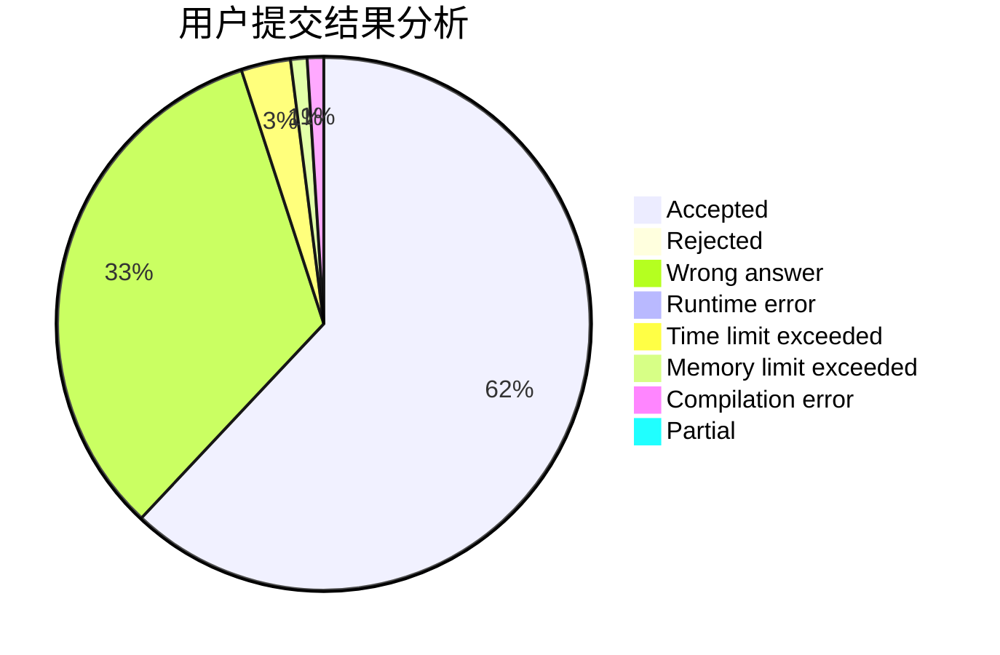
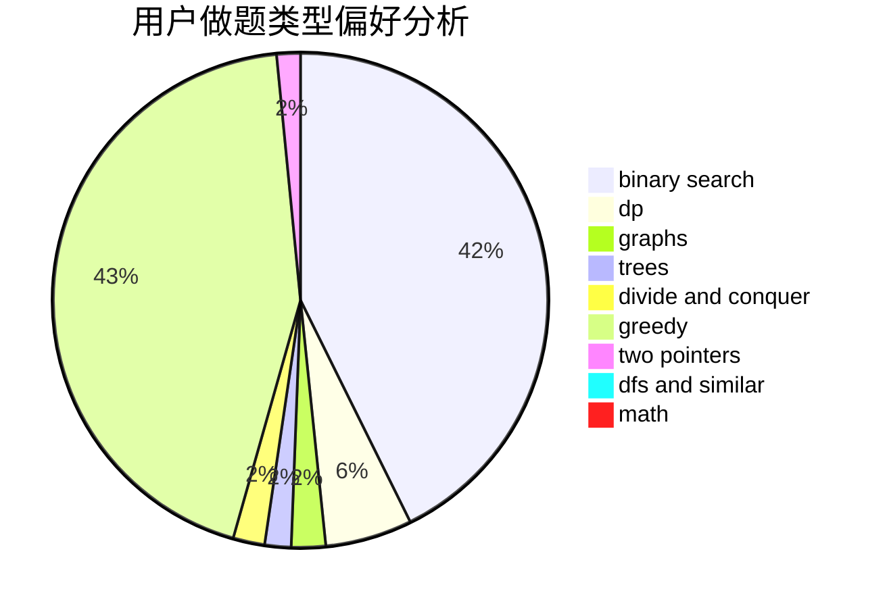

# MicroMaker

<!-- tabs:start -->

#### **用户提交结果分析**

#### **用户做题类型偏好分析**

<!-- tabs:end -->
# 推荐题目
[982A](https://codeforces.com/contest/982/problem/A)
[977C](https://codeforces.com/contest/977/problem/C)
[11412](https://codeforces.com/contest/1141/problem/2)
[1146E](https://codeforces.com/contest/1146/problem/E)
[831B](https://codeforces.com/contest/831/problem/B)
[884D](https://codeforces.com/contest/884/problem/D)
[273D](https://codeforces.com/contest/273/problem/D)
[613A](https://codeforces.com/contest/613/problem/A)
[372C](https://codeforces.com/contest/372/problem/C)
[501A](https://codeforces.com/contest/501/problem/A)
