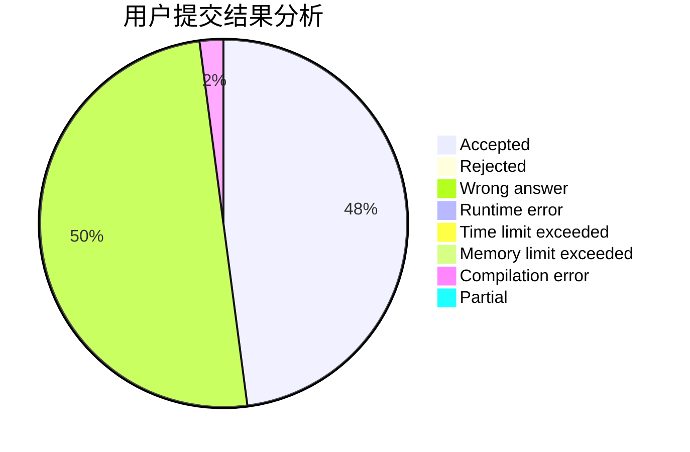
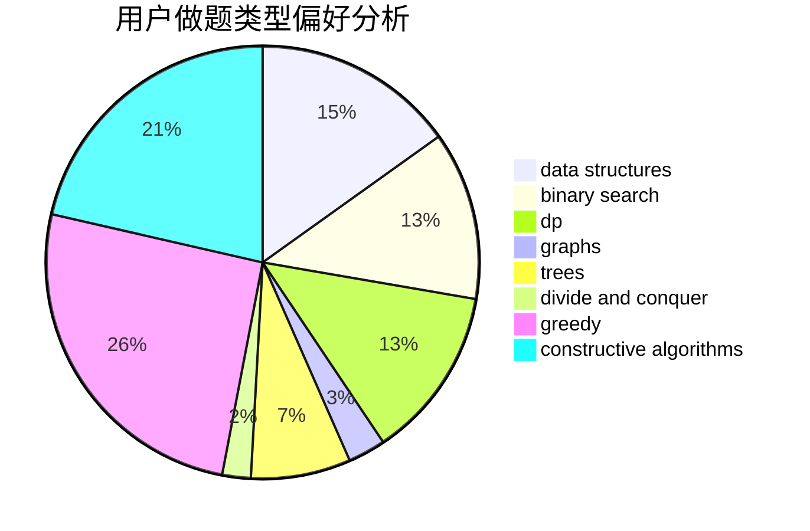
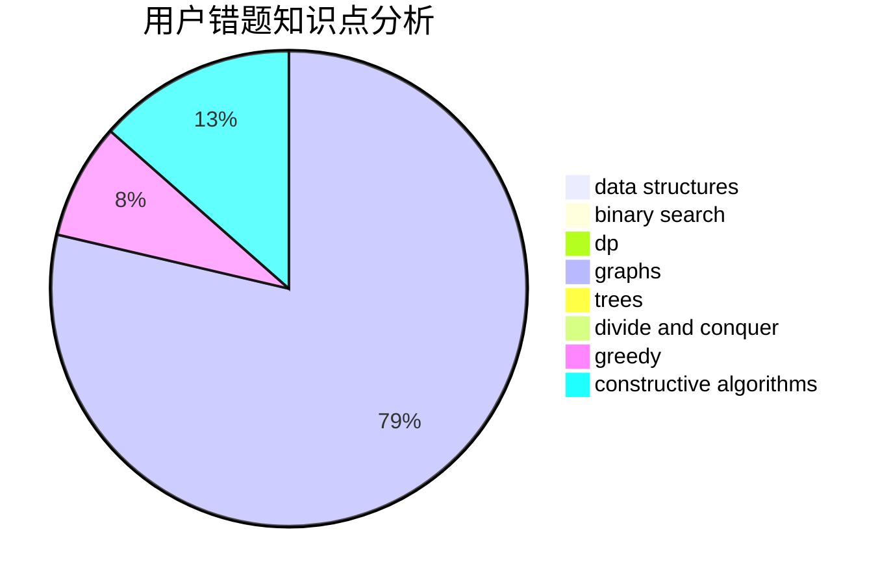

# MicroSoft_IE3.0
<!-- tabs:start -->
#### **用户提交结果分析**

#### **用户做题类型偏好分析**

#### **用户错题知识点分析**

<!-- tabs:end -->
# 推荐题目
[The Text Splitting](http://codeforces.com/problemset/problem/612/A)		brute force,
                        implementation,
                        strings		  
[Guess Your Way Out! II](http://codeforces.com/problemset/problem/558/D)		data structures,
                        implementation,
                        sortings		  
[Math Problem](https://codeforces.com/contest/1262/problem/A)		math		  
[Petya and Strings](http://codeforces.com/problemset/problem/112/A)		implementation,
                        strings		  
[Robot Rapping Results Report](http://codeforces.com/problemset/problem/645/D)		binary search,
                        dp,
                        graphs		  
[Middle of the Contest](http://codeforces.com/problemset/problem/1133/A)		implementation		  
[Weird journey](http://codeforces.com/problemset/problem/788/B)		combinatorics,
                        constructive algorithms,
                        dfs and similar,
                        dsu,
                        graphs		  
[A Good Contest](http://codeforces.com/problemset/problem/681/A)		implementation		  
[IQ test](http://codeforces.com/problemset/problem/25/A)		brute force		  
[Integer Game](http://codeforces.com/problemset/problem/1375/F)		constructive algorithms,
                        games,
                        interactive,
                        math		  
<!-- tabs:start -->
#### **data structures**
[The Text Splitting](http://codeforces.com/problemset/problem/558/D)		data structures,
                        implementation,
                        sortings		  
[Guess Your Way Out! II](http://codeforces.com/problemset/problem/1101/D)		data structures,
                        dfs and similar,
                        dp,
                        number theory,
                        trees		  
[Math Problem](http://codeforces.com/problemset/problem/1470/E)		binary search,
                        combinatorics,
                        data structures,
                        dp,
                        graphs,
                        implementation,
                        two pointers		  
[Petya and Strings](http://codeforces.com/problemset/problem/1381/A1)		constructive algorithms,
                        data structures,
                        strings		  
[Robot Rapping Results Report](http://codeforces.com/problemset/problem/193/D)		data structures		  
[Middle of the Contest](http://codeforces.com/problemset/problem/1492/C)		binary search,
                        data structures,
                        dp,
                        greedy,
                        two pointers		  
[Weird journey](http://codeforces.com/problemset/problem/1490/G)		binary search,
                        data structures,
                        math		  
[A Good Contest](http://codeforces.com/problemset/problem/1479/D)		binary search,
                        bitmasks,
                        brute force,
                        data structures,
                        probabilities,
                        trees		  
[IQ test](http://codeforces.com/problemset/problem/1497/A)		brute force,
                        data structures,
                        greedy,
                        sortings		  
[Integer Game](http://codeforces.com/problemset/problem/1491/C)		brute force,
                        data structures,
                        dp,
                        greedy,
                        implementation		  
#### **binary search**
[The Text Splitting](http://codeforces.com/problemset/problem/645/D)		binary search,
                        dp,
                        graphs		  
[Guess Your Way Out! II](http://codeforces.com/problemset/problem/258/C)		binary search,
                        combinatorics,
                        dp,
                        math		  
[Math Problem](http://codeforces.com/problemset/problem/785/C)		binary search,
                        math		  
[Petya and Strings](http://codeforces.com/problemset/problem/613/A)		binary search,
                        geometry,
                        ternary search		  
[Robot Rapping Results Report](http://codeforces.com/problemset/problem/1315/B)		binary search,
                        dp,
                        greedy,
                        strings		  
[Middle of the Contest](http://codeforces.com/problemset/problem/152/B)		binary search,
                        implementation		  
[Weird journey](http://codeforces.com/problemset/problem/1011/B)		binary search,
                        brute force,
                        implementation		  
[A Good Contest](http://codeforces.com/problemset/problem/1470/E)		binary search,
                        combinatorics,
                        data structures,
                        dp,
                        graphs,
                        implementation,
                        two pointers		  
[IQ test](http://codeforces.com/problemset/problem/1344/D)		binary search,
                        greedy,
                        math		  
[Integer Game](https://codeforces.com/contest/957/problem/C)		binary search,
                        greedy,
                        two pointers		  
#### **dp**
[The Text Splitting](http://codeforces.com/problemset/problem/645/D)		binary search,
                        dp,
                        graphs		  
[Guess Your Way Out! II](http://codeforces.com/problemset/problem/822/D)		brute force,
                        dp,
                        greedy,
                        math,
                        number theory		  
[Math Problem](http://codeforces.com/problemset/problem/258/C)		binary search,
                        combinatorics,
                        dp,
                        math		  
[Petya and Strings](http://codeforces.com/problemset/problem/1239/E)		dp,
                        implementation		  
[Robot Rapping Results Report](http://codeforces.com/problemset/problem/1315/B)		binary search,
                        dp,
                        greedy,
                        strings		  
[Middle of the Contest](https://codeforces.com/contest/816/problem/E)		brute force,
                        dp,
                        trees		  
[Weird journey](http://codeforces.com/problemset/problem/868/D)		bitmasks,
                        brute force,
                        dp,
                        implementation,
                        strings		  
[A Good Contest](http://codeforces.com/problemset/problem/1101/D)		data structures,
                        dfs and similar,
                        dp,
                        number theory,
                        trees		  
[IQ test](http://codeforces.com/problemset/problem/1203/F2)		dp,
                        greedy		  
[Integer Game](http://codeforces.com/problemset/problem/1470/E)		binary search,
                        combinatorics,
                        data structures,
                        dp,
                        graphs,
                        implementation,
                        two pointers		  
#### **graph**
[The Text Splitting](http://codeforces.com/problemset/problem/645/D)		binary search,
                        dp,
                        graphs		  
[Guess Your Way Out! II](http://codeforces.com/problemset/problem/788/B)		combinatorics,
                        constructive algorithms,
                        dfs and similar,
                        dsu,
                        graphs		  
[Math Problem](http://codeforces.com/problemset/problem/1213/G)		divide and conquer,
                        dsu,
                        graphs,
                        sortings,
                        trees		  
[Petya and Strings](http://codeforces.com/problemset/problem/1470/E)		binary search,
                        combinatorics,
                        data structures,
                        dp,
                        graphs,
                        implementation,
                        two pointers		  
[Robot Rapping Results Report](http://codeforces.com/problemset/problem/1427/G)		flows,
                        graphs		  
[Middle of the Contest](http://codeforces.com/problemset/problem/160/D)		dfs and similar,
                        dsu,
                        graphs,
                        sortings		  
[Weird journey](http://codeforces.com/problemset/problem/1487/C)		brute force,
                        constructive algorithms,
                        dfs and similar,
                        graphs,
                        greedy,
                        implementation,
                        math		  
[A Good Contest](http://codeforces.com/problemset/problem/1437/C)		dp,
                        flows,
                        graph matchings,
                        greedy,
                        math,
                        sortings		  
[IQ test](http://codeforces.com/problemset/problem/1470/D)		constructive algorithms,
                        dfs and similar,
                        graph matchings,
                        graphs,
                        greedy		  
[Integer Game](http://codeforces.com/problemset/problem/1476/C)		dp,
                        graphs,
                        greedy		  
#### **trees**
[The Text Splitting](https://codeforces.com/contest/816/problem/E)		brute force,
                        dp,
                        trees		  
[Guess Your Way Out! II](http://codeforces.com/problemset/problem/960/D)		brute force,
                        implementation,
                        trees		  
[Math Problem](http://codeforces.com/problemset/problem/1101/D)		data structures,
                        dfs and similar,
                        dp,
                        number theory,
                        trees		  
[Petya and Strings](http://codeforces.com/problemset/problem/1213/G)		divide and conquer,
                        dsu,
                        graphs,
                        sortings,
                        trees		  
[Robot Rapping Results Report](http://codeforces.com/problemset/problem/1336/A)		dfs and similar,
                        dp,
                        greedy,
                        sortings,
                        trees		  
[Middle of the Contest](http://codeforces.com/problemset/problem/1479/D)		binary search,
                        bitmasks,
                        brute force,
                        data structures,
                        probabilities,
                        trees		  
[Weird journey](http://codeforces.com/problemset/problem/1511/C)		brute force,
                        data structures,
                        implementation,
                        trees		  
[A Good Contest](http://codeforces.com/problemset/problem/1499/F)		combinatorics,
                        dfs and similar,
                        dp,
                        trees		  
[IQ test](http://codeforces.com/problemset/problem/1491/E)		brute force,
                        dfs and similar,
                        divide and conquer,
                        number theory,
                        trees		  
[Integer Game](http://codeforces.com/problemset/problem/1466/D)		data structures,
                        greedy,
                        sortings,
                        trees		  
#### **divide and conquer**
[The Text Splitting](http://codeforces.com/problemset/problem/1213/G)		divide and conquer,
                        dsu,
                        graphs,
                        sortings,
                        trees		  
[Guess Your Way Out! II](http://codeforces.com/problemset/problem/1461/D)		binary search,
                        brute force,
                        data structures,
                        divide and conquer,
                        implementation,
                        sortings		  
[Math Problem](http://codeforces.com/problemset/problem/1466/G)		combinatorics,
                        divide and conquer,
                        hashing,
                        math,
                        string suffix structures,
                        strings		  
[Petya and Strings](http://codeforces.com/problemset/problem/1490/D)		dfs and similar,
                        divide and conquer,
                        implementation		  
[Robot Rapping Results Report](https://codeforces.com/contest/1483/problem/C)		data structures,
                        divide and conquer,
                        dp		  
[Middle of the Contest](http://codeforces.com/problemset/problem/1491/E)		brute force,
                        dfs and similar,
                        divide and conquer,
                        number theory,
                        trees		  
[Weird journey](http://codeforces.com/problemset/problem/1303/G)		data structures,
                        divide and conquer,
                        geometry,
                        trees		  
[A Good Contest](http://codeforces.com/problemset/problem/1494/D)		constructive algorithms,
                        data structures,
                        dfs and similar,
                        divide and conquer,
                        dsu,
                        greedy,
                        sortings,
                        trees		  
[IQ test](http://codeforces.com/problemset/problem/1482/E)		data structures,
                        divide and conquer,
                        dp		  
[Integer Game](http://codeforces.com/problemset/problem/566/C)		dfs and similar,
                        divide and conquer,
                        trees		  
#### **greedy**
[The Text Splitting](http://codeforces.com/problemset/problem/822/D)		brute force,
                        dp,
                        greedy,
                        math,
                        number theory		  
[Guess Your Way Out! II](https://codeforces.com/contest/1086/problem/C)		greedy,
                        implementation,
                        strings		  
[Math Problem](http://codeforces.com/problemset/problem/1315/B)		binary search,
                        dp,
                        greedy,
                        strings		  
[Petya and Strings](http://codeforces.com/problemset/problem/584/E)		constructive algorithms,
                        greedy,
                        math		  
[Robot Rapping Results Report](http://codeforces.com/problemset/problem/550/E)		constructive algorithms,
                        greedy,
                        implementation,
                        math		  
[Middle of the Contest](http://codeforces.com/problemset/problem/1417/B)		greedy,
                        math,
                        sortings		  
[Weird journey](http://codeforces.com/problemset/problem/1203/F2)		dp,
                        greedy		  
[A Good Contest](http://codeforces.com/problemset/problem/960/C)		bitmasks,
                        constructive algorithms,
                        greedy,
                        implementation		  
[IQ test](http://codeforces.com/problemset/problem/765/B)		greedy,
                        implementation,
                        strings		  
[Integer Game](http://codeforces.com/problemset/problem/1336/A)		dfs and similar,
                        dp,
                        greedy,
                        sortings,
                        trees		  
#### **constructive algorithms**
[The Text Splitting](http://codeforces.com/problemset/problem/788/B)		combinatorics,
                        constructive algorithms,
                        dfs and similar,
                        dsu,
                        graphs		  
[Guess Your Way Out! II](http://codeforces.com/problemset/problem/1375/F)		constructive algorithms,
                        games,
                        interactive,
                        math		  
[Math Problem](http://codeforces.com/problemset/problem/1244/F)		constructive algorithms,
                        implementation		  
[Petya and Strings](http://codeforces.com/problemset/problem/584/E)		constructive algorithms,
                        greedy,
                        math		  
[Robot Rapping Results Report](http://codeforces.com/problemset/problem/550/E)		constructive algorithms,
                        greedy,
                        implementation,
                        math		  
[Middle of the Contest](http://codeforces.com/problemset/problem/960/C)		bitmasks,
                        constructive algorithms,
                        greedy,
                        implementation		  
[Weird journey](http://codeforces.com/problemset/problem/1381/A1)		constructive algorithms,
                        data structures,
                        strings		  
[A Good Contest](http://codeforces.com/problemset/problem/1136/B)		constructive algorithms,
                        math		  
[IQ test](http://codeforces.com/problemset/problem/1499/A)		combinatorics,
                        constructive algorithms,
                        math		  
[Integer Game](http://codeforces.com/problemset/problem/1493/A)		constructive algorithms,
                        greedy		  
#### **sortings**
[The Text Splitting](http://codeforces.com/problemset/problem/558/D)		data structures,
                        implementation,
                        sortings		  
[Guess Your Way Out! II](http://codeforces.com/problemset/problem/1417/B)		greedy,
                        math,
                        sortings		  
[Math Problem](http://codeforces.com/problemset/problem/1213/G)		divide and conquer,
                        dsu,
                        graphs,
                        sortings,
                        trees		  
[Petya and Strings](http://codeforces.com/problemset/problem/1336/A)		dfs and similar,
                        dp,
                        greedy,
                        sortings,
                        trees		  
[Robot Rapping Results Report](http://codeforces.com/problemset/problem/160/D)		dfs and similar,
                        dsu,
                        graphs,
                        sortings		  
[Middle of the Contest](http://codeforces.com/problemset/problem/1184/B1)		binary search,
                        sortings		  
[Weird journey](https://codeforces.com/contest/1496/problem/C)		geometry,
                        greedy,
                        math,
                        sortings		  
[A Good Contest](http://codeforces.com/problemset/problem/1495/A)		geometry,
                        greedy,
                        math,
                        sortings		  
[IQ test](http://codeforces.com/problemset/problem/1497/A)		brute force,
                        data structures,
                        greedy,
                        sortings		  
[Integer Game](http://codeforces.com/problemset/problem/1427/A)		math,
                        sortings		  
<!-- tabs:end -->
