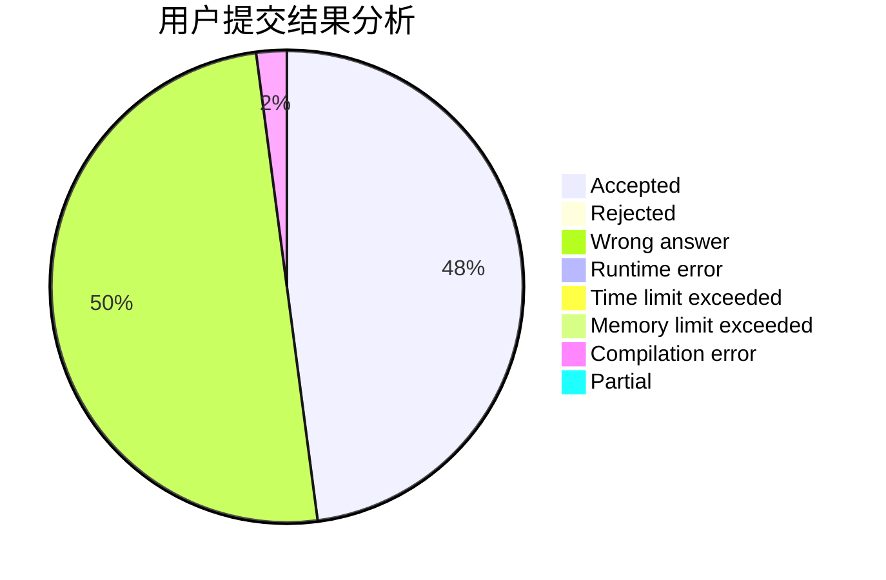
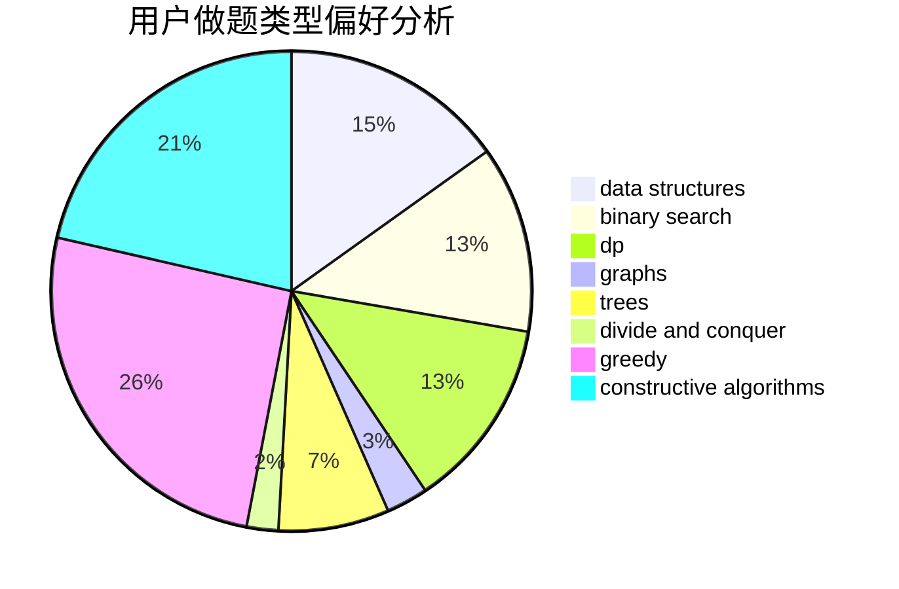
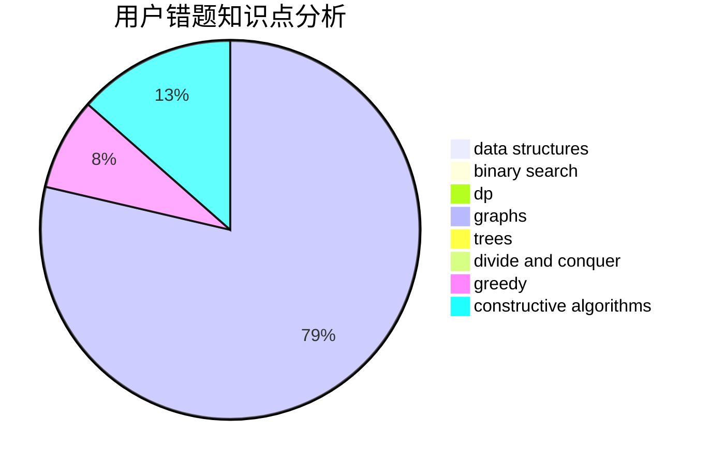

# MicroSoft_IE3.0

<!-- tabs:start -->

#### **用户提交结果分析**

#### **用户做题类型偏好分析**

#### **用户错题知识点分析**

<!-- tabs:end -->
# 推荐题目
[1375F](https://codeforces.com/contest/1375/problem/F)		constructive algorithms,
                        games,
                        interactive,
                        math		  
[1262A](https://codeforces.com/contest/1262/problem/A)		dsu,graphs,sortings,trees		  
[558D](https://codeforces.com/contest/558/problem/D)		data structures,
                        implementation,
                        sortings		  
[612A](https://codeforces.com/contest/612/problem/A)		brute force,
                        implementation,
                        strings		  
[1101D](https://codeforces.com/contest/1101/problem/D)		data structures,
                        dfs and similar,
                        dp,
                        number theory,
                        trees		  
[957C](https://codeforces.com/contest/957/problem/C)		dsu,graphs,sortings,trees		  
[822D](https://codeforces.com/contest/822/problem/D)		brute force,
                        dp,
                        greedy,
                        math,
                        number theory		  
[112A](https://codeforces.com/contest/112/problem/A)		implementation,
                        strings		  
[584E](https://codeforces.com/contest/584/problem/E)		constructive algorithms,
                        greedy,
                        math		  
[1239E](https://codeforces.com/contest/1239/problem/E)		dp,
                        implementation		  
