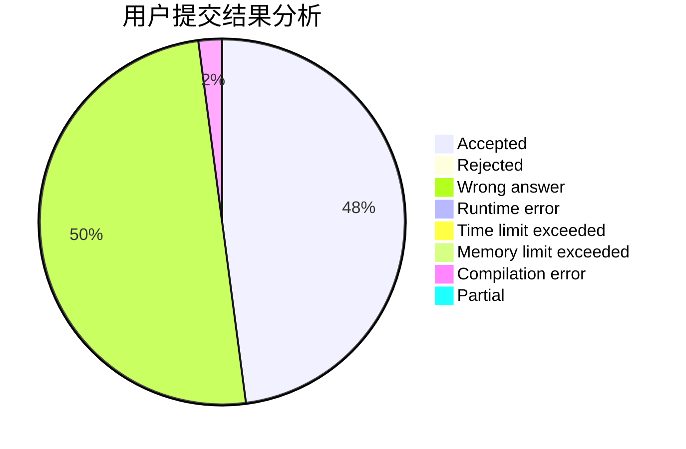
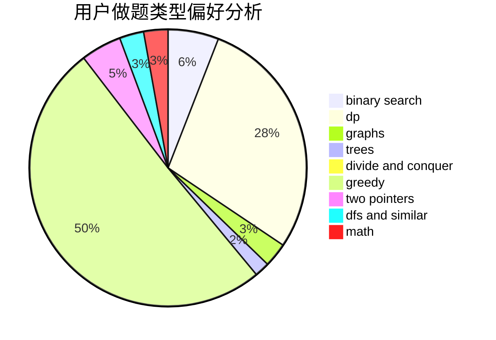

# MicroSoft_IE3.0

<!-- tabs:start -->

#### **用户提交结果分析**

#### **用户做题类型偏好分析**

<!-- tabs:end -->
# 推荐题目
[1384E](https://codeforces.com/contest/1384/problem/E)
[1267I](https://codeforces.com/contest/1267/problem/I)
[581B](https://codeforces.com/contest/581/problem/B)
[631B](https://codeforces.com/contest/631/problem/B)
[1101G](https://codeforces.com/contest/1101/problem/G)
[978F](https://codeforces.com/contest/978/problem/F)
[842C](https://codeforces.com/contest/842/problem/C)
[1131F](https://codeforces.com/contest/1131/problem/F)
[605B](https://codeforces.com/contest/605/problem/B)
[1244G](https://codeforces.com/contest/1244/problem/G)
