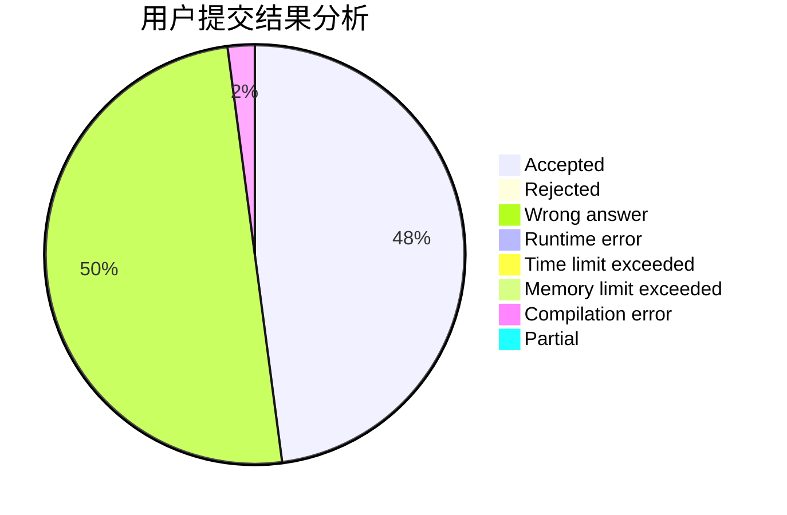
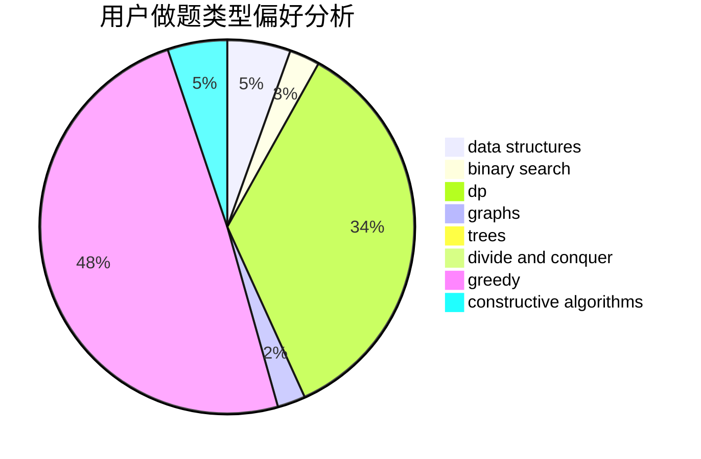

# MicroSoft_IE3.0

<!-- tabs:start -->

#### **用户提交结果分析**

#### **用户做题类型偏好分析**

#### **用户错题知识点分析**

<!-- tabs:end -->
# 推荐题目
[1384E](https://codeforces.com/contest/1384/problem/E)		dsu,graphs,sortings,trees		  
[1267I](https://codeforces.com/contest/1267/problem/I)		brute force,
                        constructive algorithms,
                        implementation,
                        interactive,
                        sortings		  
[581B](https://codeforces.com/contest/581/problem/B)		implementation,
                        math		  
[631B](https://codeforces.com/contest/631/problem/B)		constructive algorithms,
                        implementation		  
[1101G](https://codeforces.com/contest/1101/problem/G)		math,
                        matrices		  
[978F](https://codeforces.com/contest/978/problem/F)		binary search,
                        data structures,
                        implementation		  
[842C](https://codeforces.com/contest/842/problem/C)		dfs and similar,
                        graphs,
                        math,
                        number theory,
                        trees		  
[1131F](https://codeforces.com/contest/1131/problem/F)		constructive algorithms,
                        dsu		  
[605B](https://codeforces.com/contest/605/problem/B)		constructive algorithms,
                        data structures,
                        graphs		  
[1244G](https://codeforces.com/contest/1244/problem/G)		constructive algorithms,
                        greedy,
                        math		  
