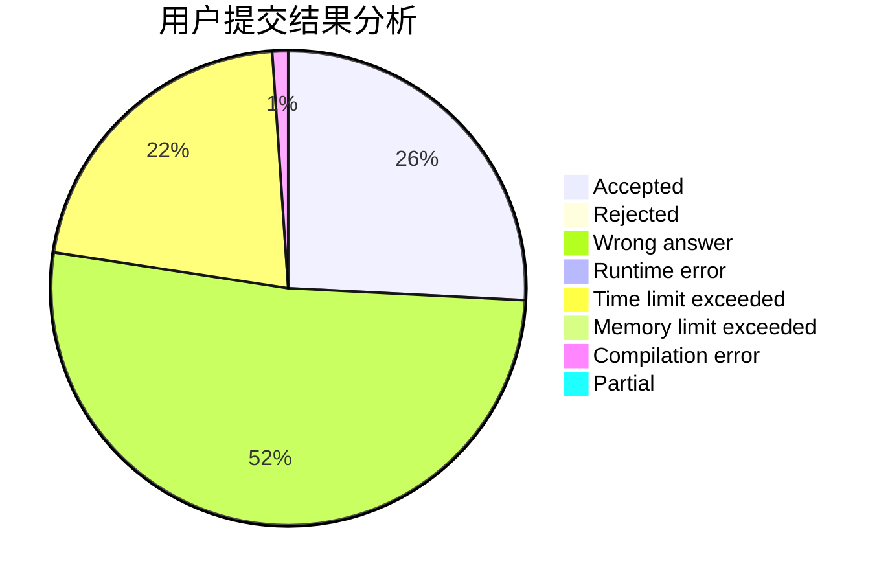
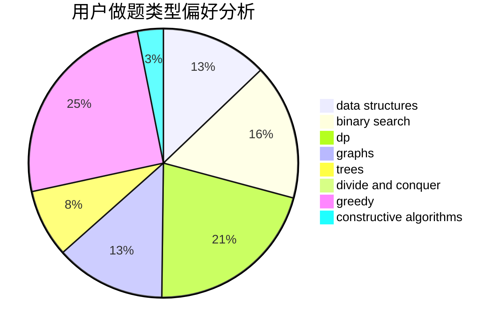
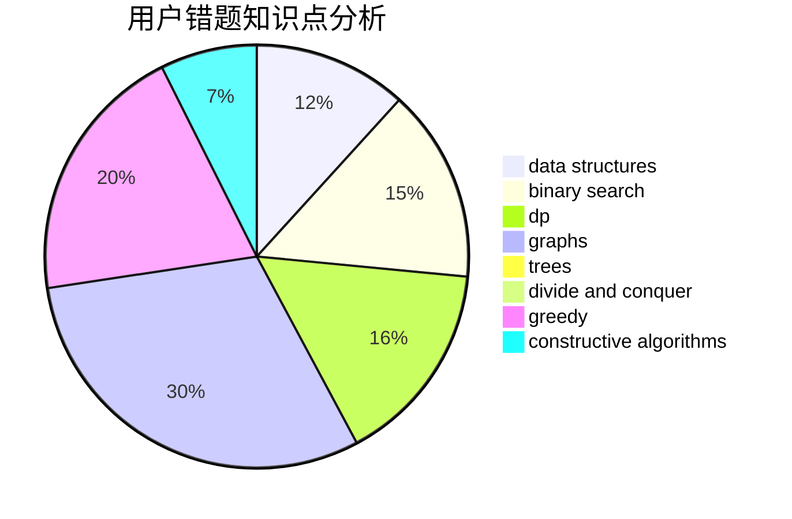

# MikuSakula

<!-- tabs:start -->

#### **用户提交结果分析**

#### **用户做题类型偏好分析**

#### **用户错题知识点分析**

<!-- tabs:end -->
# 推荐题目
[1316A](https://codeforces.com/contest/1316/problem/A)		implementation		  
[1118F2](https://codeforces.com/contest/1118F/problem/2)		combinatorics,
                        dfs and similar,
                        dp,
                        trees		  
[924C](https://codeforces.com/contest/924/problem/C)		data structures,
                        dp,
                        greedy		  
[827B](https://codeforces.com/contest/827/problem/B)		constructive algorithms,
                        greedy,
                        implementation,
                        trees		  
[893C](https://codeforces.com/contest/893/problem/C)		dfs and similar,
                        graphs,
                        greedy		  
[1512A](https://codeforces.com/contest/1512/problem/A)		brute force,
                        implementation		  
[1120A](https://codeforces.com/contest/1120/problem/A)		greedy,
                        implementation,
                        two pointers		  
[839A](https://codeforces.com/contest/839/problem/A)		implementation		  
[1340E](https://codeforces.com/contest/1340/problem/E)		graphs,
                        interactive,
                        probabilities		  
[1058B](https://codeforces.com/contest/1058/problem/B)		dsu,graphs,sortings,trees		  
