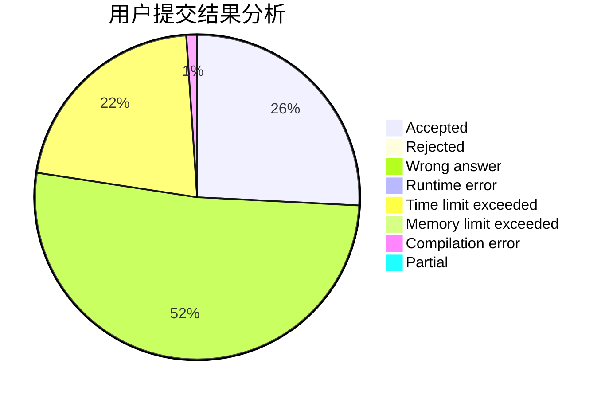
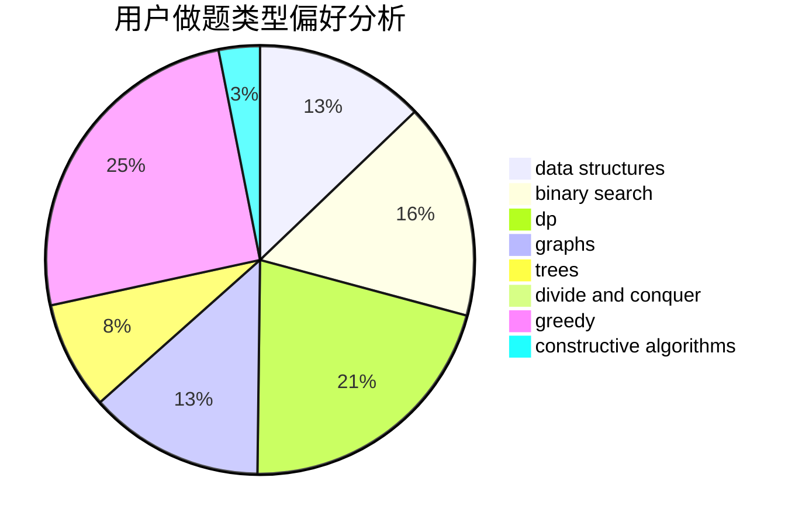
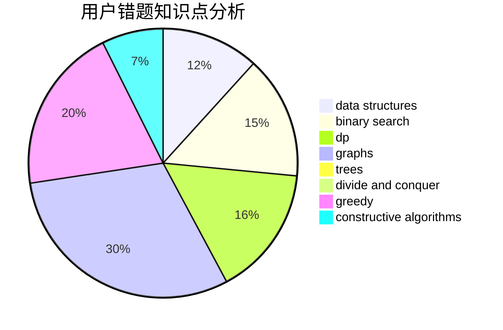

# MikuSakula
<!-- tabs:start -->
#### **用户提交结果分析**

#### **用户做题类型偏好分析**

#### **用户错题知识点分析**

<!-- tabs:end -->
# 推荐题目
[Spy Detected!](http://codeforces.com/problemset/problem/1512/A)		brute force,
                        implementation		  
[Arya and Bran](http://codeforces.com/problemset/problem/839/A)		implementation		  
[Alternating Tree](http://codeforces.com/problemset/problem/960/E)		combinatorics,
                        dfs and similar,
                        divide and conquer,
                        dp,
                        probabilities,
                        trees		  
[High Load](http://codeforces.com/problemset/problem/827/B)		constructive algorithms,
                        greedy,
                        implementation,
                        trees		  
[Almost Permutation](http://codeforces.com/problemset/problem/863/F)		flows		  
[Diana and Liana](http://codeforces.com/problemset/problem/1120/A)		greedy,
                        implementation,
                        two pointers		  
[Nastya and Bees](http://codeforces.com/problemset/problem/1340/E)		graphs,
                        interactive,
                        probabilities		  
[Green and Black Tea](http://codeforces.com/problemset/problem/746/D)		constructive algorithms,
                        greedy,
                        math		  
[Breadboard Capacity (easy version)](http://codeforces.com/problemset/problem/1368/H1)		dp,
                        flows,
                        greedy		  
[Vasya and Maximum Matching](http://codeforces.com/problemset/problem/1032/F)		dp,
                        trees		  
<!-- tabs:start -->
#### **data structures**
[Spy Detected!](http://codeforces.com/problemset/problem/895/E)		data structures,
                        probabilities		  
[Arya and Bran](http://codeforces.com/problemset/problem/924/C)		data structures,
                        dp,
                        greedy		  
[Alternating Tree](http://codeforces.com/problemset/problem/1010/E)		data structures		  
[High Load](http://codeforces.com/problemset/problem/1420/C2)		data structures,
                        divide and conquer,
                        dp,
                        greedy,
                        implementation		  
[Almost Permutation](http://codeforces.com/problemset/problem/526/F)		data structures,
                        divide and conquer		  
[Diana and Liana](http://codeforces.com/problemset/problem/1492/C)		binary search,
                        data structures,
                        dp,
                        greedy,
                        two pointers		  
[Nastya and Bees](http://codeforces.com/problemset/problem/1490/G)		binary search,
                        data structures,
                        math		  
[Green and Black Tea](http://codeforces.com/problemset/problem/1479/D)		binary search,
                        bitmasks,
                        brute force,
                        data structures,
                        probabilities,
                        trees		  
[Breadboard Capacity (easy version)](http://codeforces.com/problemset/problem/1497/A)		brute force,
                        data structures,
                        greedy,
                        sortings		  
[Vasya and Maximum Matching](http://codeforces.com/problemset/problem/1491/C)		brute force,
                        data structures,
                        dp,
                        greedy,
                        implementation		  
#### **binary search**
[Spy Detected!](http://codeforces.com/problemset/problem/360/B)		binary search,
                        dp		  
[Arya and Bran](http://codeforces.com/problemset/problem/1279/B)		binary search,
                        brute force,
                        implementation		  
[Alternating Tree](http://codeforces.com/problemset/problem/1360/H)		binary search,
                        bitmasks,
                        brute force,
                        constructive algorithms		  
[High Load](http://codeforces.com/problemset/problem/1077/D)		binary search,
                        sortings		  
[Almost Permutation](http://codeforces.com/problemset/problem/1129/E)		binary search,
                        interactive,
                        trees		  
[Diana and Liana](http://codeforces.com/problemset/problem/1492/C)		binary search,
                        data structures,
                        dp,
                        greedy,
                        two pointers		  
[Nastya and Bees](http://codeforces.com/problemset/problem/1463/D)		binary search,
                        constructive algorithms,
                        greedy,
                        two pointers		  
[Green and Black Tea](http://codeforces.com/problemset/problem/1490/G)		binary search,
                        data structures,
                        math		  
[Breadboard Capacity (easy version)](http://codeforces.com/problemset/problem/1479/D)		binary search,
                        bitmasks,
                        brute force,
                        data structures,
                        probabilities,
                        trees		  
[Vasya and Maximum Matching](http://codeforces.com/problemset/problem/1436/E)		binary search,
                        data structures,
                        two pointers		  
#### **dp**
[Spy Detected!](http://codeforces.com/problemset/problem/960/E)		combinatorics,
                        dfs and similar,
                        divide and conquer,
                        dp,
                        probabilities,
                        trees		  
[Arya and Bran](http://codeforces.com/problemset/problem/1368/H1)		dp,
                        flows,
                        greedy		  
[Alternating Tree](http://codeforces.com/problemset/problem/1032/F)		dp,
                        trees		  
[High Load](http://codeforces.com/problemset/problem/924/C)		data structures,
                        dp,
                        greedy		  
[Almost Permutation](http://codeforces.com/problemset/problem/360/B)		binary search,
                        dp		  
[Diana and Liana](http://codeforces.com/problemset/problem/1118/F2)		combinatorics,
                        dfs and similar,
                        dp,
                        trees		  
[Nastya and Bees](http://codeforces.com/problemset/problem/1420/C2)		data structures,
                        divide and conquer,
                        dp,
                        greedy,
                        implementation		  
[Green and Black Tea](http://codeforces.com/problemset/problem/1097/D)		dp,
                        math,
                        number theory,
                        probabilities		  
[Breadboard Capacity (easy version)](http://codeforces.com/problemset/problem/1492/C)		binary search,
                        data structures,
                        dp,
                        greedy,
                        two pointers		  
[Vasya and Maximum Matching](https://codeforces.com/contest/1457/problem/C)		brute force,
                        dp,
                        implementation		  
#### **graph**
[Spy Detected!](http://codeforces.com/problemset/problem/1340/E)		graphs,
                        interactive,
                        probabilities		  
[Arya and Bran](http://codeforces.com/problemset/problem/819/E)		constructive algorithms,
                        graphs		  
[Alternating Tree](http://codeforces.com/problemset/problem/893/C)		dfs and similar,
                        graphs,
                        greedy		  
[High Load](http://codeforces.com/problemset/problem/1487/C)		brute force,
                        constructive algorithms,
                        dfs and similar,
                        graphs,
                        greedy,
                        implementation,
                        math		  
[Almost Permutation](http://codeforces.com/problemset/problem/1437/C)		dp,
                        flows,
                        graph matchings,
                        greedy,
                        math,
                        sortings		  
[Diana and Liana](http://codeforces.com/problemset/problem/1470/D)		constructive algorithms,
                        dfs and similar,
                        graph matchings,
                        graphs,
                        greedy		  
[Nastya and Bees](http://codeforces.com/problemset/problem/1476/C)		dp,
                        graphs,
                        greedy		  
[Green and Black Tea](http://codeforces.com/problemset/problem/1304/D)		constructive algorithms,
                        graphs,
                        greedy,
                        two pointers		  
[Breadboard Capacity (easy version)](http://codeforces.com/problemset/problem/1475/C)		combinatorics,
                        graphs,
                        math		  
[Vasya and Maximum Matching](http://codeforces.com/problemset/problem/553/E)		dp,
                        fft,
                        graphs,
                        math,
                        probabilities		  
#### **trees**
[Spy Detected!](http://codeforces.com/problemset/problem/960/E)		combinatorics,
                        dfs and similar,
                        divide and conquer,
                        dp,
                        probabilities,
                        trees		  
[Arya and Bran](http://codeforces.com/problemset/problem/827/B)		constructive algorithms,
                        greedy,
                        implementation,
                        trees		  
[Alternating Tree](http://codeforces.com/problemset/problem/1032/F)		dp,
                        trees		  
[High Load](http://codeforces.com/problemset/problem/1118/F2)		combinatorics,
                        dfs and similar,
                        dp,
                        trees		  
[Almost Permutation](http://codeforces.com/problemset/problem/1129/E)		binary search,
                        interactive,
                        trees		  
[Diana and Liana](http://codeforces.com/problemset/problem/1479/D)		binary search,
                        bitmasks,
                        brute force,
                        data structures,
                        probabilities,
                        trees		  
[Nastya and Bees](http://codeforces.com/problemset/problem/1511/C)		brute force,
                        data structures,
                        implementation,
                        trees		  
[Green and Black Tea](http://codeforces.com/problemset/problem/1499/F)		combinatorics,
                        dfs and similar,
                        dp,
                        trees		  
[Breadboard Capacity (easy version)](http://codeforces.com/problemset/problem/1491/E)		brute force,
                        dfs and similar,
                        divide and conquer,
                        number theory,
                        trees		  
[Vasya and Maximum Matching](http://codeforces.com/problemset/problem/1466/D)		data structures,
                        greedy,
                        sortings,
                        trees		  
#### **divide and conquer**
[Spy Detected!](http://codeforces.com/problemset/problem/960/E)		combinatorics,
                        dfs and similar,
                        divide and conquer,
                        dp,
                        probabilities,
                        trees		  
[Arya and Bran](http://codeforces.com/problemset/problem/1420/C2)		data structures,
                        divide and conquer,
                        dp,
                        greedy,
                        implementation		  
[Alternating Tree](http://codeforces.com/problemset/problem/526/F)		data structures,
                        divide and conquer		  
[High Load](http://codeforces.com/problemset/problem/1461/D)		binary search,
                        brute force,
                        data structures,
                        divide and conquer,
                        implementation,
                        sortings		  
[Almost Permutation](http://codeforces.com/problemset/problem/1466/G)		combinatorics,
                        divide and conquer,
                        hashing,
                        math,
                        string suffix structures,
                        strings		  
[Diana and Liana](http://codeforces.com/problemset/problem/1490/D)		dfs and similar,
                        divide and conquer,
                        implementation		  
[Nastya and Bees](https://codeforces.com/contest/1483/problem/C)		data structures,
                        divide and conquer,
                        dp		  
[Green and Black Tea](http://codeforces.com/problemset/problem/1491/E)		brute force,
                        dfs and similar,
                        divide and conquer,
                        number theory,
                        trees		  
[Breadboard Capacity (easy version)](http://codeforces.com/problemset/problem/1303/G)		data structures,
                        divide and conquer,
                        geometry,
                        trees		  
[Vasya and Maximum Matching](http://codeforces.com/problemset/problem/1494/D)		constructive algorithms,
                        data structures,
                        dfs and similar,
                        divide and conquer,
                        dsu,
                        greedy,
                        sortings,
                        trees		  
#### **greedy**
[Spy Detected!](http://codeforces.com/problemset/problem/827/B)		constructive algorithms,
                        greedy,
                        implementation,
                        trees		  
[Arya and Bran](http://codeforces.com/problemset/problem/1120/A)		greedy,
                        implementation,
                        two pointers		  
[Alternating Tree](http://codeforces.com/problemset/problem/746/D)		constructive algorithms,
                        greedy,
                        math		  
[High Load](http://codeforces.com/problemset/problem/1368/H1)		dp,
                        flows,
                        greedy		  
[Almost Permutation](http://codeforces.com/problemset/problem/924/C)		data structures,
                        dp,
                        greedy		  
[Diana and Liana](http://codeforces.com/problemset/problem/893/C)		dfs and similar,
                        graphs,
                        greedy		  
[Nastya and Bees](http://codeforces.com/problemset/problem/1420/C2)		data structures,
                        divide and conquer,
                        dp,
                        greedy,
                        implementation		  
[Green and Black Tea](http://codeforces.com/problemset/problem/1467/A)		constructive algorithms,
                        greedy,
                        math		  
[Breadboard Capacity (easy version)](http://codeforces.com/problemset/problem/1492/C)		binary search,
                        data structures,
                        dp,
                        greedy,
                        two pointers		  
[Vasya and Maximum Matching](https://codeforces.com/contest/1496/problem/C)		geometry,
                        greedy,
                        math,
                        sortings		  
#### **constructive algorithms**
[Spy Detected!](http://codeforces.com/problemset/problem/827/B)		constructive algorithms,
                        greedy,
                        implementation,
                        trees		  
[Arya and Bran](http://codeforces.com/problemset/problem/746/D)		constructive algorithms,
                        greedy,
                        math		  
[Alternating Tree](http://codeforces.com/problemset/problem/819/E)		constructive algorithms,
                        graphs		  
[High Load](http://codeforces.com/problemset/problem/1360/H)		binary search,
                        bitmasks,
                        brute force,
                        constructive algorithms		  
[Almost Permutation](http://codeforces.com/problemset/problem/878/A)		bitmasks,
                        constructive algorithms		  
[Diana and Liana](https://codeforces.com/contest/1440/problem/C1)		constructive algorithms,
                        implementation		  
[Nastya and Bees](http://codeforces.com/problemset/problem/1467/A)		constructive algorithms,
                        greedy,
                        math		  
[Green and Black Tea](http://codeforces.com/problemset/problem/1493/A)		constructive algorithms,
                        greedy		  
[Breadboard Capacity (easy version)](http://codeforces.com/problemset/problem/1463/D)		binary search,
                        constructive algorithms,
                        greedy,
                        two pointers		  
[Vasya and Maximum Matching](https://codeforces.com/contest/1456/problem/B)		bitmasks,
                        brute force,
                        constructive algorithms		  
#### **sortings**
[Spy Detected!](http://codeforces.com/problemset/problem/1381/E)		geometry,
                        math,
                        sortings		  
[Arya and Bran](http://codeforces.com/problemset/problem/1077/D)		binary search,
                        sortings		  
[Alternating Tree](https://codeforces.com/contest/1496/problem/C)		geometry,
                        greedy,
                        math,
                        sortings		  
[High Load](http://codeforces.com/problemset/problem/1495/A)		geometry,
                        greedy,
                        math,
                        sortings		  
[Almost Permutation](http://codeforces.com/problemset/problem/1497/A)		brute force,
                        data structures,
                        greedy,
                        sortings		  
[Diana and Liana](http://codeforces.com/problemset/problem/1427/A)		math,
                        sortings		  
[Nastya and Bees](http://codeforces.com/problemset/problem/1461/D)		binary search,
                        brute force,
                        data structures,
                        divide and conquer,
                        implementation,
                        sortings		  
[Green and Black Tea](http://codeforces.com/problemset/problem/1437/C)		dp,
                        flows,
                        graph matchings,
                        greedy,
                        math,
                        sortings		  
[Breadboard Capacity (easy version)](http://codeforces.com/problemset/problem/1473/A)		greedy,
                        implementation,
                        math,
                        sortings		  
[Vasya and Maximum Matching](http://codeforces.com/problemset/problem/1486/B)		binary search,
                        geometry,
                        shortest paths,
                        sortings		  
<!-- tabs:end -->
