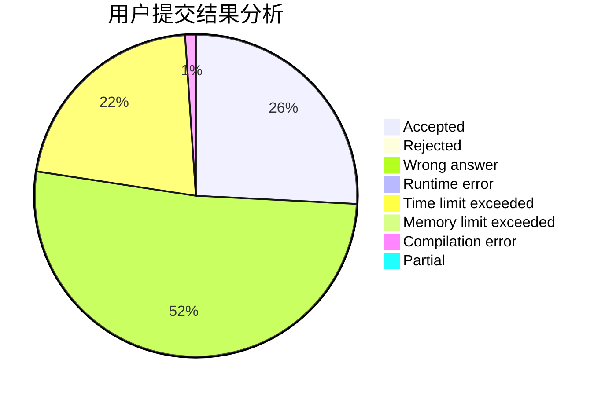
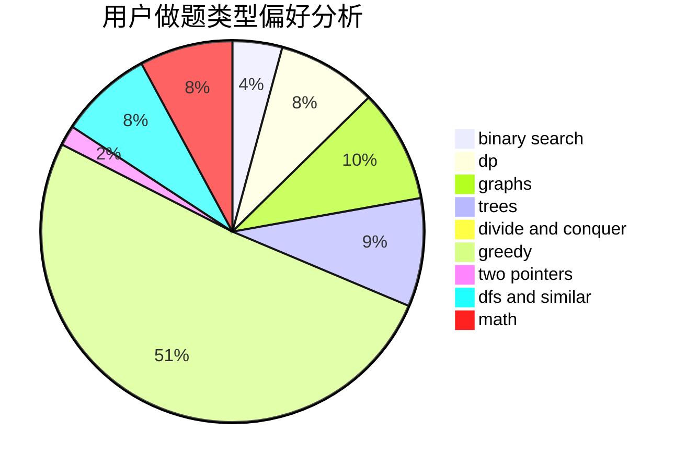

# MikuSakula

<!-- tabs:start -->

#### **用户提交结果分析**

#### **用户做题类型偏好分析**

<!-- tabs:end -->
# 推荐题目
[1325E](https://codeforces.com/contest/1325/problem/E)
[1120F](https://codeforces.com/contest/1120/problem/F)
[948A](https://codeforces.com/contest/948/problem/A)
[845E](https://codeforces.com/contest/845/problem/E)
[911C](https://codeforces.com/contest/911/problem/C)
[171A](https://codeforces.com/contest/171/problem/A)
[1129E](https://codeforces.com/contest/1129/problem/E)
[858A](https://codeforces.com/contest/858/problem/A)
[1347D](https://codeforces.com/contest/1347/problem/D)
[1058E](https://codeforces.com/contest/1058/problem/E)
