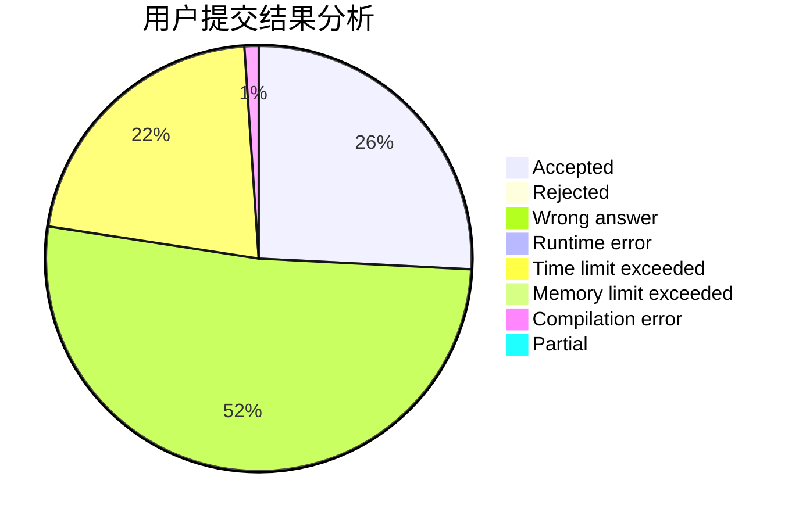
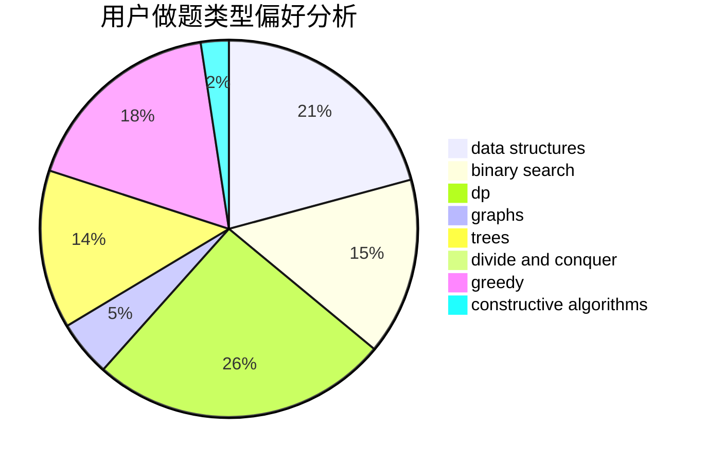
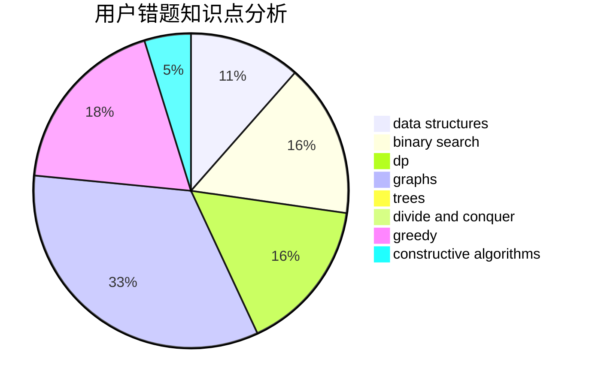

# MikuSakula

<!-- tabs:start -->

#### **用户提交结果分析**

#### **用户做题类型偏好分析**

#### **用户错题知识点分析**

<!-- tabs:end -->
# 推荐题目
[1325E](https://codeforces.com/contest/1325/problem/E)		brute force,
                        dfs and similar,
                        graphs,
                        number theory,
                        shortest paths		  
[1120F](https://codeforces.com/contest/1120/problem/F)		data structures,
                        dp,
                        greedy		  
[948A](https://codeforces.com/contest/948/problem/A)		brute force,
                        dfs and similar,
                        graphs,
                        implementation		  
[845E](https://codeforces.com/contest/845/problem/E)		binary search,
                        data structures		  
[911C](https://codeforces.com/contest/911/problem/C)		brute force,
                        constructive algorithms		  
[171A](https://codeforces.com/contest/171/problem/A)		*special problem,
                        constructive algorithms		  
[1129E](https://codeforces.com/contest/1129/problem/E)		binary search,
                        interactive,
                        trees		  
[858A](https://codeforces.com/contest/858/problem/A)		brute force,
                        math,
                        number theory		  
[1347D](https://codeforces.com/contest/1347/problem/D)		dsu,graphs,sortings,trees		  
[1058E](https://codeforces.com/contest/1058/problem/E)		dsu,graphs,sortings,trees		  
