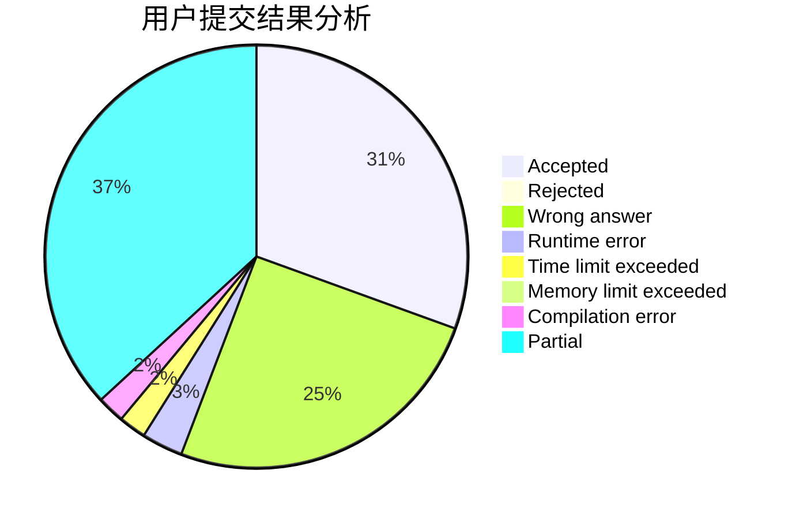
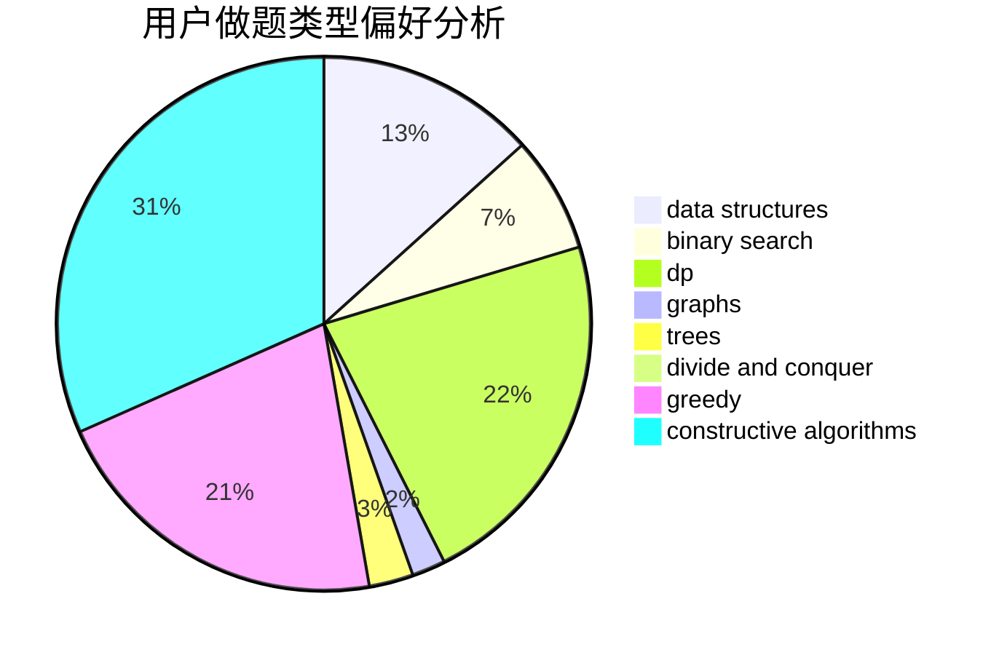
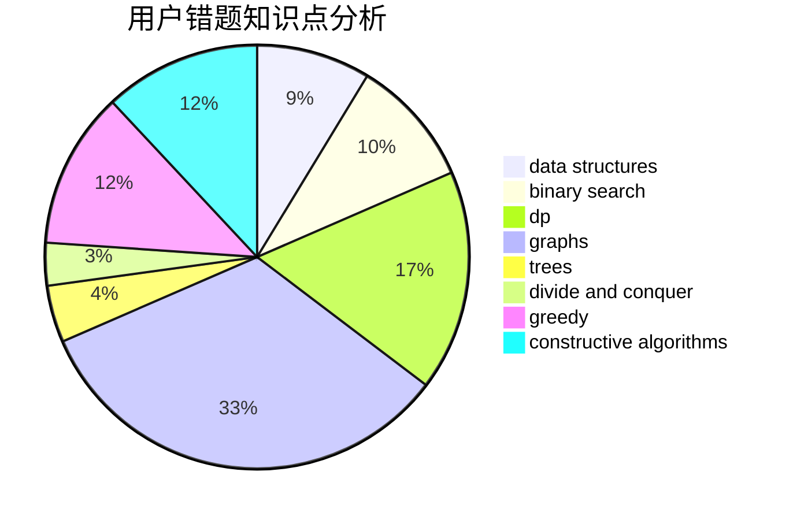

# MinakoKojima

<!-- tabs:start -->

#### **用户提交结果分析**

#### **用户做题类型偏好分析**

#### **用户错题知识点分析**

<!-- tabs:end -->
# 推荐题目
[1333B](https://codeforces.com/contest/1333/problem/B)		greedy,
                        implementation		  
[516E](https://codeforces.com/contest/516/problem/E)		math,
                        number theory		  
[1066C](https://codeforces.com/contest/1066/problem/C)		implementation		  
[76C](https://codeforces.com/contest/76/problem/C)		bitmasks,
                        dp,
                        math		  
[960F](https://codeforces.com/contest/960/problem/F)		data structures,
                        dp,
                        graphs		  
[846E](https://codeforces.com/contest/846/problem/E)		dfs and similar,
                        greedy,
                        trees		  
[1261E](https://codeforces.com/contest/1261/problem/E)		dsu,graphs,sortings,trees		  
[535C](https://codeforces.com/contest/535/problem/C)		binary search,
                        greedy,
                        math		  
[854C](https://codeforces.com/contest/854/problem/C)		dsu,graphs,sortings,trees		  
[1451C](https://codeforces.com/contest/1451/problem/C)		dp,
                        greedy,
                        hashing,
                        implementation,
                        strings		  
