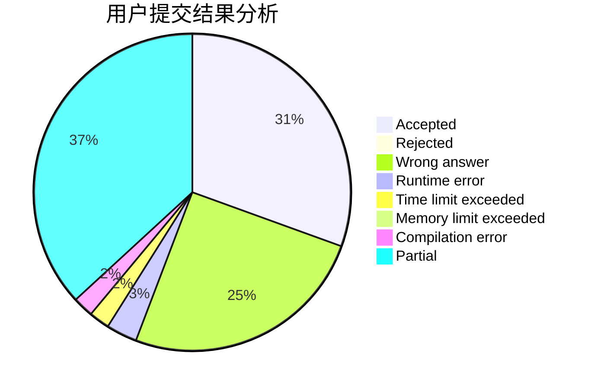
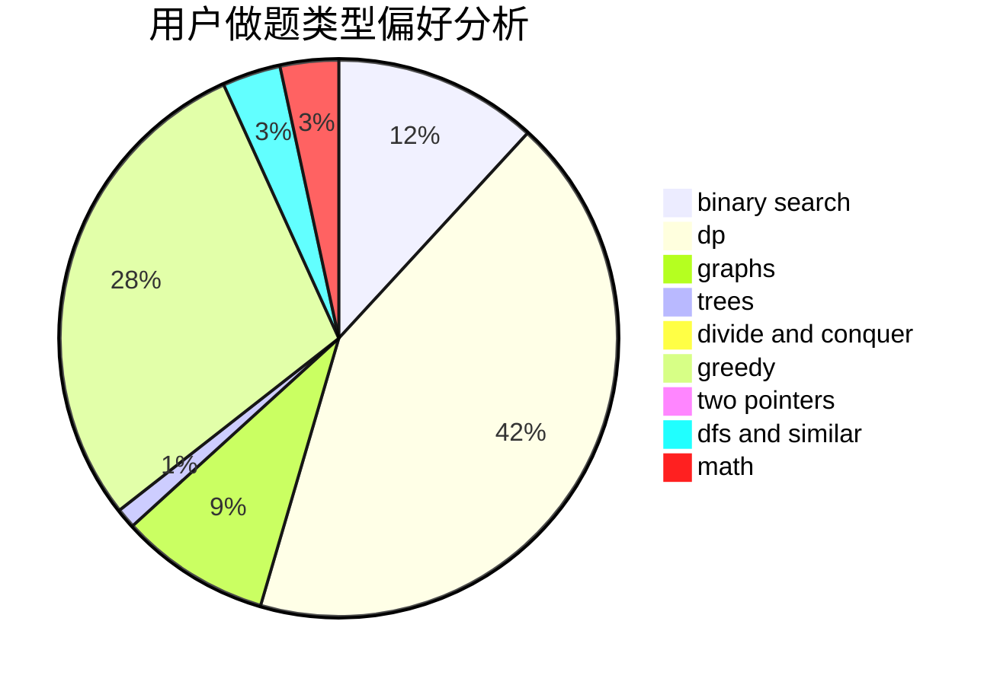

# MinakoKojima

<!-- tabs:start -->

#### **用户提交结果分析**

#### **用户做题类型偏好分析**

<!-- tabs:end -->
# 推荐题目
[1340A](https://codeforces.com/contest/1340/problem/A)
[543E](https://codeforces.com/contest/543/problem/E)
[1066F](https://codeforces.com/contest/1066/problem/F)
[789D](https://codeforces.com/contest/789/problem/D)
[982E](https://codeforces.com/contest/982/problem/E)
[864F](https://codeforces.com/contest/864/problem/F)
[1267F](https://codeforces.com/contest/1267/problem/F)
[558A](https://codeforces.com/contest/558/problem/A)
[873A](https://codeforces.com/contest/873/problem/A)
[145C](https://codeforces.com/contest/145/problem/C)
