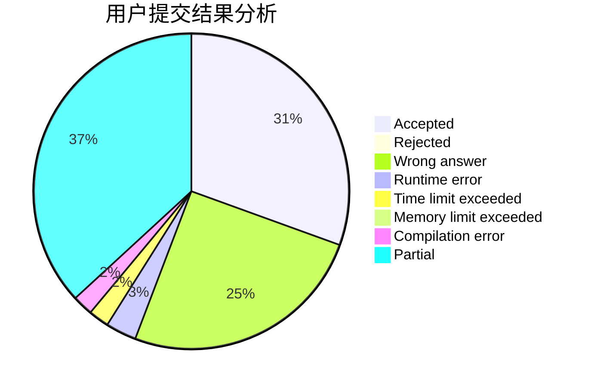
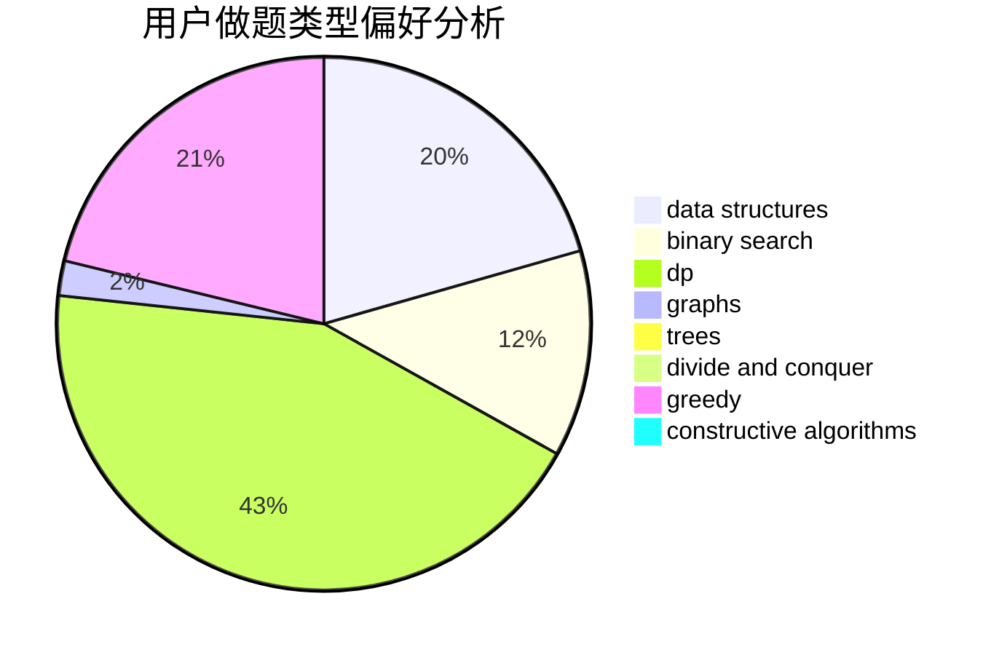
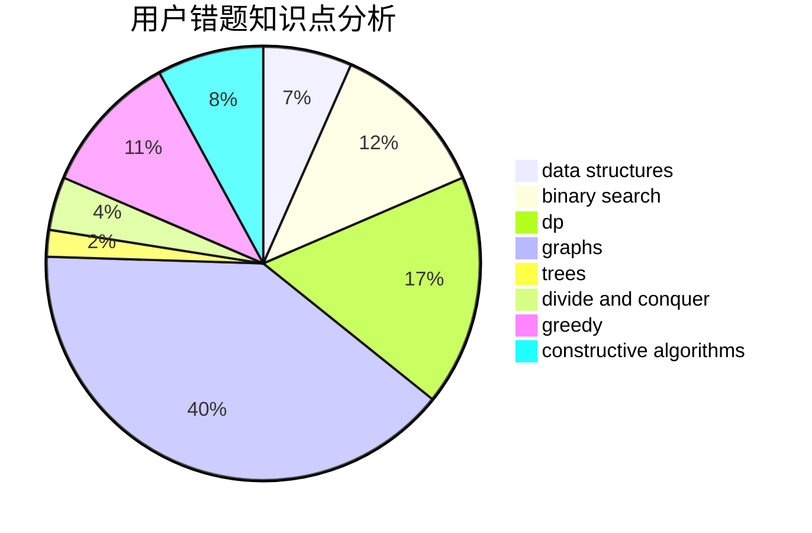

# MinakoKojima

<!-- tabs:start -->

#### **用户提交结果分析**

#### **用户做题类型偏好分析**

#### **用户错题知识点分析**

<!-- tabs:end -->
# 推荐题目
[1340A](https://codeforces.com/contest/1340/problem/A)		brute force,
                        data structures,
                        greedy,
                        implementation		  
[543E](https://codeforces.com/contest/543/problem/E)		constructive algorithms,
                        data structures		  
[1066F](https://codeforces.com/contest/1066/problem/F)		dp		  
[789D](https://codeforces.com/contest/789/problem/D)		dsu,graphs,sortings,trees		  
[982E](https://codeforces.com/contest/982/problem/E)		geometry,
                        number theory		  
[864F](https://codeforces.com/contest/864/problem/F)		dfs and similar,
                        graphs,
                        trees		  
[1267F](https://codeforces.com/contest/1267/problem/F)		graphs		  
[558A](https://codeforces.com/contest/558/problem/A)		brute force,
                        implementation,
                        sortings		  
[873A](https://codeforces.com/contest/873/problem/A)		implementation		  
[145C](https://codeforces.com/contest/145/problem/C)		combinatorics,
                        dp,
                        math		  
