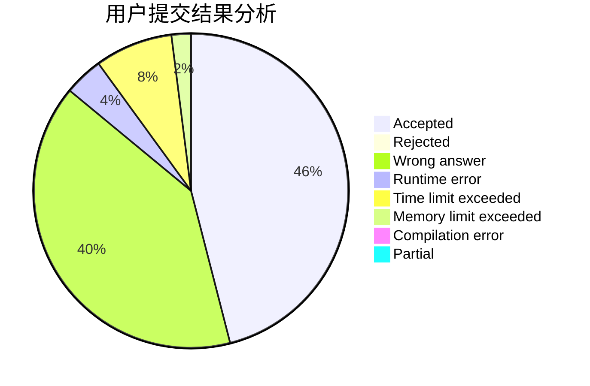
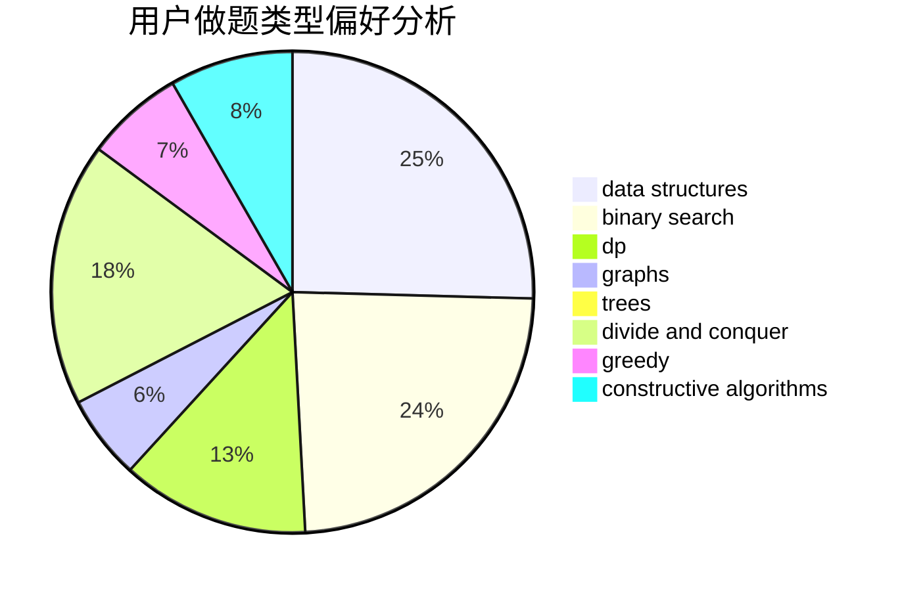

# MirAc1e_aL

<!-- tabs:start -->

#### **用户提交结果分析**

#### **用户做题类型偏好分析**

#### **用户错题知识点分析**

<!-- tabs:end -->
# 推荐题目
[1293C](https://codeforces.com/contest/1293/problem/C)		dsu,graphs,sortings,trees		  
[1070H](https://codeforces.com/contest/1070/problem/H)		brute force,
                        implementation		  
[1141B](https://codeforces.com/contest/1141/problem/B)		implementation		  
[1314E](https://codeforces.com/contest/1314/problem/E)		dsu,graphs,sortings,trees		  
[80B](https://codeforces.com/contest/80/problem/B)		geometry,
                        math		  
[1489D](https://codeforces.com/contest/1489/problem/D)		dsu,graphs,sortings,trees		  
[755C](https://codeforces.com/contest/755/problem/C)		dfs and similar,
                        dsu,
                        graphs,
                        interactive,
                        trees		  
[482E](https://codeforces.com/contest/482/problem/E)		data structures,
                        trees		  
[725C](https://codeforces.com/contest/725/problem/C)		brute force,
                        constructive algorithms,
                        implementation,
                        strings		  
[1375I](https://codeforces.com/contest/1375/problem/I)		geometry,
                        math,
                        matrices,
                        number theory		  
