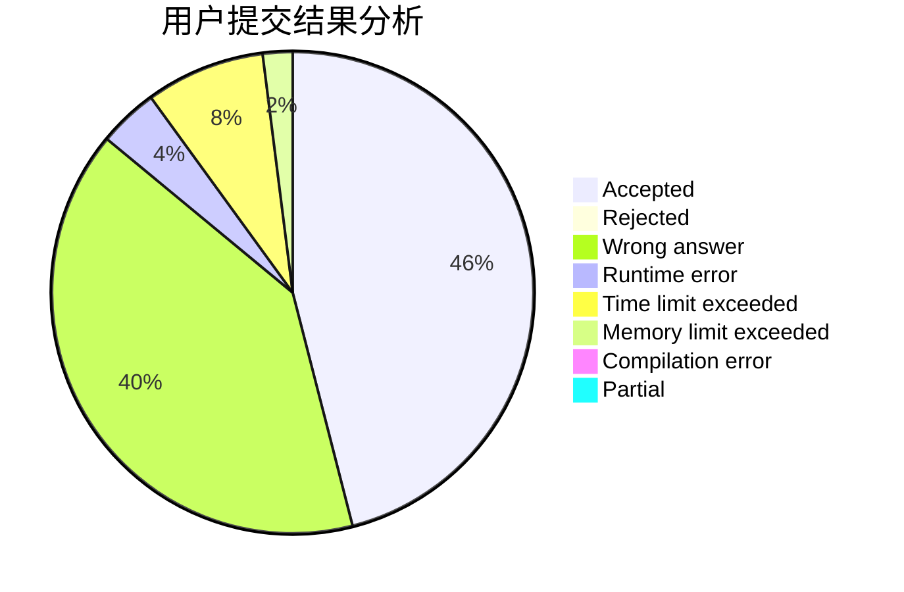
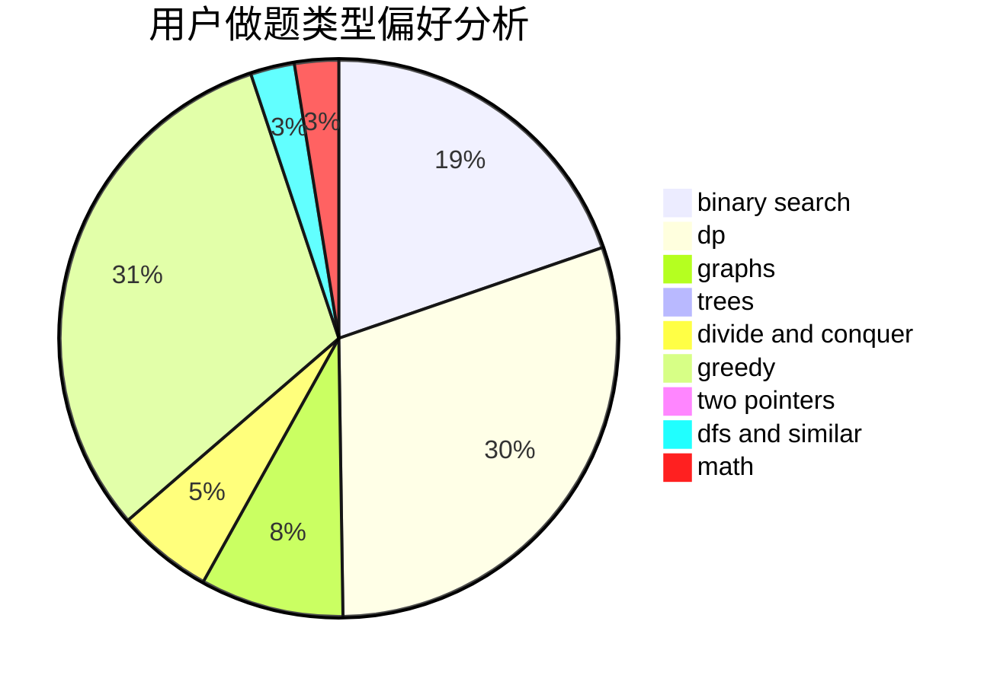

# MirAc1e_aL

<!-- tabs:start -->

#### **用户提交结果分析**

#### **用户做题类型偏好分析**

<!-- tabs:end -->
# 推荐题目
[1293C](https://codeforces.com/contest/1293/problem/C)
[1070H](https://codeforces.com/contest/1070/problem/H)
[1141B](https://codeforces.com/contest/1141/problem/B)
[1314E](https://codeforces.com/contest/1314/problem/E)
[80B](https://codeforces.com/contest/80/problem/B)
[1489D](https://codeforces.com/contest/1489/problem/D)
[755C](https://codeforces.com/contest/755/problem/C)
[482E](https://codeforces.com/contest/482/problem/E)
[725C](https://codeforces.com/contest/725/problem/C)
[1375I](https://codeforces.com/contest/1375/problem/I)
