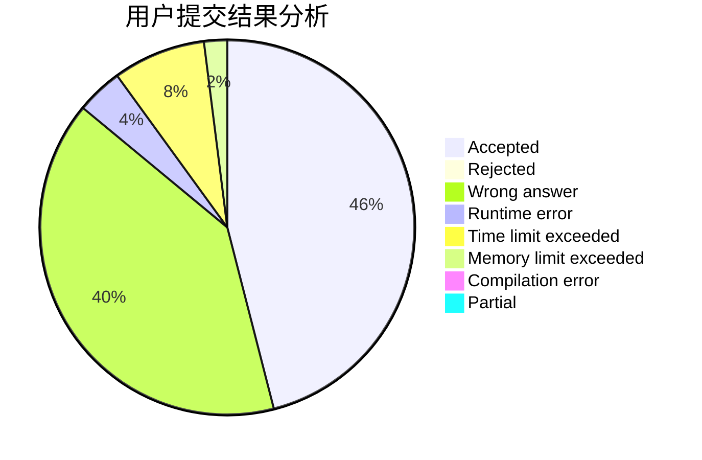
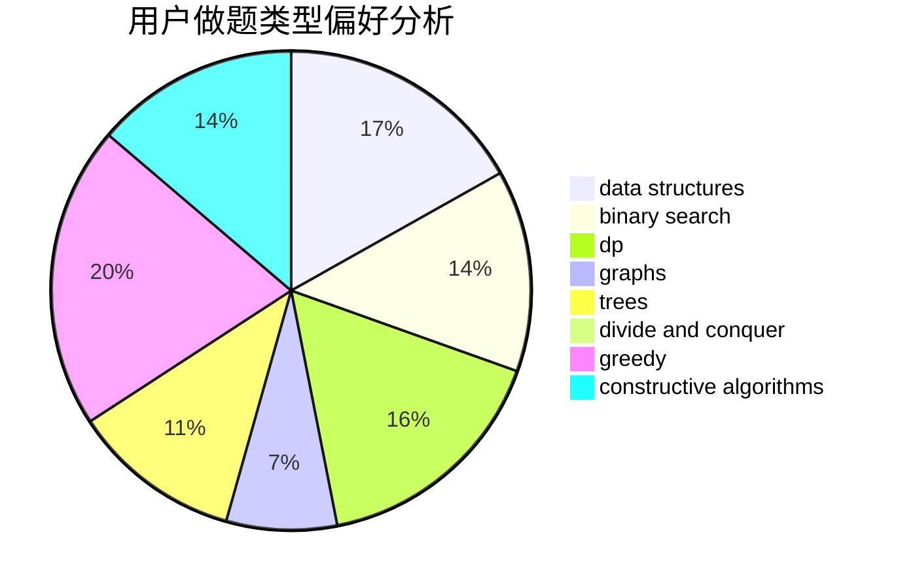
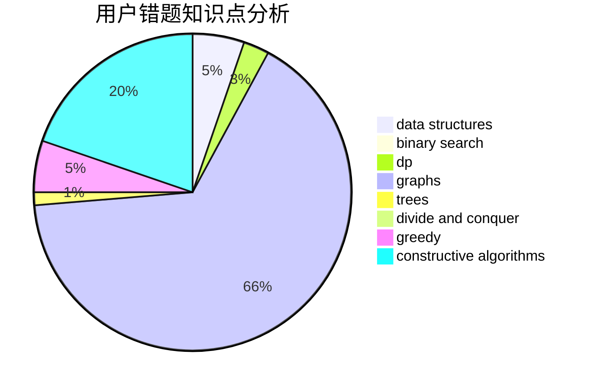

# MirAc1e_aL

<!-- tabs:start -->

#### **用户提交结果分析**

#### **用户做题类型偏好分析**

#### **用户错题知识点分析**

<!-- tabs:end -->
# 推荐题目
[1286B](https://codeforces.com/contest/1286/problem/B)		constructive algorithms,
                        data structures,
                        dfs and similar,
                        graphs,
                        greedy,
                        trees		  
[1070E](https://codeforces.com/contest/1070/problem/E)		binary search,
                        data structures		  
[113B](https://codeforces.com/contest/113/problem/B)		brute force,
                        data structures,
                        hashing,
                        strings		  
[1305F](https://codeforces.com/contest/1305/problem/F)		math,
                        number theory,
                        probabilities		  
[795D](https://codeforces.com/contest/795/problem/D)		dsu,graphs,sortings,trees		  
[1481B](https://codeforces.com/contest/1481/problem/B)		brute force,
                        greedy,
                        implementation		  
[734D](https://codeforces.com/contest/734/problem/D)		implementation		  
[463A](https://codeforces.com/contest/463/problem/A)		brute force,
                        implementation		  
[707A](https://codeforces.com/contest/707/problem/A)		implementation		  
[1369A](https://codeforces.com/contest/1369/problem/A)		geometry,
                        math		  
