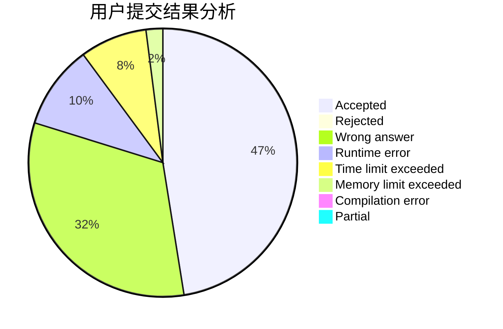
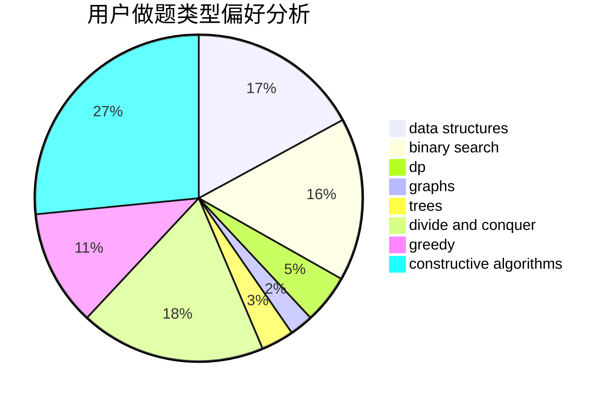
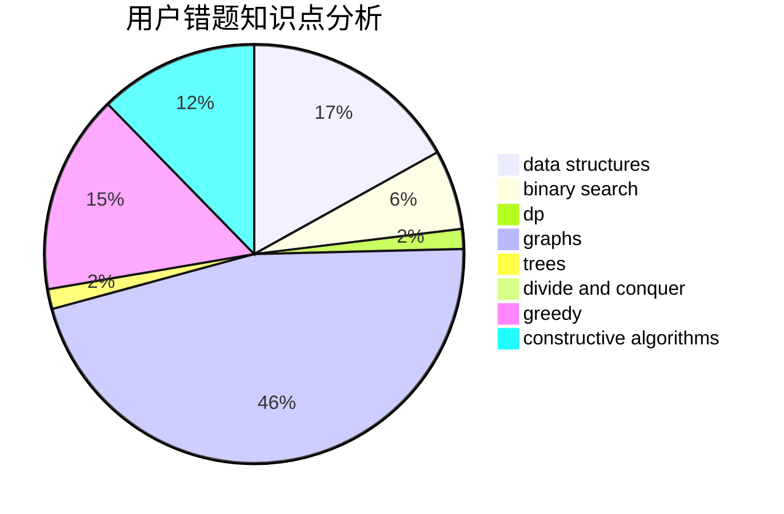

# Miracle03

<!-- tabs:start -->

#### **用户提交结果分析**

#### **用户做题类型偏好分析**

#### **用户错题知识点分析**

<!-- tabs:end -->
# 推荐题目
[576E](https://codeforces.com/contest/576/problem/E)		binary search,
                        data structures		  
[510C](https://codeforces.com/contest/510/problem/C)		dfs and similar,
                        graphs,
                        sortings		  
[311D](https://codeforces.com/contest/311/problem/D)		data structures,
                        math		  
[1139A](https://codeforces.com/contest/1139/problem/A)		implementation,
                        strings		  
[731A](https://codeforces.com/contest/731/problem/A)		implementation,
                        strings		  
[171F](https://codeforces.com/contest/171/problem/F)		*special problem,
                        brute force,
                        implementation,
                        number theory		  
[1072B](https://codeforces.com/contest/1072/problem/B)		dsu,graphs,sortings,trees		  
[337B](https://codeforces.com/contest/337/problem/B)		greedy,
                        math,
                        number theory		  
[937A](https://codeforces.com/contest/937/problem/A)		implementation,
                        sortings		  
[147B](https://codeforces.com/contest/147/problem/B)		binary search,
                        graphs,
                        matrices		  
