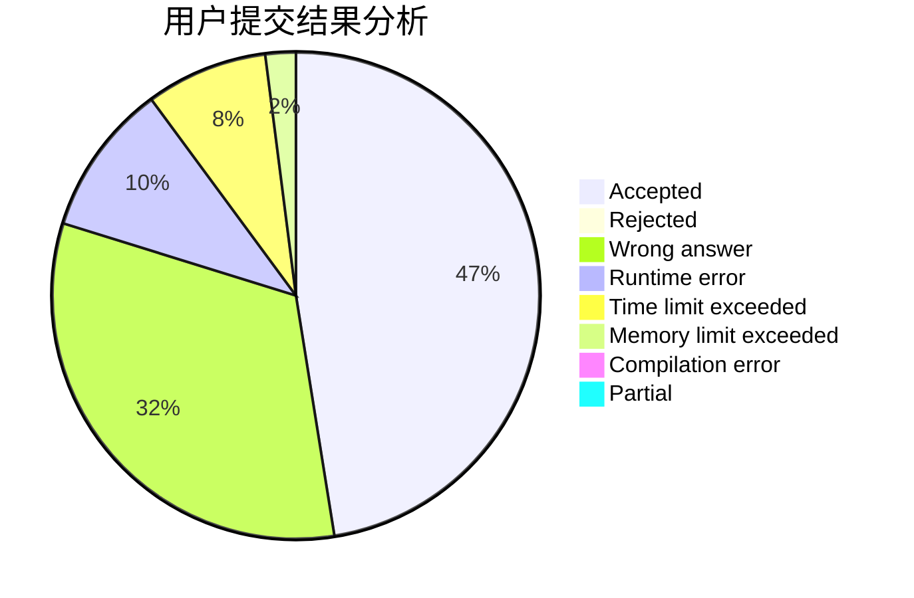
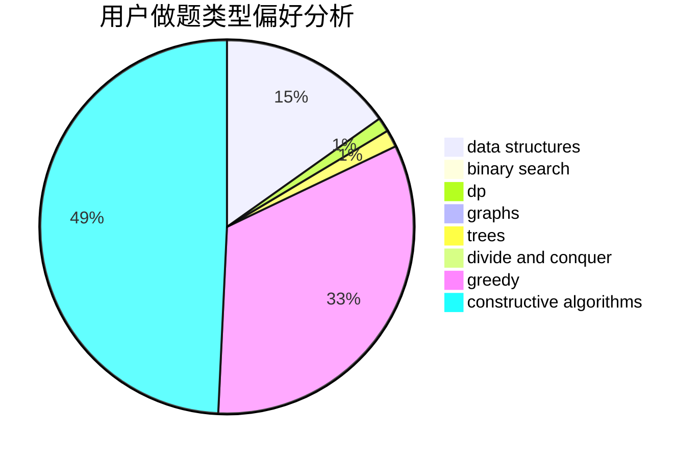
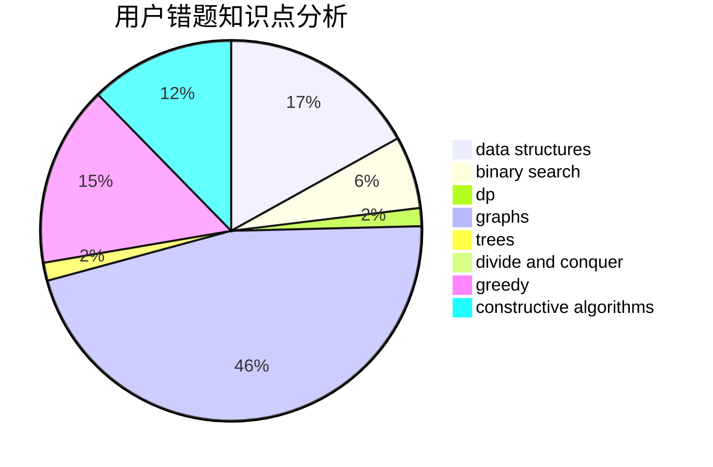

# Miracle03

<!-- tabs:start -->

#### **用户提交结果分析**

#### **用户做题类型偏好分析**

#### **用户错题知识点分析**

<!-- tabs:end -->
# 推荐题目
[598E](https://codeforces.com/contest/598/problem/E)		brute force,
                        dp		  
[533F](https://codeforces.com/contest/533/problem/F)		hashing,
                        string suffix structures,
                        strings		  
[335A](https://codeforces.com/contest/335/problem/A)		binary search,
                        constructive algorithms,
                        greedy		  
[1140E](https://codeforces.com/contest/1140/problem/E)		combinatorics,
                        divide and conquer,
                        dp		  
[749B](https://codeforces.com/contest/749/problem/B)		brute force,
                        constructive algorithms,
                        geometry		  
[199D](https://codeforces.com/contest/199/problem/D)		dsu,graphs,sortings,trees		  
[1073A](https://codeforces.com/contest/1073/problem/A)		implementation,
                        strings		  
[363D](https://codeforces.com/contest/363/problem/D)		binary search,
                        greedy		  
[959B](https://codeforces.com/contest/959/problem/B)		dsu,
                        greedy,
                        implementation		  
[1488D](https://codeforces.com/contest/1488/problem/D)		*special problem,
                        binary search,
                        greedy		  
