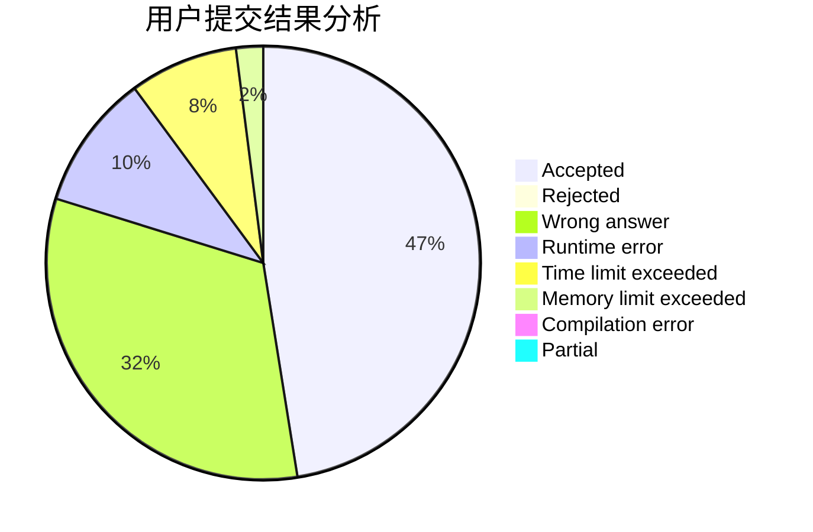
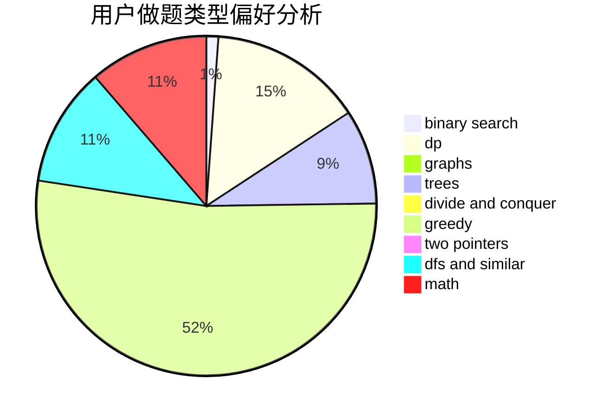

# Miracle03

<!-- tabs:start -->

#### **用户提交结果分析**

#### **用户做题类型偏好分析**

<!-- tabs:end -->
# 推荐题目
[598E](https://codeforces.com/contest/598/problem/E)
[533F](https://codeforces.com/contest/533/problem/F)
[335A](https://codeforces.com/contest/335/problem/A)
[1140E](https://codeforces.com/contest/1140/problem/E)
[749B](https://codeforces.com/contest/749/problem/B)
[199D](https://codeforces.com/contest/199/problem/D)
[1073A](https://codeforces.com/contest/1073/problem/A)
[363D](https://codeforces.com/contest/363/problem/D)
[959B](https://codeforces.com/contest/959/problem/B)
[1488D](https://codeforces.com/contest/1488/problem/D)
