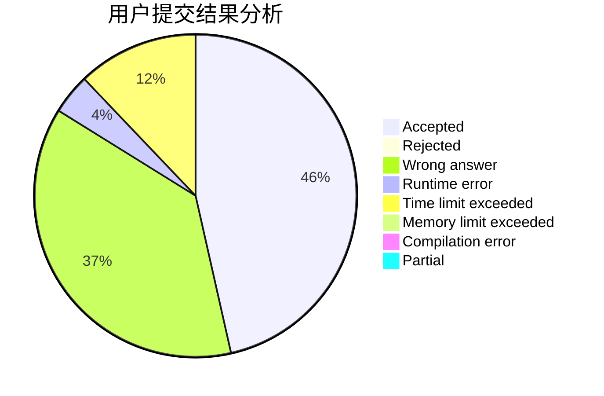
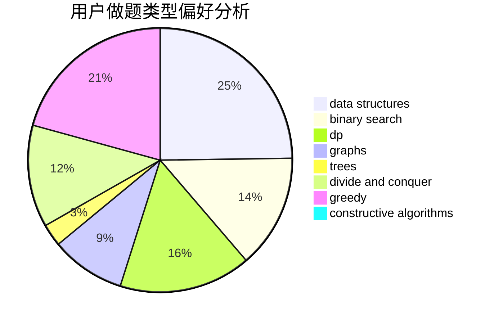
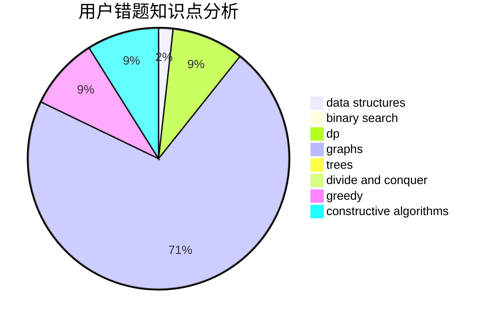

# Miracle_2001

<!-- tabs:start -->

#### **用户提交结果分析**

#### **用户做题类型偏好分析**

#### **用户错题知识点分析**

<!-- tabs:end -->
# 推荐题目
[1262A](https://codeforces.com/contest/1262/problem/A)		dsu,graphs,sortings,trees		  
[1472G](https://codeforces.com/contest/1472/problem/G)		dfs and similar,
                        dp,
                        graphs,
                        shortest paths		  
[1423F](https://codeforces.com/contest/1423/problem/F)		math		  
[1385F](https://codeforces.com/contest/1385/problem/F)		data structures,
                        greedy,
                        implementation,
                        trees		  
[827E](https://codeforces.com/contest/827/problem/E)		fft,
                        math,
                        strings		  
[1037H](https://codeforces.com/contest/1037/problem/H)		data structures,
                        string suffix structures		  
[256D](https://codeforces.com/contest/256/problem/D)		dp		  
[600E](https://codeforces.com/contest/600/problem/E)		data structures,
                        dfs and similar,
                        dsu,
                        trees		  
[1002B4](https://codeforces.com/contest/1002B/problem/4)		nan		  
[526A](https://codeforces.com/contest/526/problem/A)		brute force,
                        implementation		  
