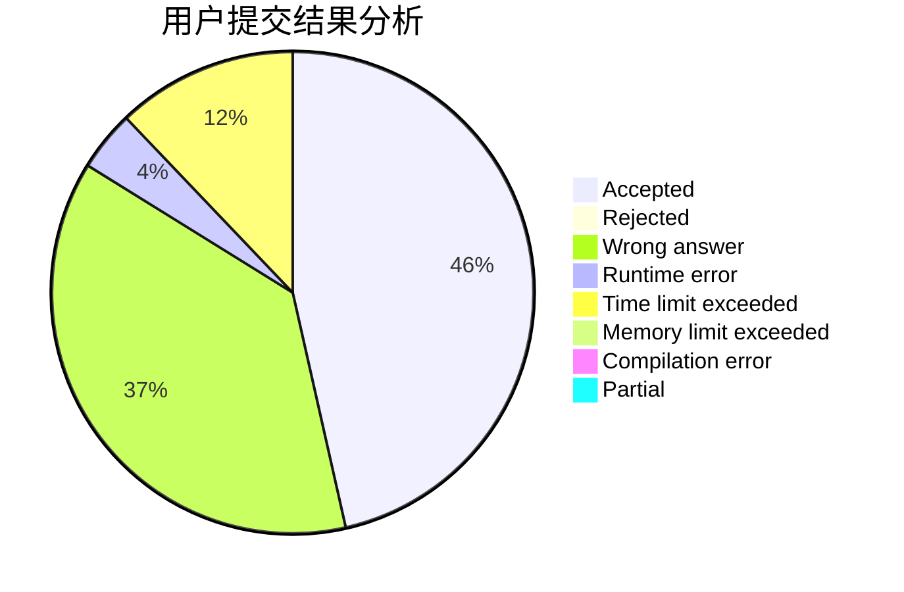
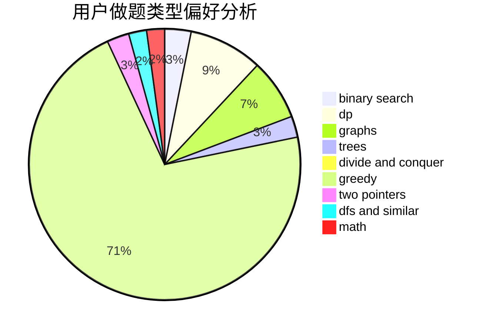

# Miracle_2001

<!-- tabs:start -->

#### **用户提交结果分析**

#### **用户做题类型偏好分析**

<!-- tabs:end -->
# 推荐题目
[1267I](https://codeforces.com/contest/1267/problem/I)
[1481C](https://codeforces.com/contest/1481/problem/C)
[1431A](https://codeforces.com/contest/1431/problem/A)
[1395F](https://codeforces.com/contest/1395/problem/F)
[846A](https://codeforces.com/contest/846/problem/A)
[1038C](https://codeforces.com/contest/1038/problem/C)
[274C](https://codeforces.com/contest/274/problem/C)
[620A](https://codeforces.com/contest/620/problem/A)
[10023](https://codeforces.com/contest/1002/problem/3)
[550A](https://codeforces.com/contest/550/problem/A)
