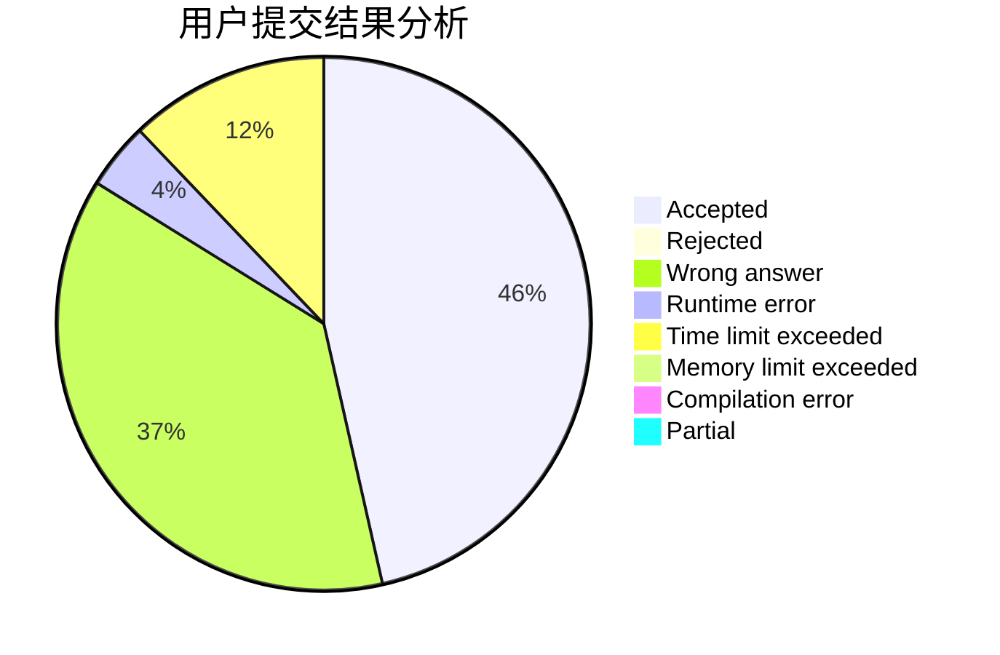
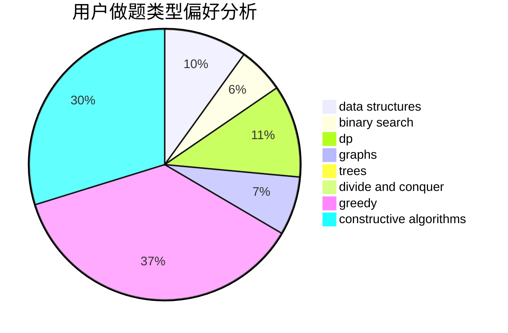

# Miracle_2001

<!-- tabs:start -->

#### **用户提交结果分析**

#### **用户做题类型偏好分析**

#### **用户错题知识点分析**

<!-- tabs:end -->
# 推荐题目
[1267I](https://codeforces.com/contest/1267/problem/I)		brute force,
                        constructive algorithms,
                        implementation,
                        interactive,
                        sortings		  
[1481C](https://codeforces.com/contest/1481/problem/C)		brute force,
                        constructive algorithms,
                        greedy		  
[1431A](https://codeforces.com/contest/1431/problem/A)		*special problem		  
[1395F](https://codeforces.com/contest/1395/problem/F)		dsu,graphs,sortings,trees		  
[846A](https://codeforces.com/contest/846/problem/A)		brute force,
                        implementation		  
[1038C](https://codeforces.com/contest/1038/problem/C)		greedy,
                        sortings		  
[274C](https://codeforces.com/contest/274/problem/C)		brute force,
                        geometry		  
[620A](https://codeforces.com/contest/620/problem/A)		implementation,
                        math		  
[10023](https://codeforces.com/contest/1002/problem/3)		dsu,graphs,sortings,trees		  
[550A](https://codeforces.com/contest/550/problem/A)		brute force,
                        dp,
                        greedy,
                        implementation,
                        strings		  
