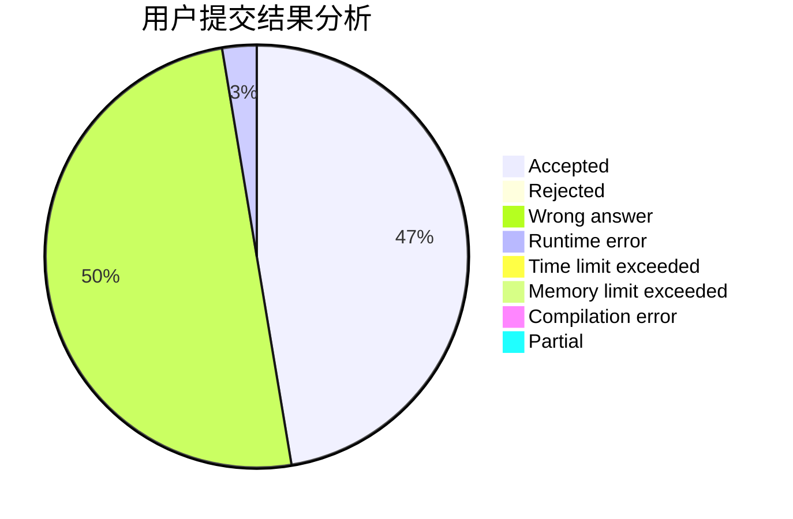
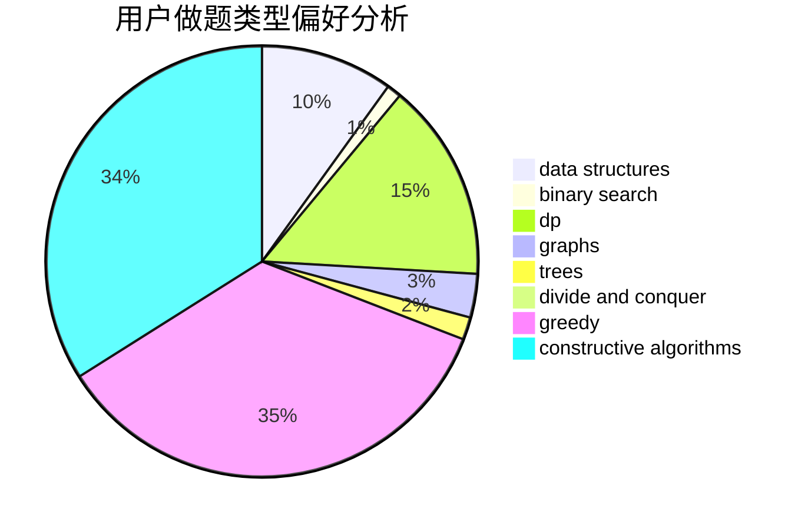
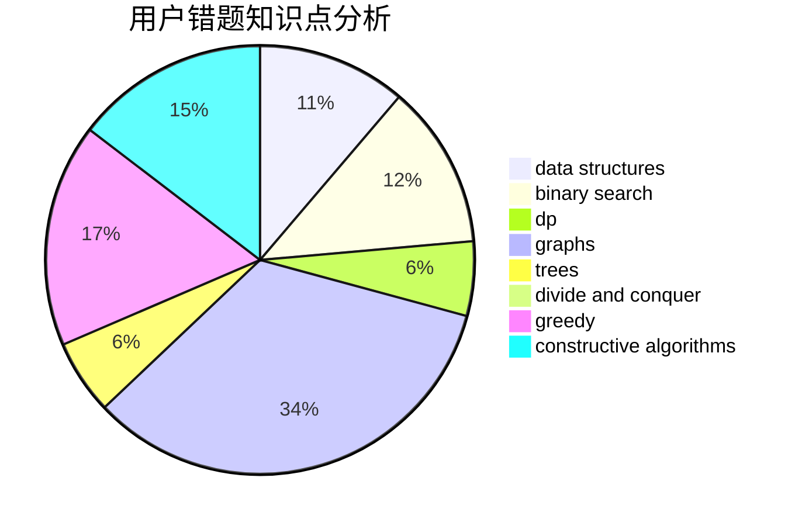

# Miracle__Creator
<!-- tabs:start -->
#### **用户提交结果分析**

#### **用户做题类型偏好分析**

#### **用户错题知识点分析**

<!-- tabs:end -->
# 推荐题目
[A polyline](http://codeforces.com/problemset/problem/171/H)		*special problem,
                        implementation		  
[Pisces](http://codeforces.com/problemset/problem/1023/G)		data structures,
                        flows,
                        trees		  
[Water Lily](http://codeforces.com/problemset/problem/1199/B)		geometry,
                        math		  
[Monsters and Diamonds](http://codeforces.com/problemset/problem/325/C)		dfs and similar,
                        graphs,
                        shortest paths		  
[Magic, Wizardry and Wonders](http://codeforces.com/problemset/problem/231/B)		constructive algorithms,
                        greedy		  
[Tree Diameter](http://codeforces.com/problemset/problem/1146/C)		bitmasks,
                        graphs,
                        interactive		  
[Divisibility](http://codeforces.com/problemset/problem/597/A)		math		  
[Hongcow Learns the Cyclic Shift](http://codeforces.com/problemset/problem/745/A)		implementation,
                        strings		  
[Au Pont Rouge](https://codeforces.com/contest/1315/problem/F)		binary search,
                        dp,
                        strings		  
[Yaroslav and Algorithm](http://codeforces.com/problemset/problem/301/C)		constructive algorithms		  
<!-- tabs:start -->
#### **data structures**
[A polyline](http://codeforces.com/problemset/problem/1023/G)		data structures,
                        flows,
                        trees		  
[Pisces](http://codeforces.com/problemset/problem/362/C)		data structures,
                        dp,
                        implementation,
                        math		  
[Water Lily](http://codeforces.com/problemset/problem/1422/F)		data structures,
                        math,
                        number theory		  
[Monsters and Diamonds](http://codeforces.com/problemset/problem/1175/F)		brute force,
                        data structures,
                        divide and conquer,
                        hashing,
                        math		  
[Magic, Wizardry and Wonders](http://codeforces.com/problemset/problem/961/B)		data structures,
                        dp,
                        implementation,
                        two pointers		  
[Tree Diameter](http://codeforces.com/problemset/problem/1492/C)		binary search,
                        data structures,
                        dp,
                        greedy,
                        two pointers		  
[Divisibility](http://codeforces.com/problemset/problem/1490/G)		binary search,
                        data structures,
                        math		  
[Hongcow Learns the Cyclic Shift](http://codeforces.com/problemset/problem/1479/D)		binary search,
                        bitmasks,
                        brute force,
                        data structures,
                        probabilities,
                        trees		  
[Au Pont Rouge](http://codeforces.com/problemset/problem/1497/A)		brute force,
                        data structures,
                        greedy,
                        sortings		  
[Yaroslav and Algorithm](http://codeforces.com/problemset/problem/1491/C)		brute force,
                        data structures,
                        dp,
                        greedy,
                        implementation		  
#### **binary search**
[A polyline](https://codeforces.com/contest/1315/problem/F)		binary search,
                        dp,
                        strings		  
[Pisces](http://codeforces.com/problemset/problem/1486/E)		binary search,
                        brute force,
                        constructive algorithms,
                        dp,
                        flows,
                        graphs,
                        shortest paths		  
[Water Lily](http://codeforces.com/problemset/problem/1408/C)		binary search,
                        dp,
                        implementation,
                        math,
                        two pointers		  
[Monsters and Diamonds](http://codeforces.com/problemset/problem/1492/C)		binary search,
                        data structures,
                        dp,
                        greedy,
                        two pointers		  
[Magic, Wizardry and Wonders](http://codeforces.com/problemset/problem/1463/D)		binary search,
                        constructive algorithms,
                        greedy,
                        two pointers		  
[Tree Diameter](http://codeforces.com/problemset/problem/1490/G)		binary search,
                        data structures,
                        math		  
[Divisibility](http://codeforces.com/problemset/problem/1479/D)		binary search,
                        bitmasks,
                        brute force,
                        data structures,
                        probabilities,
                        trees		  
[Hongcow Learns the Cyclic Shift](http://codeforces.com/problemset/problem/1436/E)		binary search,
                        data structures,
                        two pointers		  
[Au Pont Rouge](http://codeforces.com/problemset/problem/1461/D)		binary search,
                        brute force,
                        data structures,
                        divide and conquer,
                        implementation,
                        sortings		  
[Yaroslav and Algorithm](http://codeforces.com/problemset/problem/1493/C)		binary search,
                        brute force,
                        constructive algorithms,
                        greedy,
                        strings		  
#### **dp**
[A polyline](https://codeforces.com/contest/1315/problem/F)		binary search,
                        dp,
                        strings		  
[Pisces](http://codeforces.com/problemset/problem/362/C)		data structures,
                        dp,
                        implementation,
                        math		  
[Water Lily](http://codeforces.com/problemset/problem/479/E)		combinatorics,
                        dp		  
[Monsters and Diamonds](http://codeforces.com/problemset/problem/1323/A)		brute force,
                        dp,
                        greedy,
                        implementation		  
[Magic, Wizardry and Wonders](http://codeforces.com/problemset/problem/1486/E)		binary search,
                        brute force,
                        constructive algorithms,
                        dp,
                        flows,
                        graphs,
                        shortest paths		  
[Tree Diameter](http://codeforces.com/problemset/problem/961/B)		data structures,
                        dp,
                        implementation,
                        two pointers		  
[Divisibility](http://codeforces.com/problemset/problem/1408/C)		binary search,
                        dp,
                        implementation,
                        math,
                        two pointers		  
[Hongcow Learns the Cyclic Shift](http://codeforces.com/problemset/problem/1478/B)		brute force,
                        dp,
                        greedy,
                        math		  
[Au Pont Rouge](http://codeforces.com/problemset/problem/1492/C)		binary search,
                        data structures,
                        dp,
                        greedy,
                        two pointers		  
[Yaroslav and Algorithm](https://codeforces.com/contest/1457/problem/C)		brute force,
                        dp,
                        implementation		  
#### **graph**
[A polyline](http://codeforces.com/problemset/problem/325/C)		dfs and similar,
                        graphs,
                        shortest paths		  
[Pisces](http://codeforces.com/problemset/problem/1146/C)		bitmasks,
                        graphs,
                        interactive		  
[Water Lily](http://codeforces.com/problemset/problem/343/E)		brute force,
                        dfs and similar,
                        divide and conquer,
                        flows,
                        graphs,
                        greedy,
                        trees		  
[Monsters and Diamonds](http://codeforces.com/problemset/problem/1385/E)		constructive algorithms,
                        dfs and similar,
                        graphs		  
[Magic, Wizardry and Wonders](http://codeforces.com/problemset/problem/1067/B)		dfs and similar,
                        graphs,
                        shortest paths		  
[Tree Diameter](http://codeforces.com/problemset/problem/1486/E)		binary search,
                        brute force,
                        constructive algorithms,
                        dp,
                        flows,
                        graphs,
                        shortest paths		  
[Divisibility](http://codeforces.com/problemset/problem/1487/C)		brute force,
                        constructive algorithms,
                        dfs and similar,
                        graphs,
                        greedy,
                        implementation,
                        math		  
[Hongcow Learns the Cyclic Shift](http://codeforces.com/problemset/problem/1437/C)		dp,
                        flows,
                        graph matchings,
                        greedy,
                        math,
                        sortings		  
[Au Pont Rouge](http://codeforces.com/problemset/problem/1470/D)		constructive algorithms,
                        dfs and similar,
                        graph matchings,
                        graphs,
                        greedy		  
[Yaroslav and Algorithm](http://codeforces.com/problemset/problem/1476/C)		dp,
                        graphs,
                        greedy		  
#### **trees**
[A polyline](http://codeforces.com/problemset/problem/1023/G)		data structures,
                        flows,
                        trees		  
[Pisces](http://codeforces.com/problemset/problem/343/E)		brute force,
                        dfs and similar,
                        divide and conquer,
                        flows,
                        graphs,
                        greedy,
                        trees		  
[Water Lily](http://codeforces.com/problemset/problem/1479/D)		binary search,
                        bitmasks,
                        brute force,
                        data structures,
                        probabilities,
                        trees		  
[Monsters and Diamonds](http://codeforces.com/problemset/problem/1511/C)		brute force,
                        data structures,
                        implementation,
                        trees		  
[Magic, Wizardry and Wonders](http://codeforces.com/problemset/problem/1499/F)		combinatorics,
                        dfs and similar,
                        dp,
                        trees		  
[Tree Diameter](http://codeforces.com/problemset/problem/1491/E)		brute force,
                        dfs and similar,
                        divide and conquer,
                        number theory,
                        trees		  
[Divisibility](http://codeforces.com/problemset/problem/1466/D)		data structures,
                        greedy,
                        sortings,
                        trees		  
[Hongcow Learns the Cyclic Shift](http://codeforces.com/problemset/problem/1495/D)		combinatorics,
                        dfs and similar,
                        graphs,
                        math,
                        shortest paths,
                        trees		  
[Au Pont Rouge](http://codeforces.com/problemset/problem/1303/G)		data structures,
                        divide and conquer,
                        geometry,
                        trees		  
[Yaroslav and Algorithm](http://codeforces.com/problemset/problem/1454/E)		combinatorics,
                        dfs and similar,
                        graphs,
                        trees		  
#### **divide and conquer**
[A polyline](http://codeforces.com/problemset/problem/343/E)		brute force,
                        dfs and similar,
                        divide and conquer,
                        flows,
                        graphs,
                        greedy,
                        trees		  
[Pisces](http://codeforces.com/problemset/problem/1175/F)		brute force,
                        data structures,
                        divide and conquer,
                        hashing,
                        math		  
[Water Lily](http://codeforces.com/problemset/problem/1461/D)		binary search,
                        brute force,
                        data structures,
                        divide and conquer,
                        implementation,
                        sortings		  
[Monsters and Diamonds](http://codeforces.com/problemset/problem/1466/G)		combinatorics,
                        divide and conquer,
                        hashing,
                        math,
                        string suffix structures,
                        strings		  
[Magic, Wizardry and Wonders](http://codeforces.com/problemset/problem/1490/D)		dfs and similar,
                        divide and conquer,
                        implementation		  
[Tree Diameter](https://codeforces.com/contest/1483/problem/C)		data structures,
                        divide and conquer,
                        dp		  
[Divisibility](http://codeforces.com/problemset/problem/1491/E)		brute force,
                        dfs and similar,
                        divide and conquer,
                        number theory,
                        trees		  
[Hongcow Learns the Cyclic Shift](http://codeforces.com/problemset/problem/1303/G)		data structures,
                        divide and conquer,
                        geometry,
                        trees		  
[Au Pont Rouge](http://codeforces.com/problemset/problem/1494/D)		constructive algorithms,
                        data structures,
                        dfs and similar,
                        divide and conquer,
                        dsu,
                        greedy,
                        sortings,
                        trees		  
[Yaroslav and Algorithm](http://codeforces.com/problemset/problem/1482/E)		data structures,
                        divide and conquer,
                        dp		  
#### **greedy**
[A polyline](http://codeforces.com/problemset/problem/231/B)		constructive algorithms,
                        greedy		  
[Pisces](http://codeforces.com/problemset/problem/1062/A)		greedy,
                        implementation		  
[Water Lily](http://codeforces.com/problemset/problem/343/E)		brute force,
                        dfs and similar,
                        divide and conquer,
                        flows,
                        graphs,
                        greedy,
                        trees		  
[Monsters and Diamonds](http://codeforces.com/problemset/problem/1323/A)		brute force,
                        dp,
                        greedy,
                        implementation		  
[Magic, Wizardry and Wonders](http://codeforces.com/problemset/problem/1478/B)		brute force,
                        dp,
                        greedy,
                        math		  
[Tree Diameter](http://codeforces.com/problemset/problem/1492/C)		binary search,
                        data structures,
                        dp,
                        greedy,
                        two pointers		  
[Divisibility](https://codeforces.com/contest/1496/problem/C)		geometry,
                        greedy,
                        math,
                        sortings		  
[Hongcow Learns the Cyclic Shift](http://codeforces.com/problemset/problem/1493/A)		constructive algorithms,
                        greedy		  
[Au Pont Rouge](http://codeforces.com/problemset/problem/1463/D)		binary search,
                        constructive algorithms,
                        greedy,
                        two pointers		  
[Yaroslav and Algorithm](http://codeforces.com/problemset/problem/1462/C)		brute force,
                        greedy,
                        math		  
#### **constructive algorithms**
[A polyline](http://codeforces.com/problemset/problem/231/B)		constructive algorithms,
                        greedy		  
[Pisces](http://codeforces.com/problemset/problem/301/C)		constructive algorithms		  
[Water Lily](http://codeforces.com/problemset/problem/1385/E)		constructive algorithms,
                        dfs and similar,
                        graphs		  
[Monsters and Diamonds](http://codeforces.com/problemset/problem/1486/E)		binary search,
                        brute force,
                        constructive algorithms,
                        dp,
                        flows,
                        graphs,
                        shortest paths		  
[Magic, Wizardry and Wonders](http://codeforces.com/problemset/problem/1493/A)		constructive algorithms,
                        greedy		  
[Tree Diameter](http://codeforces.com/problemset/problem/1463/D)		binary search,
                        constructive algorithms,
                        greedy,
                        two pointers		  
[Divisibility](https://codeforces.com/contest/1456/problem/B)		bitmasks,
                        brute force,
                        constructive algorithms		  
[Hongcow Learns the Cyclic Shift](http://codeforces.com/problemset/problem/1492/D)		bitmasks,
                        constructive algorithms,
                        greedy,
                        math		  
[Au Pont Rouge](https://codeforces.com/contest/1504/problem/D)		constructive algorithms,
                        games,
                        interactive		  
[Yaroslav and Algorithm](https://codeforces.com/contest/1483/problem/A)		brute force,
                        constructive algorithms,
                        greedy,
                        implementation		  
#### **sortings**
[A polyline](https://codeforces.com/contest/1138/problem/C)		implementation,
                        sortings		  
[Pisces](https://codeforces.com/contest/1496/problem/C)		geometry,
                        greedy,
                        math,
                        sortings		  
[Water Lily](http://codeforces.com/problemset/problem/1495/A)		geometry,
                        greedy,
                        math,
                        sortings		  
[Monsters and Diamonds](http://codeforces.com/problemset/problem/1497/A)		brute force,
                        data structures,
                        greedy,
                        sortings		  
[Magic, Wizardry and Wonders](http://codeforces.com/problemset/problem/1427/A)		math,
                        sortings		  
[Tree Diameter](http://codeforces.com/problemset/problem/1461/D)		binary search,
                        brute force,
                        data structures,
                        divide and conquer,
                        implementation,
                        sortings		  
[Divisibility](http://codeforces.com/problemset/problem/1437/C)		dp,
                        flows,
                        graph matchings,
                        greedy,
                        math,
                        sortings		  
[Hongcow Learns the Cyclic Shift](http://codeforces.com/problemset/problem/1473/A)		greedy,
                        implementation,
                        math,
                        sortings		  
[Au Pont Rouge](http://codeforces.com/problemset/problem/1486/B)		binary search,
                        geometry,
                        shortest paths,
                        sortings		  
[Yaroslav and Algorithm](http://codeforces.com/problemset/problem/1480/B)		greedy,
                        implementation,
                        sortings		  
<!-- tabs:end -->
