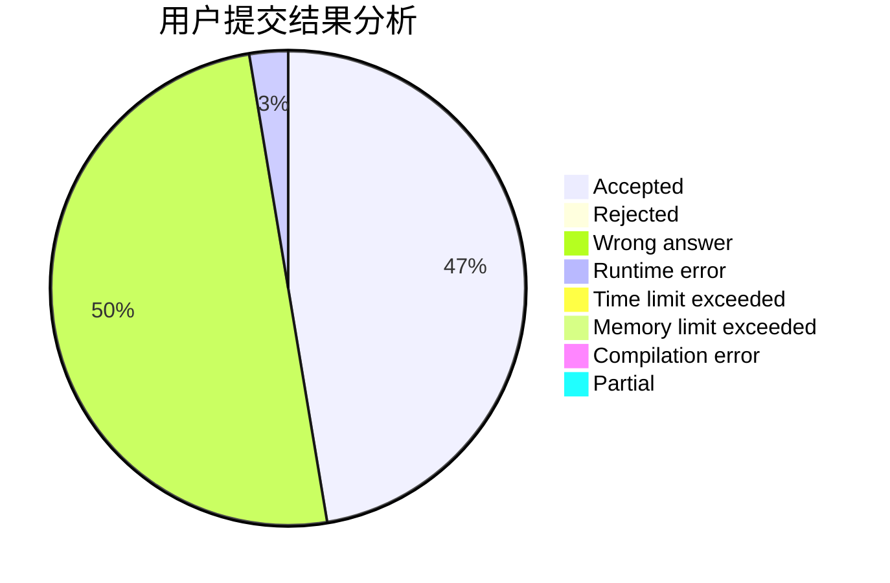
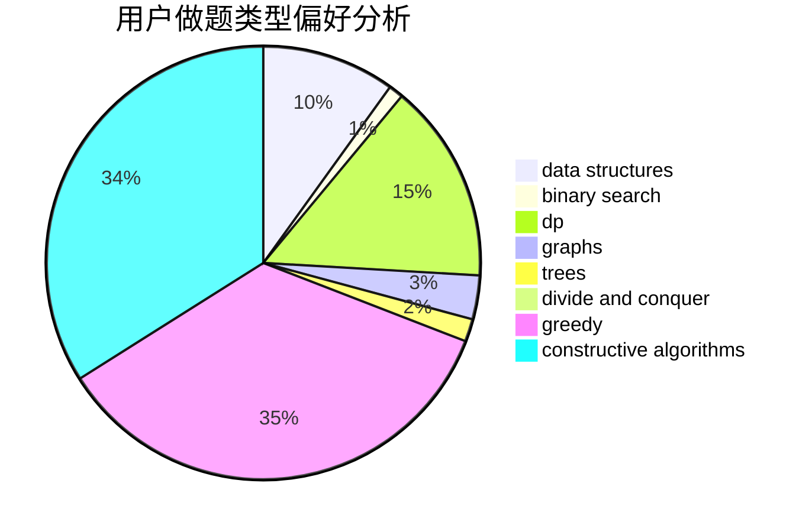
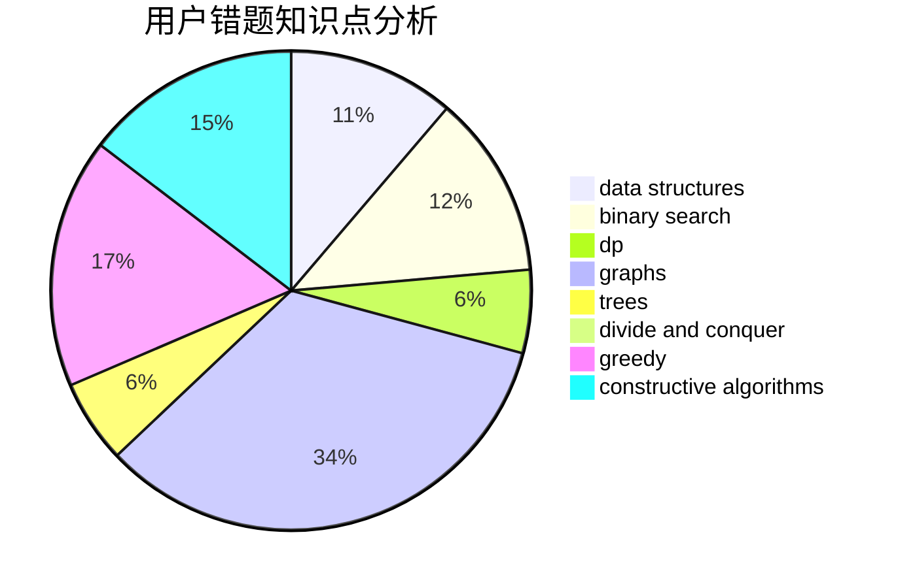

# Miracle__Creator

<!-- tabs:start -->

#### **用户提交结果分析**

#### **用户做题类型偏好分析**

#### **用户错题知识点分析**

<!-- tabs:end -->
# 推荐题目
[1023G](https://codeforces.com/contest/1023/problem/G)		data structures,
                        flows,
                        trees		  
[343E](https://codeforces.com/contest/343/problem/E)		brute force,
                        dfs and similar,
                        divide and conquer,
                        flows,
                        graphs,
                        greedy,
                        trees		  
[1323A](https://codeforces.com/contest/1323/problem/A)		brute force,
                        dp,
                        greedy,
                        implementation		  
[171H](https://codeforces.com/contest/171/problem/H)		*special problem,
                        implementation		  
[1199B](https://codeforces.com/contest/1199/problem/B)		geometry,
                        math		  
[325C](https://codeforces.com/contest/325/problem/C)		dfs and similar,
                        graphs,
                        shortest paths		  
[231B](https://codeforces.com/contest/231/problem/B)		constructive algorithms,
                        greedy		  
[597A](https://codeforces.com/contest/597/problem/A)		math		  
[1408C](https://codeforces.com/contest/1408/problem/C)		binary search,
                        dp,
                        implementation,
                        math,
                        two pointers		  
[961B](https://codeforces.com/contest/961/problem/B)		data structures,
                        dp,
                        implementation,
                        two pointers		  
