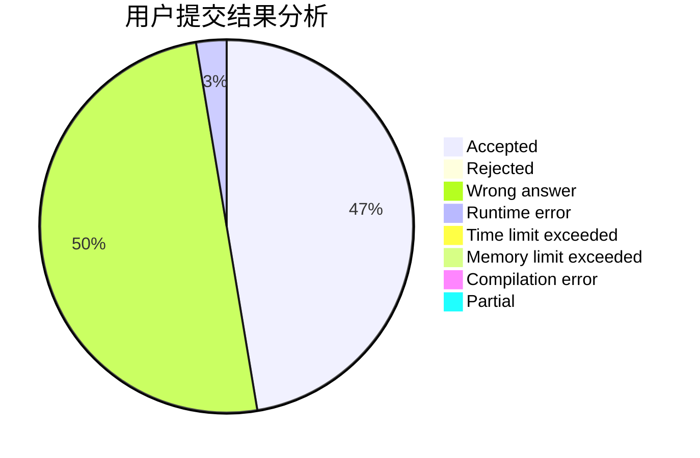
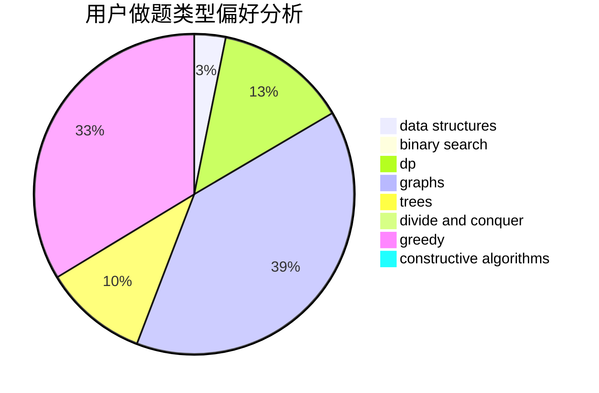
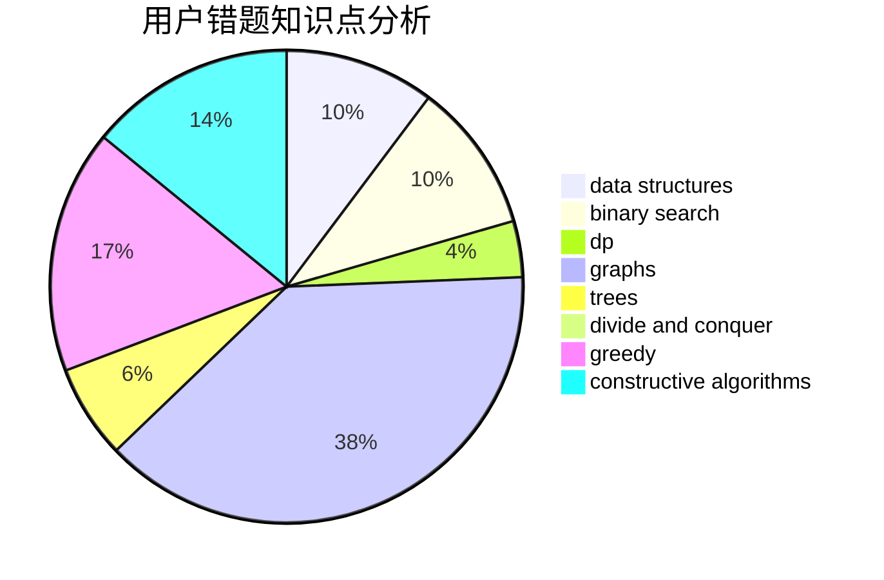

# Miracle__Creator

<!-- tabs:start -->

#### **用户提交结果分析**

#### **用户做题类型偏好分析**

#### **用户错题知识点分析**

<!-- tabs:end -->
# 推荐题目
[1025C](https://codeforces.com/contest/1025/problem/C)		constructive algorithms,
                        implementation		  
[370A](https://codeforces.com/contest/370/problem/A)		graphs,
                        math,
                        shortest paths		  
[132C](https://codeforces.com/contest/132/problem/C)		dp		  
[19A](https://codeforces.com/contest/19/problem/A)		implementation		  
[1202F](https://codeforces.com/contest/1202/problem/F)		binary search,
                        implementation,
                        math		  
[354D](https://codeforces.com/contest/354/problem/D)		dp		  
[252A](https://codeforces.com/contest/252/problem/A)		brute force,
                        implementation		  
[613E](https://codeforces.com/contest/613/problem/E)		dp,
                        hashing,
                        strings		  
[1418G](https://codeforces.com/contest/1418/problem/G)		data structures,
                        divide and conquer,
                        hashing,
                        two pointers		  
[983C](https://codeforces.com/contest/983/problem/C)		dp,
                        graphs,
                        shortest paths		  
