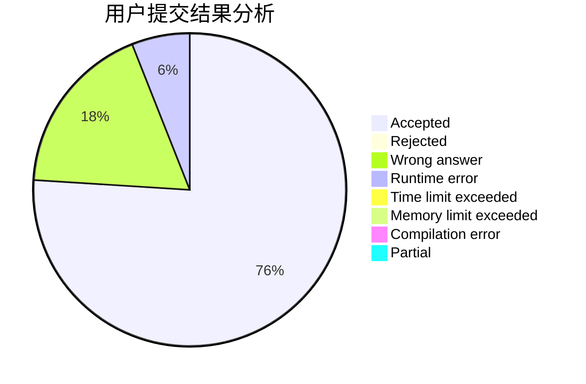
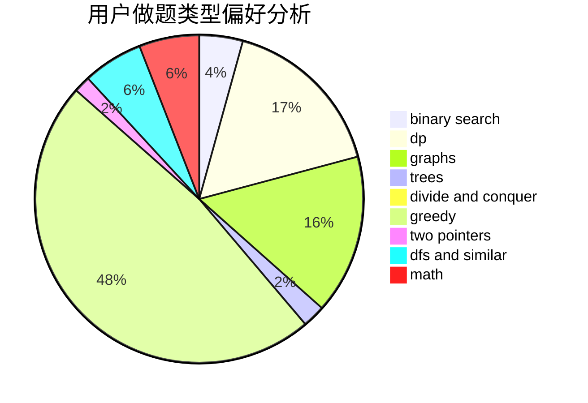

# Misaka-Mikoto-

<!-- tabs:start -->

#### **用户提交结果分析**

#### **用户做题类型偏好分析**

<!-- tabs:end -->
# 推荐题目
[1494F](https://codeforces.com/contest/1494/problem/F)
[1070H](https://codeforces.com/contest/1070/problem/H)
[1295F](https://codeforces.com/contest/1295/problem/F)
[672B](https://codeforces.com/contest/672/problem/B)
[352E](https://codeforces.com/contest/352/problem/E)
[746B](https://codeforces.com/contest/746/problem/B)
[1221E](https://codeforces.com/contest/1221/problem/E)
[841C](https://codeforces.com/contest/841/problem/C)
[257D](https://codeforces.com/contest/257/problem/D)
[1105A](https://codeforces.com/contest/1105/problem/A)
