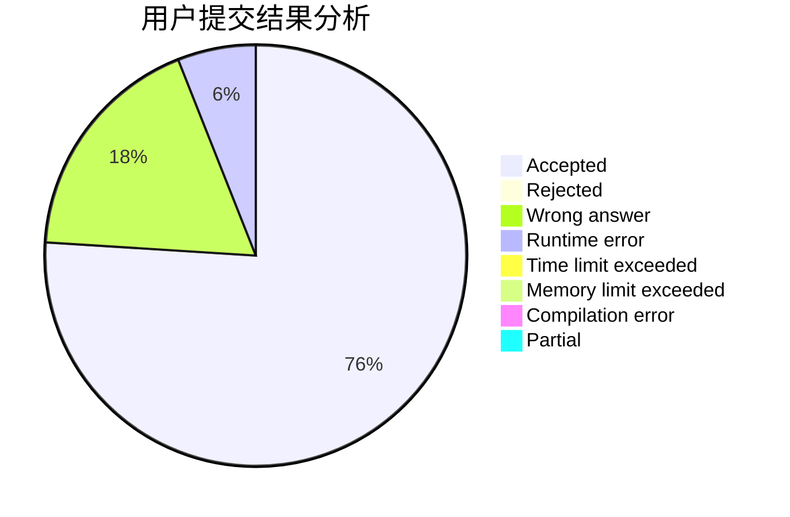
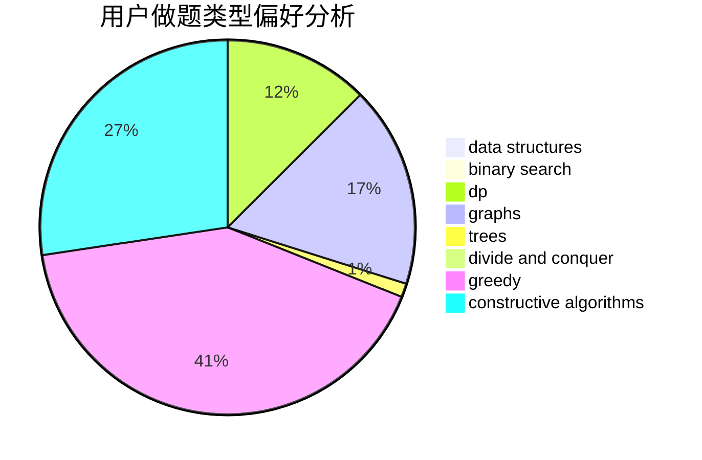
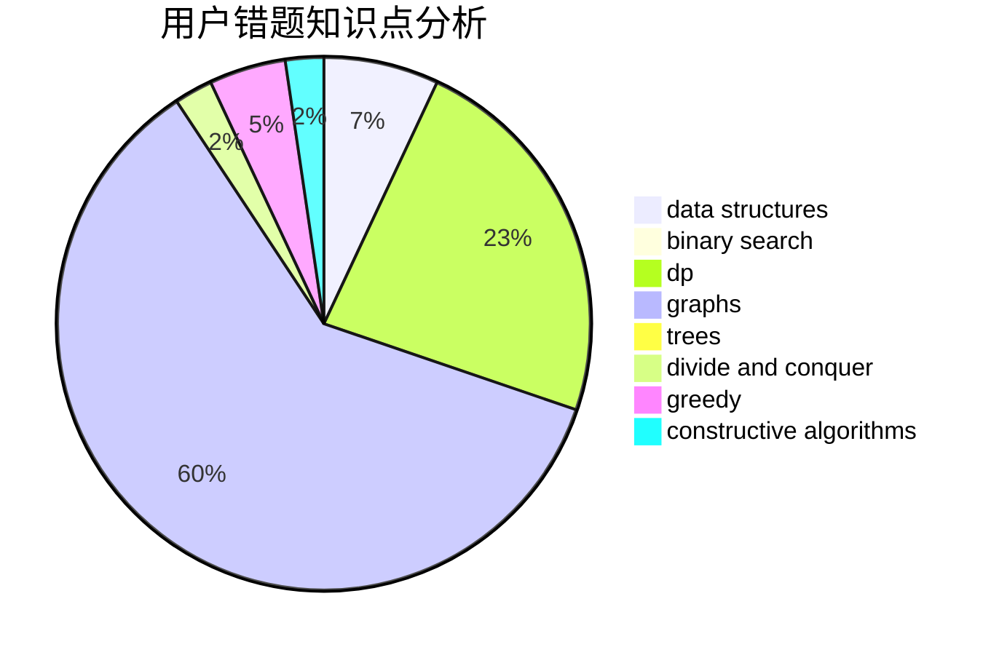

# Misaka-Mikoto-

<!-- tabs:start -->

#### **用户提交结果分析**

#### **用户做题类型偏好分析**

#### **用户错题知识点分析**

<!-- tabs:end -->
# 推荐题目
[1487C](https://codeforces.com/contest/1487/problem/C)		brute force,
                        constructive algorithms,
                        dfs and similar,
                        graphs,
                        greedy,
                        implementation,
                        math		  
[1070E](https://codeforces.com/contest/1070/problem/E)		binary search,
                        data structures		  
[1288D](https://codeforces.com/contest/1288/problem/D)		binary search,
                        bitmasks,
                        dp		  
[645F](https://codeforces.com/contest/645/problem/F)		combinatorics,
                        math,
                        number theory		  
[321C](https://codeforces.com/contest/321/problem/C)		constructive algorithms,
                        dfs and similar,
                        divide and conquer,
                        greedy,
                        trees		  
[729B](https://codeforces.com/contest/729/problem/B)		dp,
                        implementation		  
[1216A](https://codeforces.com/contest/1216/problem/A)		strings		  
[821D](https://codeforces.com/contest/821/problem/D)		dfs and similar,
                        graphs,
                        shortest paths		  
[235A](https://codeforces.com/contest/235/problem/A)		number theory		  
[1104C](https://codeforces.com/contest/1104/problem/C)		dsu,graphs,sortings,trees		  
