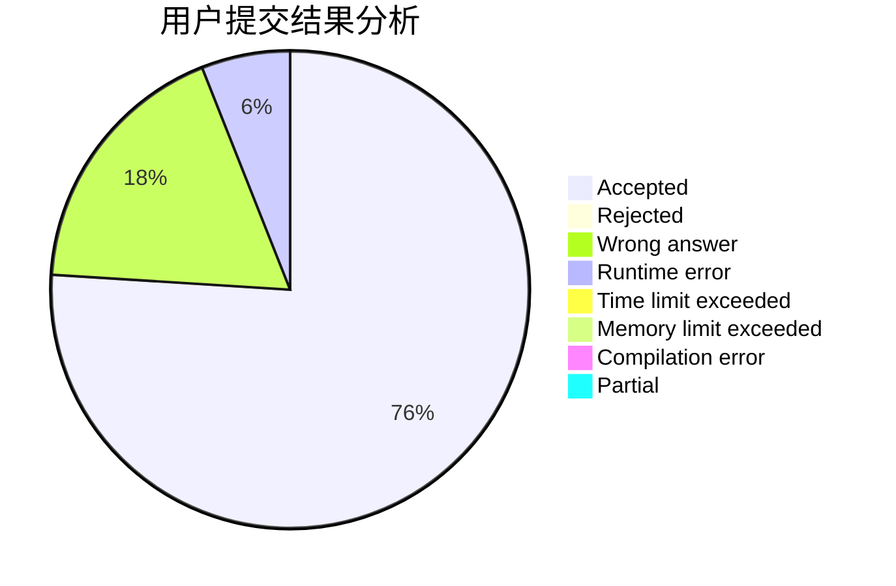
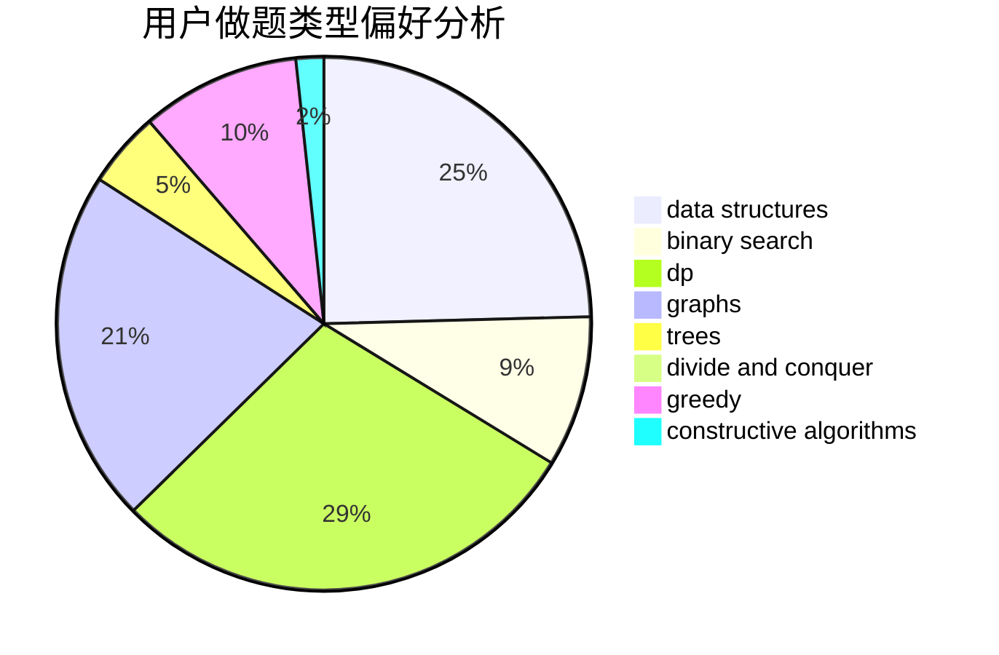
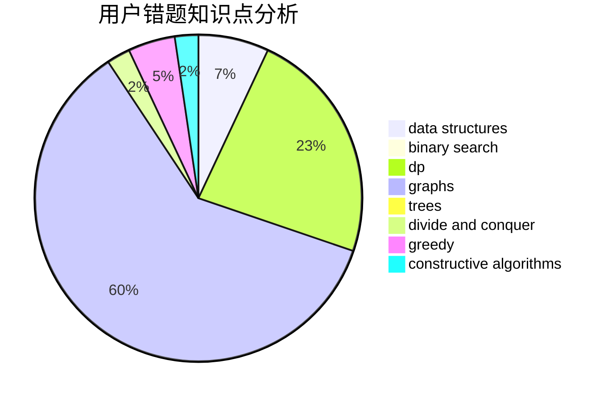

# Misaka-Mikoto-

<!-- tabs:start -->

#### **用户提交结果分析**

#### **用户做题类型偏好分析**

#### **用户错题知识点分析**

<!-- tabs:end -->
# 推荐题目
[1494F](https://codeforces.com/contest/1494/problem/F)		brute force,
                        constructive algorithms,
                        dfs and similar,
                        graphs,
                        implementation		  
[1070H](https://codeforces.com/contest/1070/problem/H)		brute force,
                        implementation		  
[1295F](https://codeforces.com/contest/1295/problem/F)		combinatorics,
                        dp,
                        probabilities		  
[672B](https://codeforces.com/contest/672/problem/B)		constructive algorithms,
                        implementation,
                        strings		  
[352E](https://codeforces.com/contest/352/problem/E)		dsu,graphs,sortings,trees		  
[746B](https://codeforces.com/contest/746/problem/B)		implementation,
                        strings		  
[1221E](https://codeforces.com/contest/1221/problem/E)		games		  
[841C](https://codeforces.com/contest/841/problem/C)		dsu,graphs,sortings,trees		  
[257D](https://codeforces.com/contest/257/problem/D)		greedy,
                        math		  
[1105A](https://codeforces.com/contest/1105/problem/A)		brute force,
                        implementation		  
