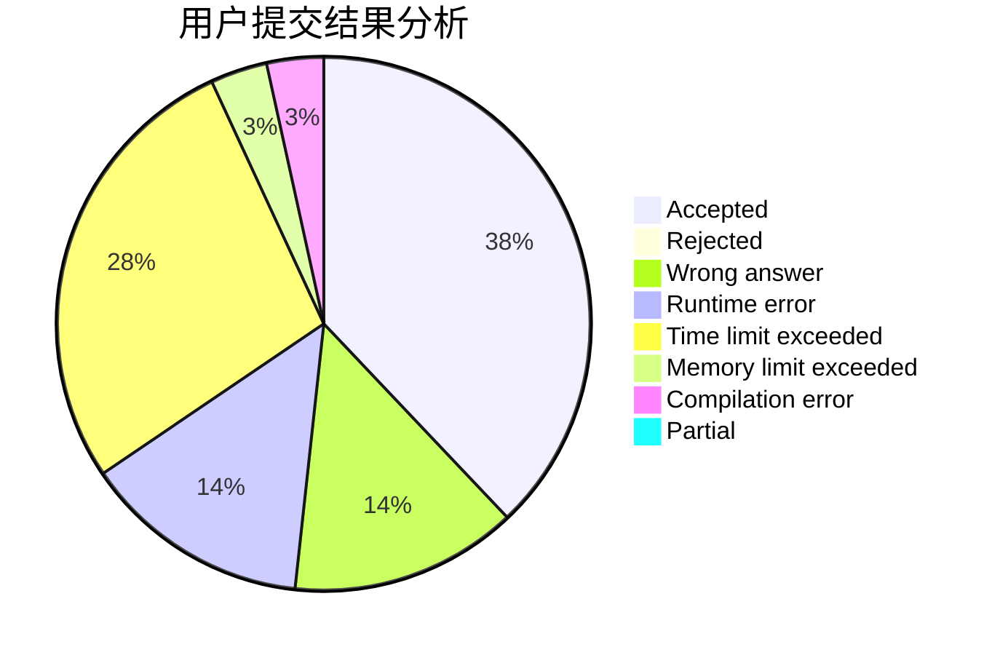
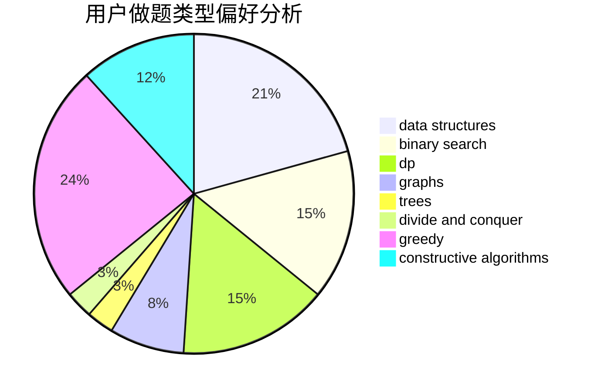
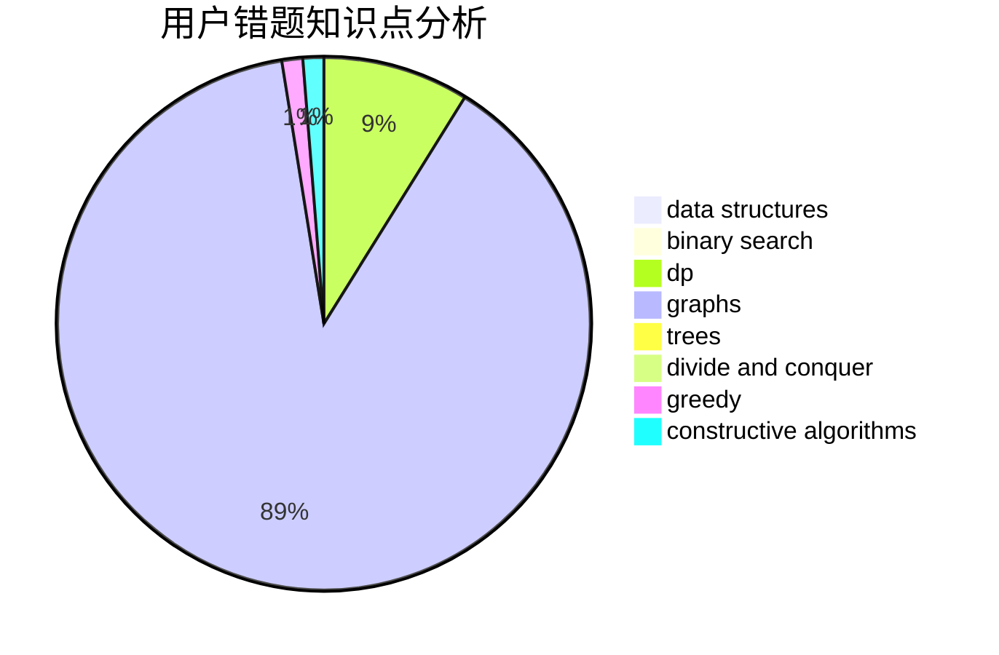

# Misaka19998

<!-- tabs:start -->

#### **用户提交结果分析**

#### **用户做题类型偏好分析**

#### **用户错题知识点分析**

<!-- tabs:end -->
# 推荐题目
[1423I](https://codeforces.com/contest/1423/problem/I)		bitmasks		  
[225E](https://codeforces.com/contest/225/problem/E)		math,
                        number theory		  
[500D](https://codeforces.com/contest/500/problem/D)		combinatorics,
                        dfs and similar,
                        graphs,
                        trees		  
[1300E](https://codeforces.com/contest/1300/problem/E)		dsu,graphs,sortings,trees		  
[701C](https://codeforces.com/contest/701/problem/C)		binary search,
                        strings,
                        two pointers		  
[710C](https://codeforces.com/contest/710/problem/C)		constructive algorithms,
                        math		  
[516C](https://codeforces.com/contest/516/problem/C)		dsu,graphs,sortings,trees		  
[827D](https://codeforces.com/contest/827/problem/D)		data structures,
                        dfs and similar,
                        graphs,
                        trees		  
[1496F](https://codeforces.com/contest/1496/problem/F)		dsu,graphs,sortings,trees		  
[1482C](https://codeforces.com/contest/1482/problem/C)		brute force,
                        constructive algorithms,
                        greedy,
                        implementation		  
