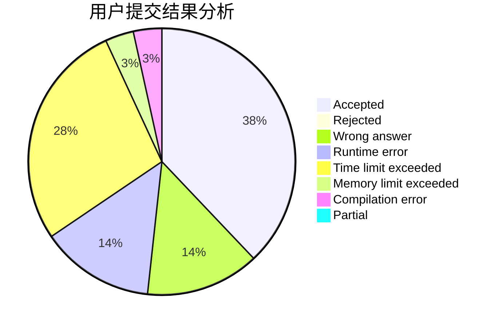
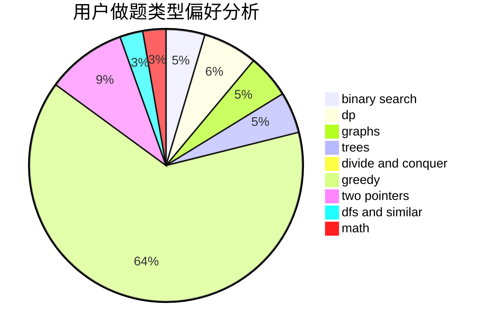

# Misaka19998

<!-- tabs:start -->

#### **用户提交结果分析**

#### **用户做题类型偏好分析**

<!-- tabs:end -->
# 推荐题目
[1423I](https://codeforces.com/contest/1423/problem/I)
[225E](https://codeforces.com/contest/225/problem/E)
[500D](https://codeforces.com/contest/500/problem/D)
[1300E](https://codeforces.com/contest/1300/problem/E)
[701C](https://codeforces.com/contest/701/problem/C)
[710C](https://codeforces.com/contest/710/problem/C)
[516C](https://codeforces.com/contest/516/problem/C)
[827D](https://codeforces.com/contest/827/problem/D)
[1496F](https://codeforces.com/contest/1496/problem/F)
[1482C](https://codeforces.com/contest/1482/problem/C)
