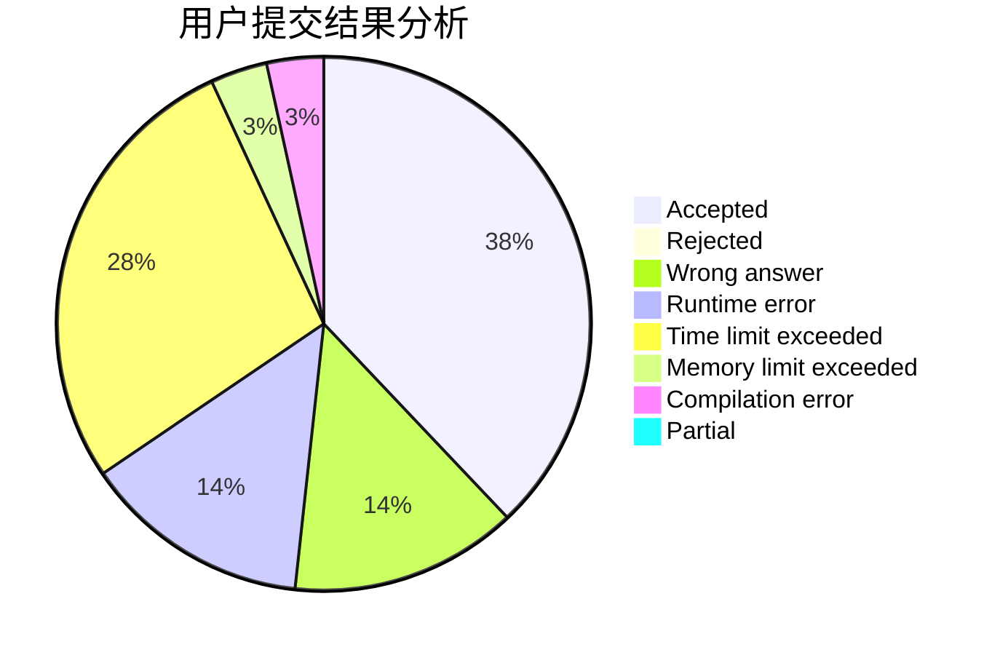
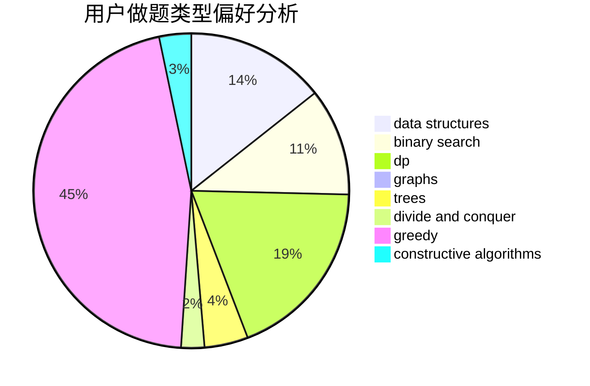
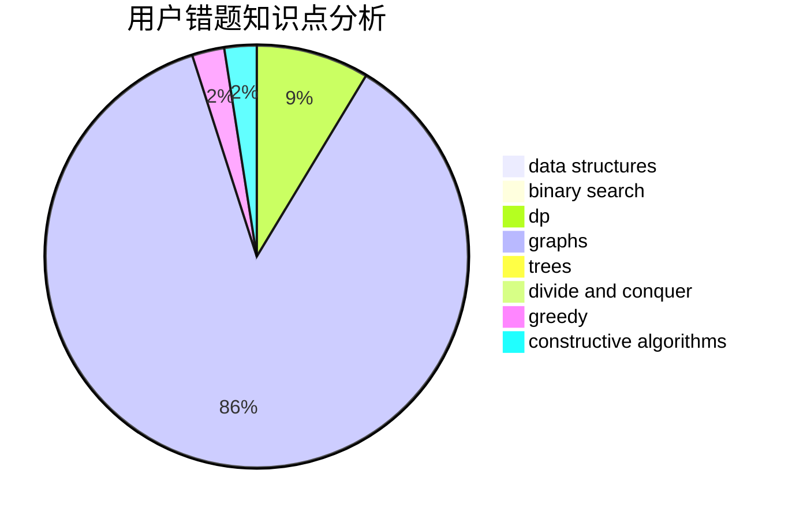

# Misaka19998

<!-- tabs:start -->

#### **用户提交结果分析**

#### **用户做题类型偏好分析**

#### **用户错题知识点分析**

<!-- tabs:end -->
# 推荐题目
[1415E](https://codeforces.com/contest/1415/problem/E)		constructive algorithms,
                        greedy,
                        math		  
[200C](https://codeforces.com/contest/200/problem/C)		brute force,
                        implementation		  
[480E](https://codeforces.com/contest/480/problem/E)		data structures,
                        divide and conquer		  
[1294C](https://codeforces.com/contest/1294/problem/C)		greedy,
                        math,
                        number theory		  
[677C](https://codeforces.com/contest/677/problem/C)		bitmasks,
                        combinatorics,
                        implementation,
                        strings		  
[690A2](https://codeforces.com/contest/690A/problem/2)		nan		  
[497B](https://codeforces.com/contest/497/problem/B)		dsu,graphs,sortings,trees		  
[809E](https://codeforces.com/contest/809/problem/E)		divide and conquer,
                        math,
                        number theory,
                        trees		  
[1488H](https://codeforces.com/contest/1488/problem/H)		*special problem,
                        combinatorics,
                        data structures		  
[1473F](https://codeforces.com/contest/1473/problem/F)		flows,
                        math		  
