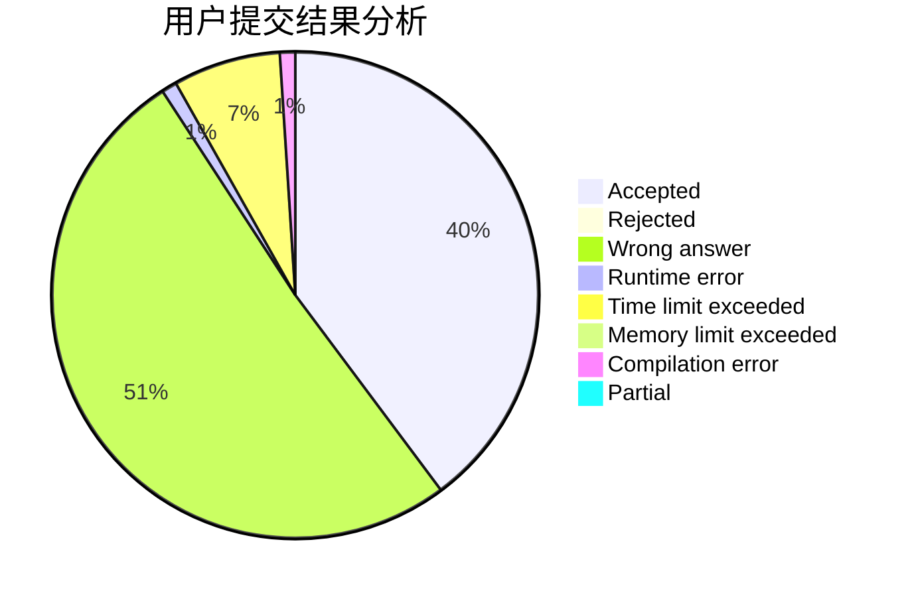
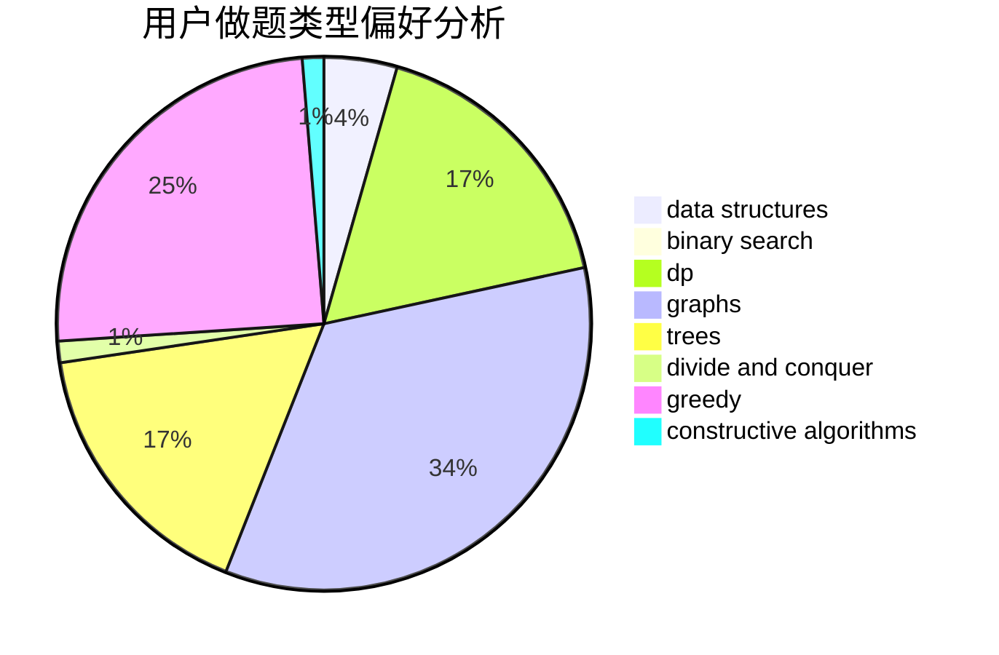
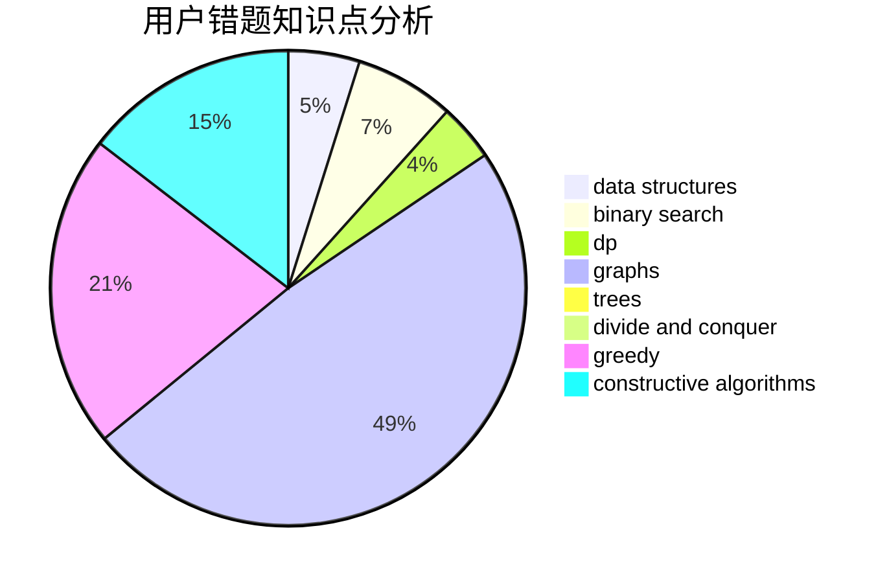

# 827852427

<!-- tabs:start -->

#### **用户提交结果分析**

#### **用户做题类型偏好分析**

#### **用户错题知识点分析**

<!-- tabs:end -->
# 推荐题目
[1439E](https://codeforces.com/contest/1439/problem/E)		bitmasks,
                        data structures,
                        games,
                        trees		  
[1073D](https://codeforces.com/contest/1073/problem/D)		binary search,
                        brute force,
                        data structures,
                        greedy		  
[1109F](https://codeforces.com/contest/1109/problem/F)		data structures,
                        trees		  
[1284D](https://codeforces.com/contest/1284/problem/D)		binary search,
                        data structures,
                        hashing,
                        sortings		  
[1016D](https://codeforces.com/contest/1016/problem/D)		constructive algorithms,
                        flows,
                        math		  
[1279A](https://codeforces.com/contest/1279/problem/A)		math		  
[1140G](https://codeforces.com/contest/1140/problem/G)		data structures,
                        divide and conquer,
                        shortest paths,
                        trees		  
[1439D](https://codeforces.com/contest/1439/problem/D)		combinatorics,
                        dp,
                        fft		  
[1151A](https://codeforces.com/contest/1151/problem/A)		brute force,
                        strings		  
[1045I](https://codeforces.com/contest/1045/problem/I)		hashing,
                        strings		  
