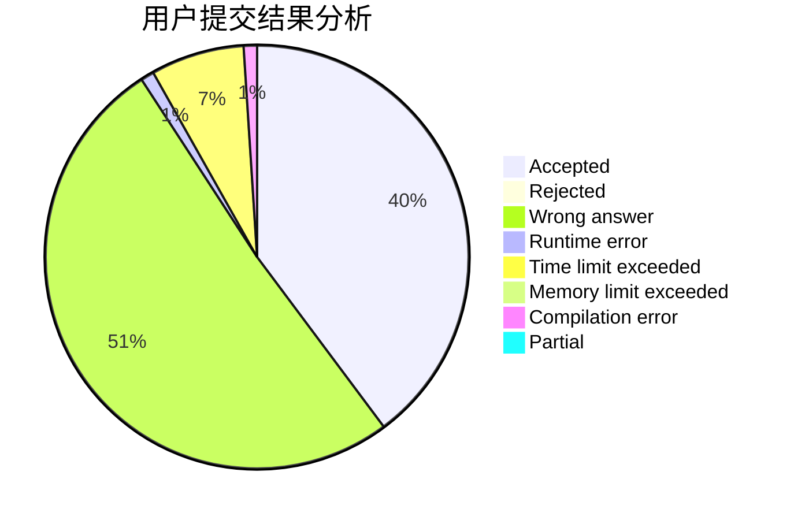
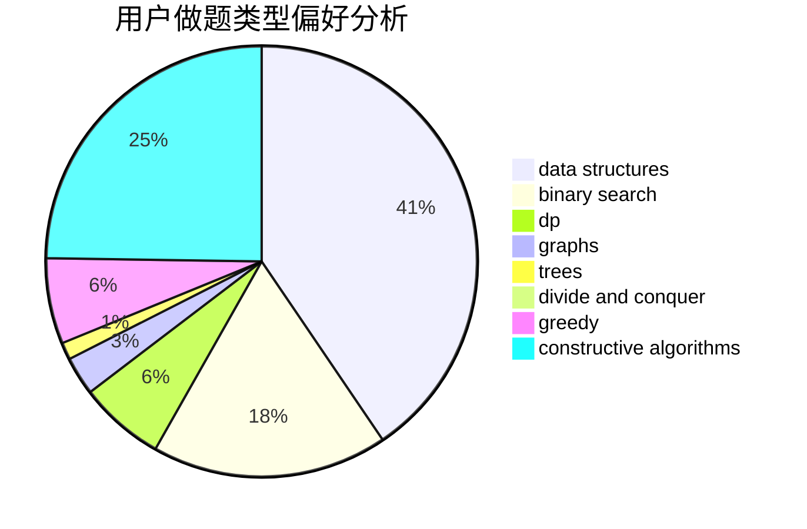
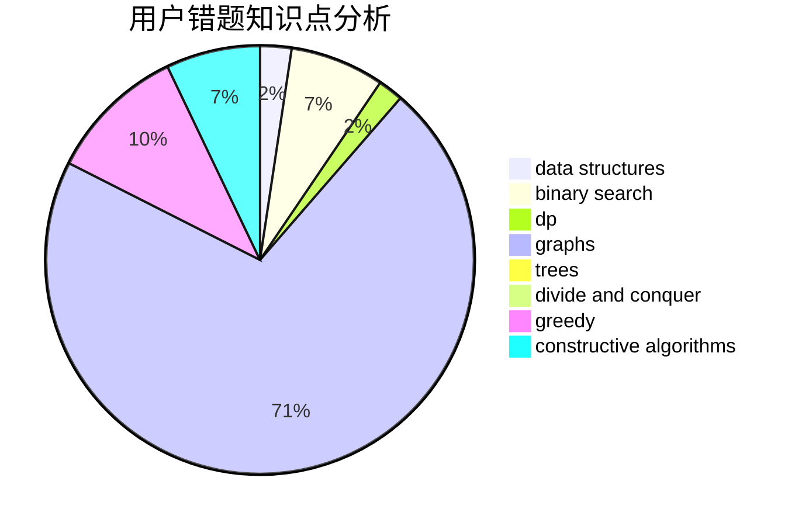

# 827852427

<!-- tabs:start -->

#### **用户提交结果分析**

#### **用户做题类型偏好分析**

#### **用户错题知识点分析**

<!-- tabs:end -->
# 推荐题目
[1430G](https://codeforces.com/contest/1430/problem/G)		bitmasks,
                        dfs and similar,
                        dp,
                        flows,
                        graphs,
                        math		  
[1073A](https://codeforces.com/contest/1073/problem/A)		implementation,
                        strings		  
[1109B](https://codeforces.com/contest/1109/problem/B)		constructive algorithms,
                        hashing,
                        strings		  
[1278B](https://codeforces.com/contest/1278/problem/B)		greedy,
                        math		  
[1016A](https://codeforces.com/contest/1016/problem/A)		greedy,
                        implementation,
                        math		  
[1270A](https://codeforces.com/contest/1270/problem/A)		games,
                        greedy,
                        math		  
[1139C](https://codeforces.com/contest/1139/problem/C)		dfs and similar,
                        dsu,
                        graphs,
                        math,
                        trees		  
[1430F](https://codeforces.com/contest/1430/problem/F)		dp,
                        greedy		  
[1149C](https://codeforces.com/contest/1149/problem/C)		data structures,
                        implementation,
                        trees		  
[1045E](https://codeforces.com/contest/1045/problem/E)		constructive algorithms,
                        geometry		  
