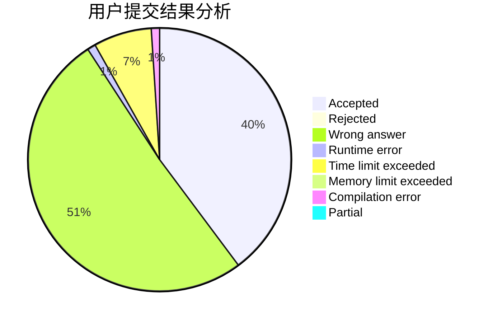
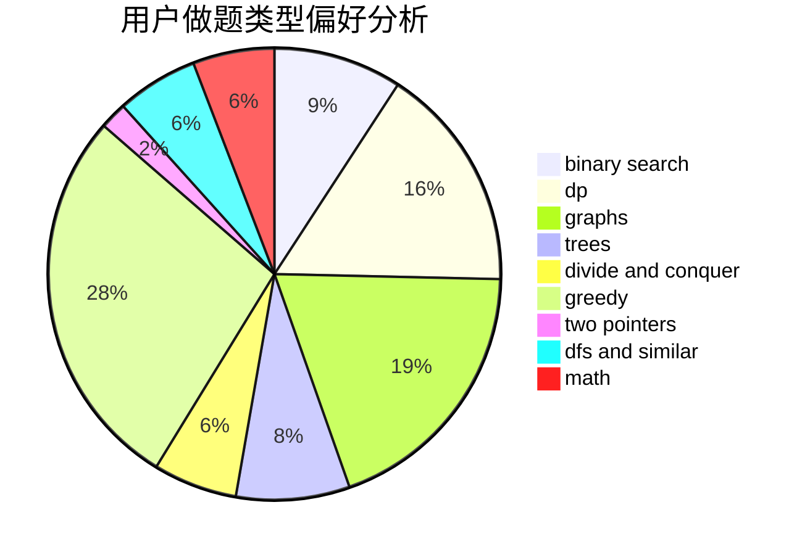

# 827852427

<!-- tabs:start -->

#### **用户提交结果分析**

#### **用户做题类型偏好分析**

<!-- tabs:end -->
# 推荐题目
[1439E](https://codeforces.com/contest/1439/problem/E)
[1073D](https://codeforces.com/contest/1073/problem/D)
[1109F](https://codeforces.com/contest/1109/problem/F)
[1284D](https://codeforces.com/contest/1284/problem/D)
[1016D](https://codeforces.com/contest/1016/problem/D)
[1279A](https://codeforces.com/contest/1279/problem/A)
[1140G](https://codeforces.com/contest/1140/problem/G)
[1439D](https://codeforces.com/contest/1439/problem/D)
[1151A](https://codeforces.com/contest/1151/problem/A)
[1045I](https://codeforces.com/contest/1045/problem/I)
