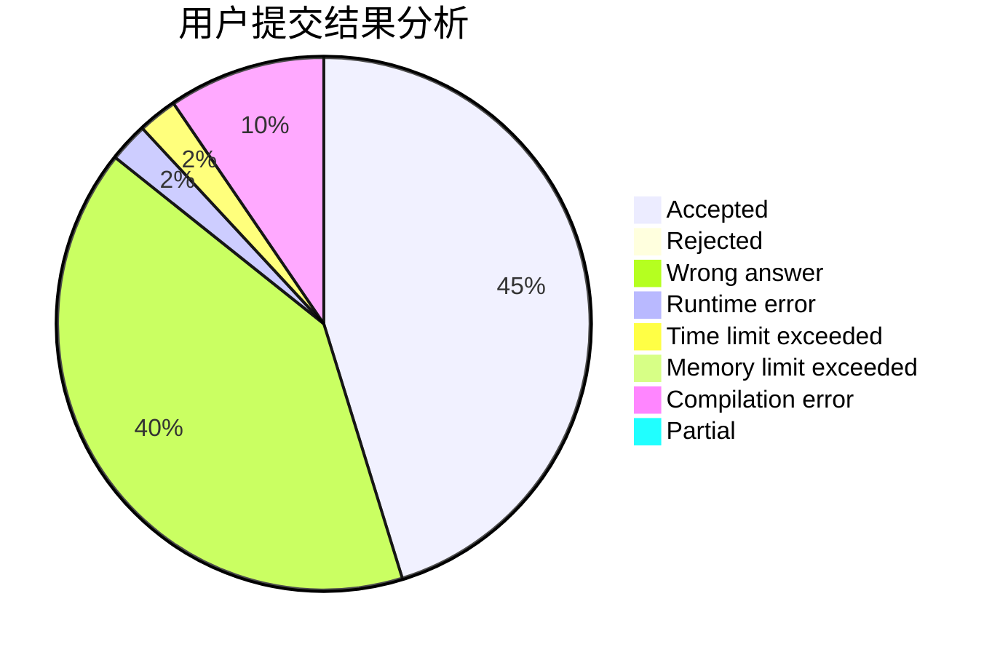
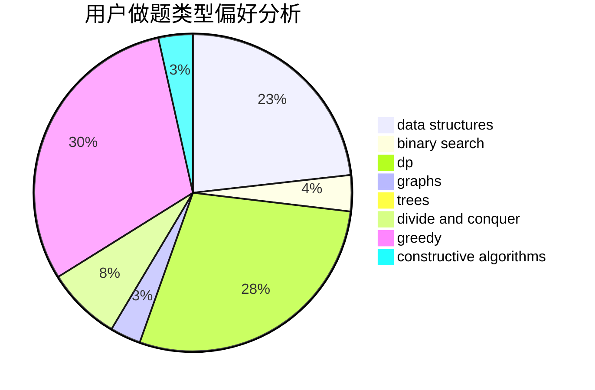

# Mister5

<!-- tabs:start -->

#### **用户提交结果分析**

#### **用户做题类型偏好分析**

#### **用户错题知识点分析**

<!-- tabs:end -->
# 推荐题目
[727F](https://codeforces.com/contest/727/problem/F)		binary search,
                        dp,
                        greedy		  
[12092](https://codeforces.com/contest/1209/problem/2)		dsu,graphs,sortings,trees		  
[1144B](https://codeforces.com/contest/1144/problem/B)		greedy,
                        implementation,
                        sortings		  
[1089A](https://codeforces.com/contest/1089/problem/A)		dp		  
[1121B](https://codeforces.com/contest/1121/problem/B)		brute force,
                        implementation		  
[697C](https://codeforces.com/contest/697/problem/C)		dsu,graphs,sortings,trees		  
[11291](https://codeforces.com/contest/1129/problem/1)		dsu,graphs,sortings,trees		  
[1110D](https://codeforces.com/contest/1110/problem/D)		dp		  
[977B](https://codeforces.com/contest/977/problem/B)		implementation,
                        strings		  
[509A](https://codeforces.com/contest/509/problem/A)		brute force,
                        implementation		  
