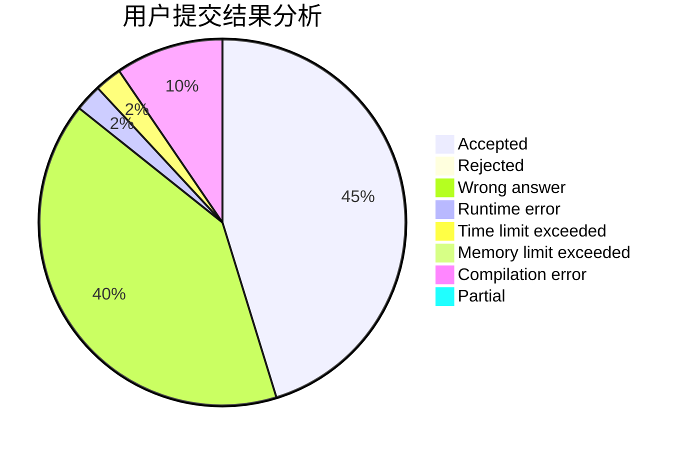
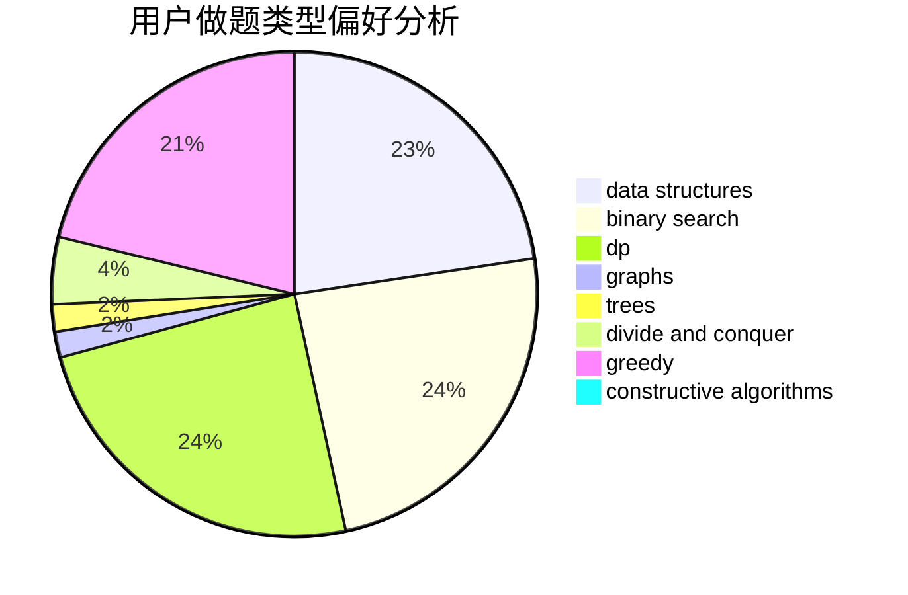

# Mister5
<!-- tabs:start -->
#### **用户提交结果分析**

#### **用户做题类型偏好分析**

#### **用户错题知识点分析**

<!-- tabs:end -->
# 推荐题目
[GCD Groups 2](http://codeforces.com/problemset/problem/1198/F)		greedy,
                        number theory,
                        probabilities		  
[Incorrect Flow](http://codeforces.com/problemset/problem/708/D)		flows		  
[Privatization of Roads in Treeland](http://codeforces.com/problemset/problem/1141/G)		binary search,
                        constructive algorithms,
                        dfs and similar,
                        graphs,
                        greedy,
                        trees		  
[Roads in Yusland](http://codeforces.com/problemset/problem/671/D)		data structures,
                        dp,
                        greedy		  
[Tourism](https://codeforces.com/contest/1314/problem/D)		dp,
                        graphs,
                        probabilities		  
[Cunning Gena](http://codeforces.com/problemset/problem/417/D)		bitmasks,
                        dp,
                        greedy,
                        sortings		  
[SwapSort](http://codeforces.com/problemset/problem/489/A)		greedy,
                        implementation,
                        sortings		  
[Kirk and a Binary String (easy version)](http://codeforces.com/problemset/problem/1204/D1)		brute force,
                        greedy,
                        strings		  
[Two Cakes](http://codeforces.com/problemset/problem/1130/B)		greedy		  
[Ehab and another another xor problem](http://codeforces.com/problemset/problem/1088/D)		bitmasks,
                        constructive algorithms,
                        implementation,
                        interactive		  
<!-- tabs:start -->
#### **data structures**
[GCD Groups 2](http://codeforces.com/problemset/problem/671/D)		data structures,
                        dp,
                        greedy		  
[Incorrect Flow](https://codeforces.com/contest/1248/problem/E)		data structures,
                        greedy,
                        implementation		  
[Privatization of Roads in Treeland](http://codeforces.com/problemset/problem/1286/E)		data structures,
                        strings		  
[Roads in Yusland](http://codeforces.com/problemset/problem/920/F)		brute force,
                        data structures,
                        dsu,
                        number theory		  
[Tourism](http://codeforces.com/problemset/problem/19/D)		data structures		  
[Cunning Gena](http://codeforces.com/problemset/problem/1492/C)		binary search,
                        data structures,
                        dp,
                        greedy,
                        two pointers		  
[SwapSort](http://codeforces.com/problemset/problem/1490/G)		binary search,
                        data structures,
                        math		  
[Kirk and a Binary String (easy version)](http://codeforces.com/problemset/problem/1479/D)		binary search,
                        bitmasks,
                        brute force,
                        data structures,
                        probabilities,
                        trees		  
[Two Cakes](http://codeforces.com/problemset/problem/1497/A)		brute force,
                        data structures,
                        greedy,
                        sortings		  
[Ehab and another another xor problem](http://codeforces.com/problemset/problem/1491/C)		brute force,
                        data structures,
                        dp,
                        greedy,
                        implementation		  
#### **binary search**
[GCD Groups 2](http://codeforces.com/problemset/problem/1141/G)		binary search,
                        constructive algorithms,
                        dfs and similar,
                        graphs,
                        greedy,
                        trees		  
[Incorrect Flow](http://codeforces.com/problemset/problem/1119/B)		binary search,
                        flows,
                        greedy,
                        sortings		  
[Privatization of Roads in Treeland](http://codeforces.com/problemset/problem/1119/D)		binary search,
                        sortings		  
[Roads in Yusland](http://codeforces.com/problemset/problem/958/F2)		binary search,
                        two pointers		  
[Tourism](http://codeforces.com/problemset/problem/1443/C)		binary search,
                        greedy,
                        sortings		  
[Cunning Gena](http://codeforces.com/problemset/problem/1442/E)		binary search,
                        constructive algorithms,
                        dfs and similar,
                        dp,
                        greedy,
                        trees		  
[SwapSort](https://codeforces.com/contest/1011/problem/C)		binary search,
                        math		  
[Kirk and a Binary String (easy version)](http://codeforces.com/problemset/problem/1492/C)		binary search,
                        data structures,
                        dp,
                        greedy,
                        two pointers		  
[Two Cakes](http://codeforces.com/problemset/problem/1463/D)		binary search,
                        constructive algorithms,
                        greedy,
                        two pointers		  
[Ehab and another another xor problem](http://codeforces.com/problemset/problem/1490/G)		binary search,
                        data structures,
                        math		  
#### **dp**
[GCD Groups 2](http://codeforces.com/problemset/problem/671/D)		data structures,
                        dp,
                        greedy		  
[Incorrect Flow](https://codeforces.com/contest/1314/problem/D)		dp,
                        graphs,
                        probabilities		  
[Privatization of Roads in Treeland](http://codeforces.com/problemset/problem/417/D)		bitmasks,
                        dp,
                        greedy,
                        sortings		  
[Roads in Yusland](https://codeforces.com/contest/781/problem/D)		bitmasks,
                        dp,
                        graphs,
                        matrices		  
[Tourism](http://codeforces.com/problemset/problem/115/D)		dp,
                        expression parsing		  
[Cunning Gena](http://codeforces.com/problemset/problem/653/B)		brute force,
                        dfs and similar,
                        dp,
                        strings		  
[SwapSort](http://codeforces.com/problemset/problem/1442/E)		binary search,
                        constructive algorithms,
                        dfs and similar,
                        dp,
                        greedy,
                        trees		  
[Kirk and a Binary String (easy version)](http://codeforces.com/problemset/problem/1492/C)		binary search,
                        data structures,
                        dp,
                        greedy,
                        two pointers		  
[Two Cakes](https://codeforces.com/contest/1457/problem/C)		brute force,
                        dp,
                        implementation		  
[Ehab and another another xor problem](http://codeforces.com/problemset/problem/1491/C)		brute force,
                        data structures,
                        dp,
                        greedy,
                        implementation		  
#### **graph**
[GCD Groups 2](http://codeforces.com/problemset/problem/1141/G)		binary search,
                        constructive algorithms,
                        dfs and similar,
                        graphs,
                        greedy,
                        trees		  
[Incorrect Flow](https://codeforces.com/contest/1314/problem/D)		dp,
                        graphs,
                        probabilities		  
[Privatization of Roads in Treeland](https://codeforces.com/contest/781/problem/D)		bitmasks,
                        dp,
                        graphs,
                        matrices		  
[Roads in Yusland](http://codeforces.com/problemset/problem/367/C)		graphs,
                        greedy,
                        sortings		  
[Tourism](http://codeforces.com/problemset/problem/1184/E2)		dfs and similar,
                        graphs,
                        shortest paths,
                        trees		  
[Cunning Gena](https://codeforces.com/contest/1162/problem/C)		graphs		  
[SwapSort](http://codeforces.com/problemset/problem/1133/F1)		graphs		  
[Kirk and a Binary String (easy version)](https://codeforces.com/contest/1064/problem/D)		graphs,
                        shortest paths		  
[Two Cakes](http://codeforces.com/problemset/problem/1439/A2)		constructive algorithms,
                        graphs,
                        greedy,
                        implementation		  
[Ehab and another another xor problem](http://codeforces.com/problemset/problem/1487/C)		brute force,
                        constructive algorithms,
                        dfs and similar,
                        graphs,
                        greedy,
                        implementation,
                        math		  
#### **trees**
[GCD Groups 2](http://codeforces.com/problemset/problem/1141/G)		binary search,
                        constructive algorithms,
                        dfs and similar,
                        graphs,
                        greedy,
                        trees		  
[Incorrect Flow](http://codeforces.com/problemset/problem/1184/E2)		dfs and similar,
                        graphs,
                        shortest paths,
                        trees		  
[Privatization of Roads in Treeland](http://codeforces.com/problemset/problem/1205/D)		constructive algorithms,
                        trees		  
[Roads in Yusland](http://codeforces.com/problemset/problem/1442/E)		binary search,
                        constructive algorithms,
                        dfs and similar,
                        dp,
                        greedy,
                        trees		  
[Tourism](http://codeforces.com/problemset/problem/1479/D)		binary search,
                        bitmasks,
                        brute force,
                        data structures,
                        probabilities,
                        trees		  
[Cunning Gena](http://codeforces.com/problemset/problem/1511/C)		brute force,
                        data structures,
                        implementation,
                        trees		  
[SwapSort](http://codeforces.com/problemset/problem/1499/F)		combinatorics,
                        dfs and similar,
                        dp,
                        trees		  
[Kirk and a Binary String (easy version)](http://codeforces.com/problemset/problem/1491/E)		brute force,
                        dfs and similar,
                        divide and conquer,
                        number theory,
                        trees		  
[Two Cakes](http://codeforces.com/problemset/problem/1466/D)		data structures,
                        greedy,
                        sortings,
                        trees		  
[Ehab and another another xor problem](http://codeforces.com/problemset/problem/1495/D)		combinatorics,
                        dfs and similar,
                        graphs,
                        math,
                        shortest paths,
                        trees		  
#### **divide and conquer**
[GCD Groups 2](http://codeforces.com/problemset/problem/1461/D)		binary search,
                        brute force,
                        data structures,
                        divide and conquer,
                        implementation,
                        sortings		  
[Incorrect Flow](http://codeforces.com/problemset/problem/1466/G)		combinatorics,
                        divide and conquer,
                        hashing,
                        math,
                        string suffix structures,
                        strings		  
[Privatization of Roads in Treeland](http://codeforces.com/problemset/problem/1490/D)		dfs and similar,
                        divide and conquer,
                        implementation		  
[Roads in Yusland](https://codeforces.com/contest/1483/problem/C)		data structures,
                        divide and conquer,
                        dp		  
[Tourism](http://codeforces.com/problemset/problem/1491/E)		brute force,
                        dfs and similar,
                        divide and conquer,
                        number theory,
                        trees		  
[Cunning Gena](http://codeforces.com/problemset/problem/1303/G)		data structures,
                        divide and conquer,
                        geometry,
                        trees		  
[SwapSort](http://codeforces.com/problemset/problem/1494/D)		constructive algorithms,
                        data structures,
                        dfs and similar,
                        divide and conquer,
                        dsu,
                        greedy,
                        sortings,
                        trees		  
[Kirk and a Binary String (easy version)](http://codeforces.com/problemset/problem/1482/E)		data structures,
                        divide and conquer,
                        dp		  
[Two Cakes](http://codeforces.com/problemset/problem/566/C)		dfs and similar,
                        divide and conquer,
                        trees		  
[Ehab and another another xor problem](http://codeforces.com/problemset/problem/1428/F)		binary search,
                        data structures,
                        divide and conquer,
                        dp,
                        two pointers		  
#### **greedy**
[GCD Groups 2](http://codeforces.com/problemset/problem/1198/F)		greedy,
                        number theory,
                        probabilities		  
[Incorrect Flow](http://codeforces.com/problemset/problem/1141/G)		binary search,
                        constructive algorithms,
                        dfs and similar,
                        graphs,
                        greedy,
                        trees		  
[Privatization of Roads in Treeland](http://codeforces.com/problemset/problem/671/D)		data structures,
                        dp,
                        greedy		  
[Roads in Yusland](http://codeforces.com/problemset/problem/417/D)		bitmasks,
                        dp,
                        greedy,
                        sortings		  
[Tourism](http://codeforces.com/problemset/problem/489/A)		greedy,
                        implementation,
                        sortings		  
[Cunning Gena](http://codeforces.com/problemset/problem/1204/D1)		brute force,
                        greedy,
                        strings		  
[SwapSort](http://codeforces.com/problemset/problem/1130/B)		greedy		  
[Kirk and a Binary String (easy version)](http://codeforces.com/problemset/problem/1119/B)		binary search,
                        flows,
                        greedy,
                        sortings		  
[Two Cakes](http://codeforces.com/problemset/problem/57/A)		dfs and similar,
                        greedy,
                        implementation		  
[Ehab and another another xor problem](http://codeforces.com/problemset/problem/367/C)		graphs,
                        greedy,
                        sortings		  
#### **constructive algorithms**
[GCD Groups 2](http://codeforces.com/problemset/problem/1141/G)		binary search,
                        constructive algorithms,
                        dfs and similar,
                        graphs,
                        greedy,
                        trees		  
[Incorrect Flow](http://codeforces.com/problemset/problem/1088/D)		bitmasks,
                        constructive algorithms,
                        implementation,
                        interactive		  
[Privatization of Roads in Treeland](http://codeforces.com/problemset/problem/357/B)		constructive algorithms,
                        implementation		  
[Roads in Yusland](http://codeforces.com/problemset/problem/1427/D)		constructive algorithms,
                        implementation		  
[Tourism](http://codeforces.com/problemset/problem/1205/D)		constructive algorithms,
                        trees		  
[Cunning Gena](http://codeforces.com/problemset/problem/1451/F)		constructive algorithms,
                        games		  
[SwapSort](http://codeforces.com/problemset/problem/1439/A2)		constructive algorithms,
                        graphs,
                        greedy,
                        implementation		  
[Kirk and a Binary String (easy version)](http://codeforces.com/problemset/problem/1327/C)		constructive algorithms,
                        implementation		  
[Two Cakes](http://codeforces.com/problemset/problem/1439/A1)		constructive algorithms,
                        implementation		  
[Ehab and another another xor problem](http://codeforces.com/problemset/problem/1401/B)		constructive algorithms,
                        greedy,
                        math		  
#### **sortings**
[GCD Groups 2](http://codeforces.com/problemset/problem/417/D)		bitmasks,
                        dp,
                        greedy,
                        sortings		  
[Incorrect Flow](http://codeforces.com/problemset/problem/489/A)		greedy,
                        implementation,
                        sortings		  
[Privatization of Roads in Treeland](http://codeforces.com/problemset/problem/1119/B)		binary search,
                        flows,
                        greedy,
                        sortings		  
[Roads in Yusland](http://codeforces.com/problemset/problem/367/C)		graphs,
                        greedy,
                        sortings		  
[Tourism](http://codeforces.com/problemset/problem/1121/A)		implementation,
                        sortings		  
[Cunning Gena](http://codeforces.com/problemset/problem/1119/D)		binary search,
                        sortings		  
[SwapSort](http://codeforces.com/problemset/problem/1165/E)		greedy,
                        math,
                        sortings		  
[Kirk and a Binary String (easy version)](http://codeforces.com/problemset/problem/1443/C)		binary search,
                        greedy,
                        sortings		  
[Two Cakes](https://codeforces.com/contest/1496/problem/C)		geometry,
                        greedy,
                        math,
                        sortings		  
[Ehab and another another xor problem](http://codeforces.com/problemset/problem/1495/A)		geometry,
                        greedy,
                        math,
                        sortings		  
<!-- tabs:end -->
