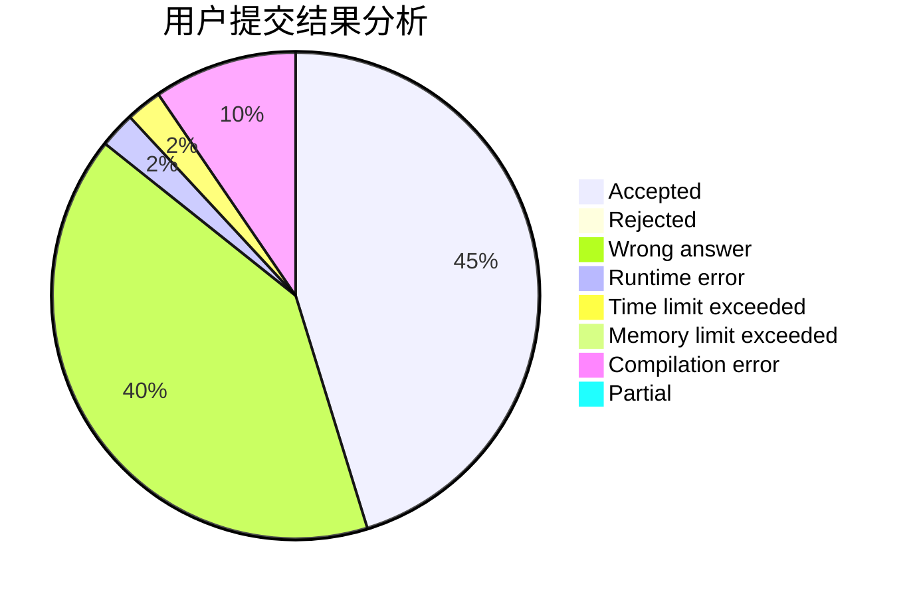
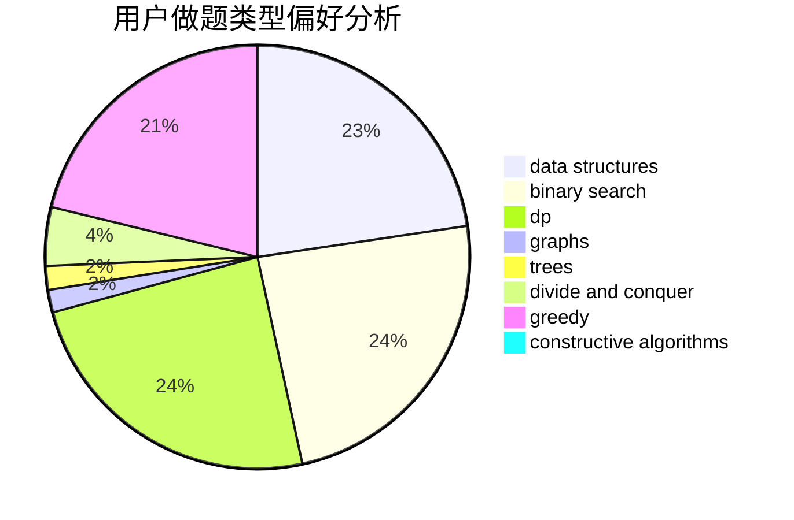

# Mister5

<!-- tabs:start -->

#### **用户提交结果分析**

#### **用户做题类型偏好分析**

#### **用户错题知识点分析**

<!-- tabs:end -->
# 推荐题目
[708D](https://codeforces.com/contest/708/problem/D)		flows		  
[1204D1](https://codeforces.com/contest/1204D/problem/1)		brute force,
                        greedy,
                        strings		  
[1141G](https://codeforces.com/contest/1141/problem/G)		binary search,
                        constructive algorithms,
                        dfs and similar,
                        graphs,
                        greedy,
                        trees		  
[1088D](https://codeforces.com/contest/1088/problem/D)		bitmasks,
                        constructive algorithms,
                        implementation,
                        interactive		  
[1119B](https://codeforces.com/contest/1119/problem/B)		binary search,
                        flows,
                        greedy,
                        sortings		  
[671D](https://codeforces.com/contest/671/problem/D)		data structures,
                        dp,
                        greedy		  
[1119D](https://codeforces.com/contest/1119/problem/D)		binary search,
                        sortings		  
[1110A](https://codeforces.com/contest/1110/problem/A)		math		  
[955B](https://codeforces.com/contest/955/problem/B)		implementation		  
[489A](https://codeforces.com/contest/489/problem/A)		greedy,
                        implementation,
                        sortings		  
