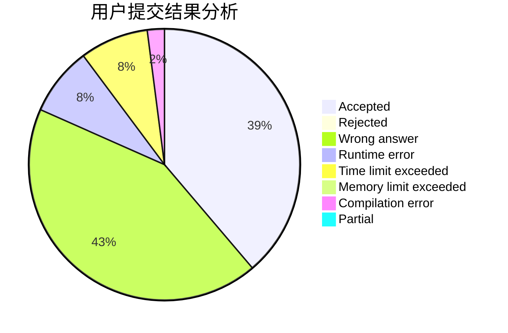
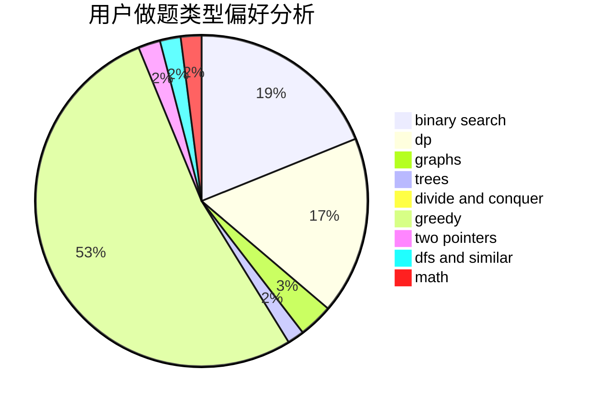

# Mitsukasa_Ayase

<!-- tabs:start -->

#### **用户提交结果分析**

#### **用户做题类型偏好分析**

<!-- tabs:end -->
# 推荐题目
[850F](https://codeforces.com/contest/850/problem/F)
[1279E](https://codeforces.com/contest/1279/problem/E)
[727F](https://codeforces.com/contest/727/problem/F)
[1187E](https://codeforces.com/contest/1187/problem/E)
[472G](https://codeforces.com/contest/472/problem/G)
[1238G](https://codeforces.com/contest/1238/problem/G)
[353D](https://codeforces.com/contest/353/problem/D)
[1225F](https://codeforces.com/contest/1225/problem/F)
[626F](https://codeforces.com/contest/626/problem/F)
[984A](https://codeforces.com/contest/984/problem/A)
