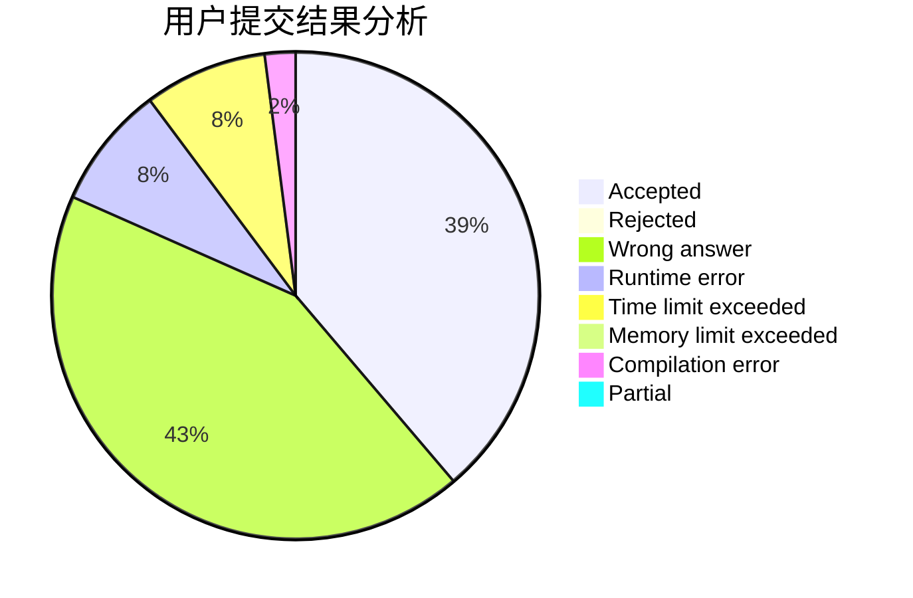
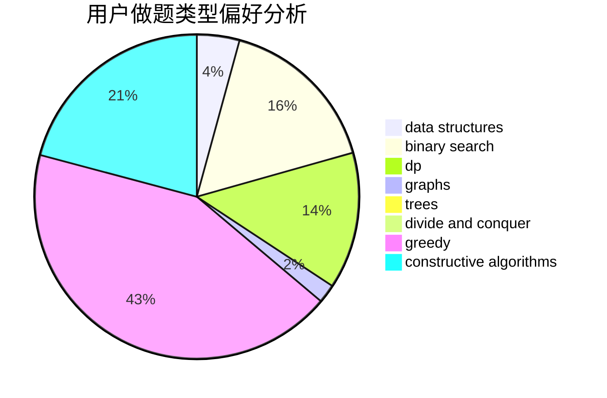
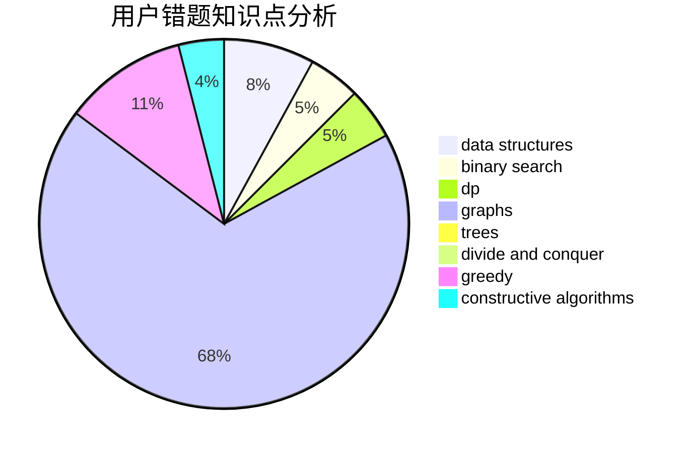

# Mitsukasa_Ayase

<!-- tabs:start -->

#### **用户提交结果分析**

#### **用户做题类型偏好分析**

#### **用户错题知识点分析**

<!-- tabs:end -->
# 推荐题目
[850F](https://codeforces.com/contest/850/problem/F)		math		  
[1279E](https://codeforces.com/contest/1279/problem/E)		combinatorics,
                        dp		  
[727F](https://codeforces.com/contest/727/problem/F)		binary search,
                        dp,
                        greedy		  
[1187E](https://codeforces.com/contest/1187/problem/E)		dfs and similar,
                        dp,
                        trees		  
[472G](https://codeforces.com/contest/472/problem/G)		bitmasks,
                        data structures,
                        fft		  
[1238G](https://codeforces.com/contest/1238/problem/G)		data structures,
                        greedy,
                        sortings		  
[353D](https://codeforces.com/contest/353/problem/D)		constructive algorithms,
                        dp		  
[1225F](https://codeforces.com/contest/1225/problem/F)		constructive algorithms,
                        greedy,
                        trees		  
[626F](https://codeforces.com/contest/626/problem/F)		dp		  
[984A](https://codeforces.com/contest/984/problem/A)		sortings		  
