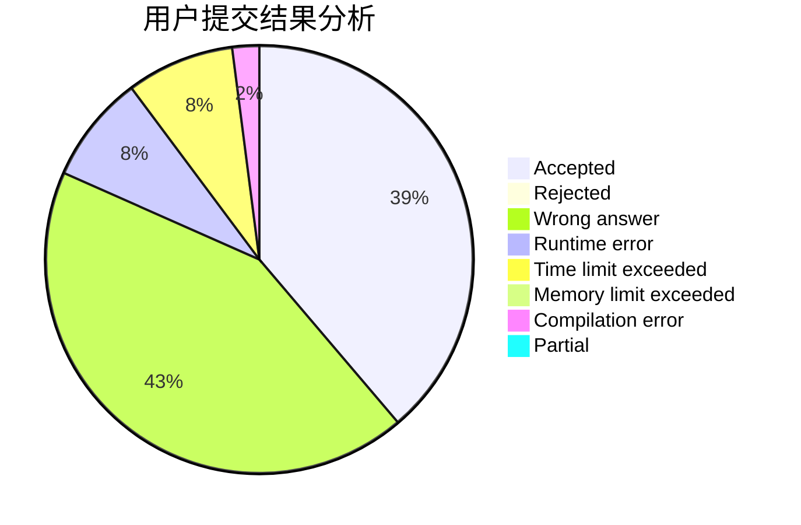
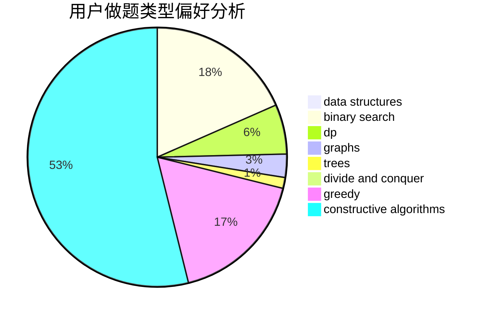
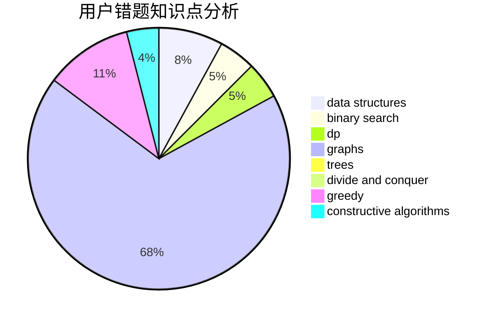

# Mitsukasa_Ayase

<!-- tabs:start -->

#### **用户提交结果分析**

#### **用户做题类型偏好分析**

#### **用户错题知识点分析**

<!-- tabs:end -->
# 推荐题目
[832D](https://codeforces.com/contest/832/problem/D)		dfs and similar,
                        graphs,
                        trees		  
[1270E](https://codeforces.com/contest/1270/problem/E)		constructive algorithms,
                        geometry,
                        math		  
[708D](https://codeforces.com/contest/708/problem/D)		flows		  
[1184B2](https://codeforces.com/contest/1184B/problem/2)		flows,
                        graph matchings,
                        graphs,
                        shortest paths,
                        sortings		  
[451E](https://codeforces.com/contest/451/problem/E)		bitmasks,
                        combinatorics,
                        number theory		  
[1230C](https://codeforces.com/contest/1230/problem/C)		dsu,graphs,sortings,trees		  
[321E](https://codeforces.com/contest/321/problem/E)		data structures,
                        divide and conquer,
                        dp		  
[1218H](https://codeforces.com/contest/1218/problem/H)		dfs and similar		  
[607E](https://codeforces.com/contest/607/problem/E)		binary search,
                        geometry		  
[961E](https://codeforces.com/contest/961/problem/E)		data structures		  
