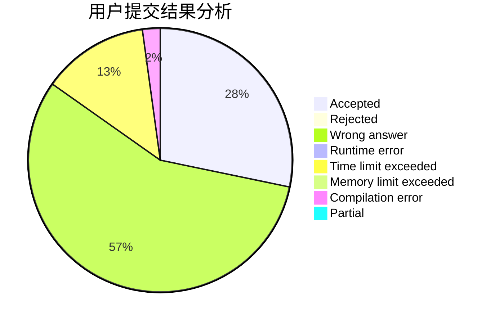
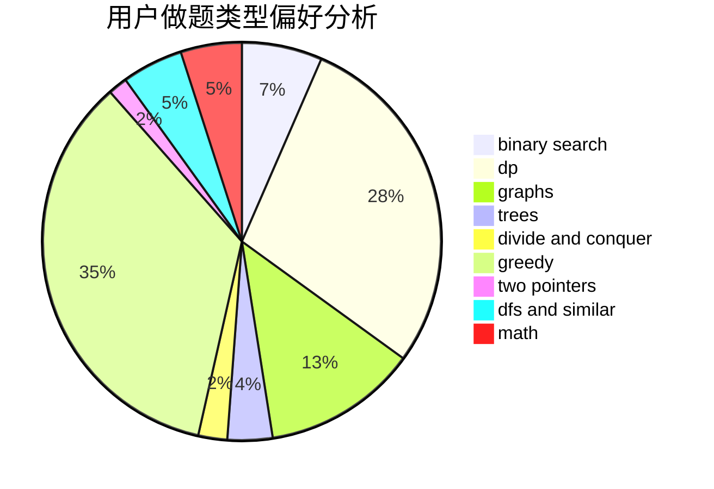

# Mitsunari

<!-- tabs:start -->

#### **用户提交结果分析**

#### **用户做题类型偏好分析**

<!-- tabs:end -->
# 推荐题目
[1325F](https://codeforces.com/contest/1325/problem/F)
[1091A](https://codeforces.com/contest/1091/problem/A)
[962C](https://codeforces.com/contest/962/problem/C)
[1297A](https://codeforces.com/contest/1297/problem/A)
[1063B](https://codeforces.com/contest/1063/problem/B)
[755C](https://codeforces.com/contest/755/problem/C)
[1071D](https://codeforces.com/contest/1071/problem/D)
[1153C](https://codeforces.com/contest/1153/problem/C)
[984B](https://codeforces.com/contest/984/problem/B)
[1198F](https://codeforces.com/contest/1198/problem/F)
