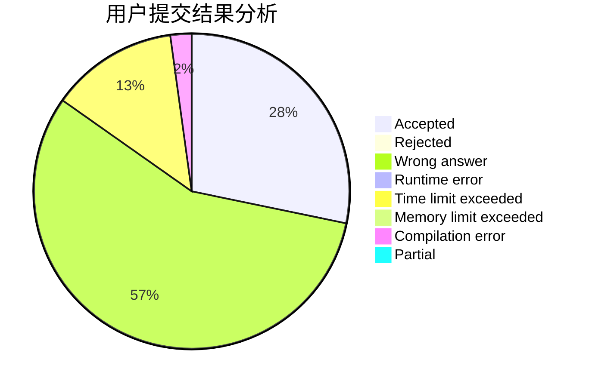
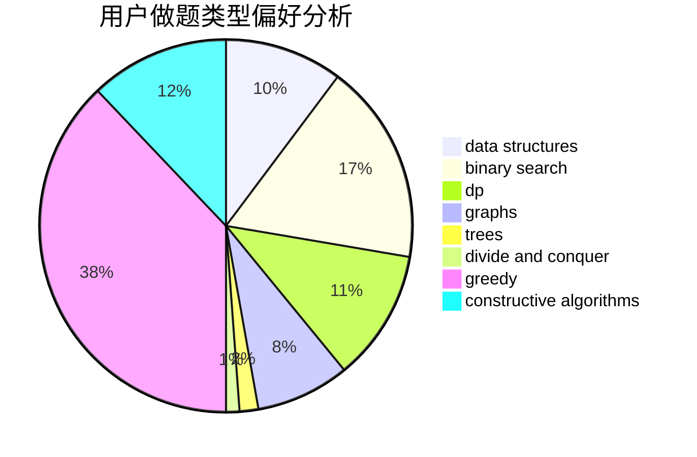

# Mitsunari

<!-- tabs:start -->

#### **用户提交结果分析**

#### **用户做题类型偏好分析**

#### **用户错题知识点分析**

<!-- tabs:end -->
# 推荐题目
[1316B](https://codeforces.com/contest/1316/problem/B)		brute force,
                        constructive algorithms,
                        implementation,
                        sortings,
                        strings		  
[1090D](https://codeforces.com/contest/1090/problem/D)		constructive algorithms		  
[940F](https://codeforces.com/contest/940/problem/F)		brute force,
                        data structures		  
[1290D](https://codeforces.com/contest/1290/problem/D)		constructive algorithms,
                        graphs,
                        interactive		  
[1062E](https://codeforces.com/contest/1062/problem/E)		binary search,
                        data structures,
                        dfs and similar,
                        greedy,
                        trees		  
[734D](https://codeforces.com/contest/734/problem/D)		implementation		  
[1071A](https://codeforces.com/contest/1071/problem/A)		dsu,graphs,sortings,trees		  
[1151C](https://codeforces.com/contest/1151/problem/C)		constructive algorithms,
                        math		  
[961F](https://codeforces.com/contest/961/problem/F)		binary search,
                        hashing,
                        string suffix structures		  
[1194D](https://codeforces.com/contest/1194/problem/D)		games,
                        math		  
