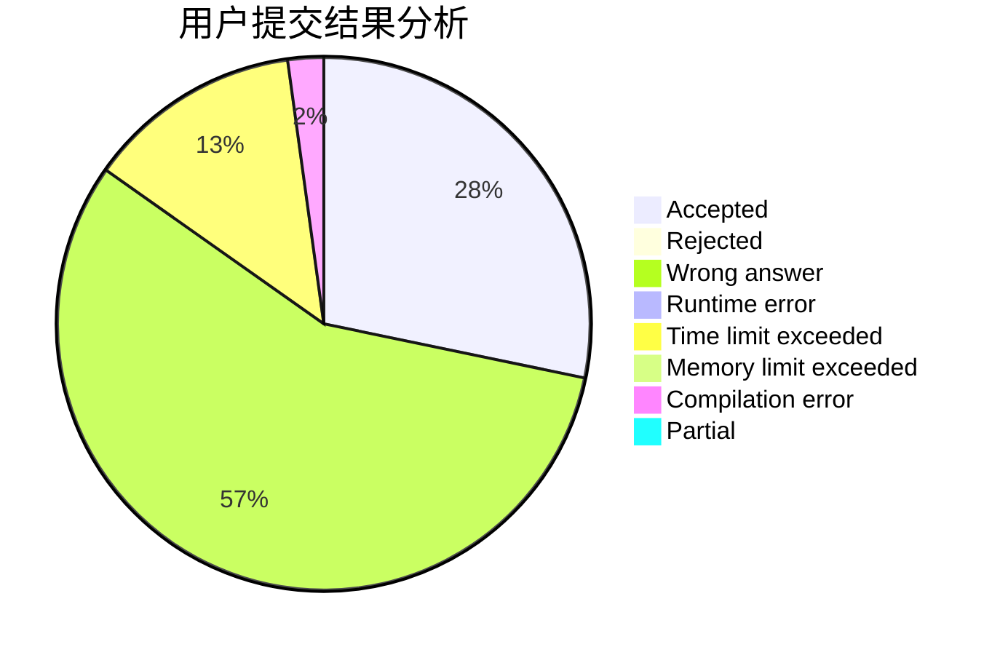
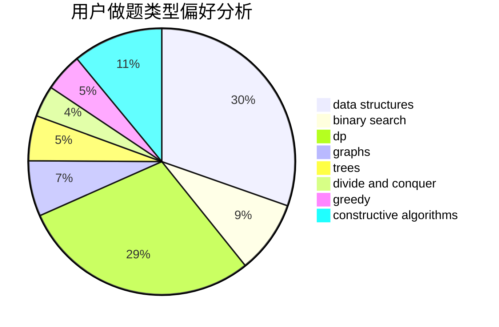

# Mitsunari

<!-- tabs:start -->

#### **用户提交结果分析**

#### **用户做题类型偏好分析**

#### **用户错题知识点分析**

<!-- tabs:end -->
# 推荐题目
[1325F](https://codeforces.com/contest/1325/problem/F)		constructive algorithms,
                        dfs and similar,
                        graphs,
                        greedy		  
[1091A](https://codeforces.com/contest/1091/problem/A)		brute force,
                        implementation,
                        math		  
[962C](https://codeforces.com/contest/962/problem/C)		brute force,
                        implementation,
                        math		  
[1297A](https://codeforces.com/contest/1297/problem/A)		*special problem,
                        implementation		  
[1063B](https://codeforces.com/contest/1063/problem/B)		graphs,
                        shortest paths		  
[755C](https://codeforces.com/contest/755/problem/C)		dfs and similar,
                        dsu,
                        graphs,
                        interactive,
                        trees		  
[1071D](https://codeforces.com/contest/1071/problem/D)		dsu,graphs,sortings,trees		  
[1153C](https://codeforces.com/contest/1153/problem/C)		greedy,
                        strings		  
[984B](https://codeforces.com/contest/984/problem/B)		implementation		  
[1198F](https://codeforces.com/contest/1198/problem/F)		greedy,
                        number theory,
                        probabilities		  
