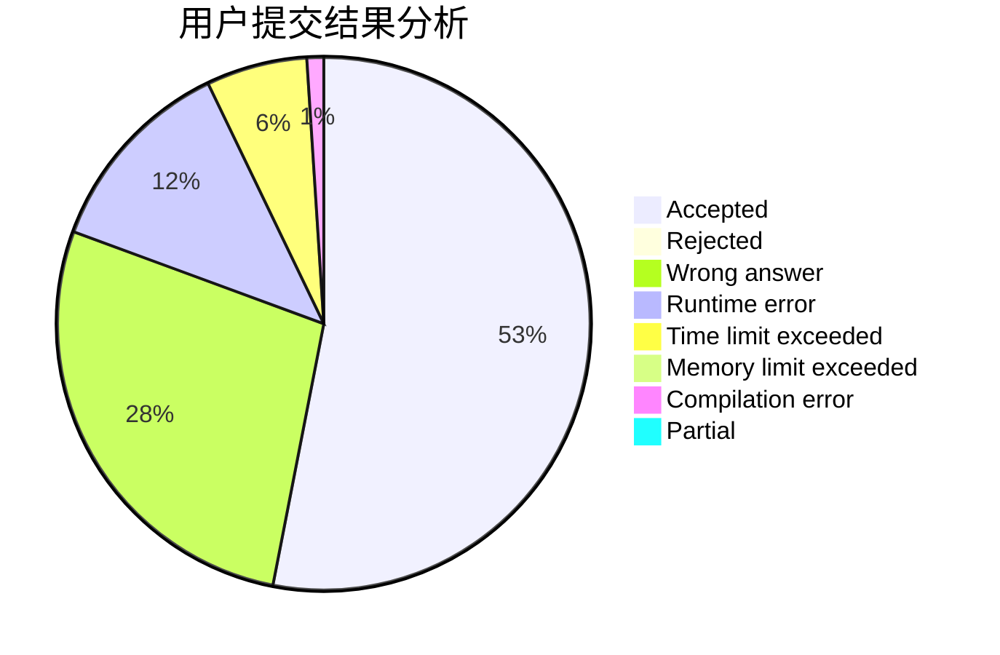
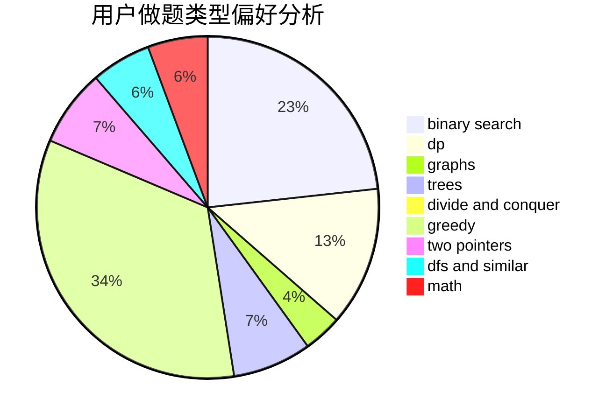

# Mivik

<!-- tabs:start -->

#### **用户提交结果分析**

#### **用户做题类型偏好分析**

<!-- tabs:end -->
# 推荐题目
[1329C](https://codeforces.com/contest/1329/problem/C)
[1148B](https://codeforces.com/contest/1148/problem/B)
[497D](https://codeforces.com/contest/497/problem/D)
[157B](https://codeforces.com/contest/157/problem/B)
[1362E](https://codeforces.com/contest/1362/problem/E)
[812A](https://codeforces.com/contest/812/problem/A)
[577E](https://codeforces.com/contest/577/problem/E)
[550B](https://codeforces.com/contest/550/problem/B)
[597B](https://codeforces.com/contest/597/problem/B)
[1172A](https://codeforces.com/contest/1172/problem/A)
