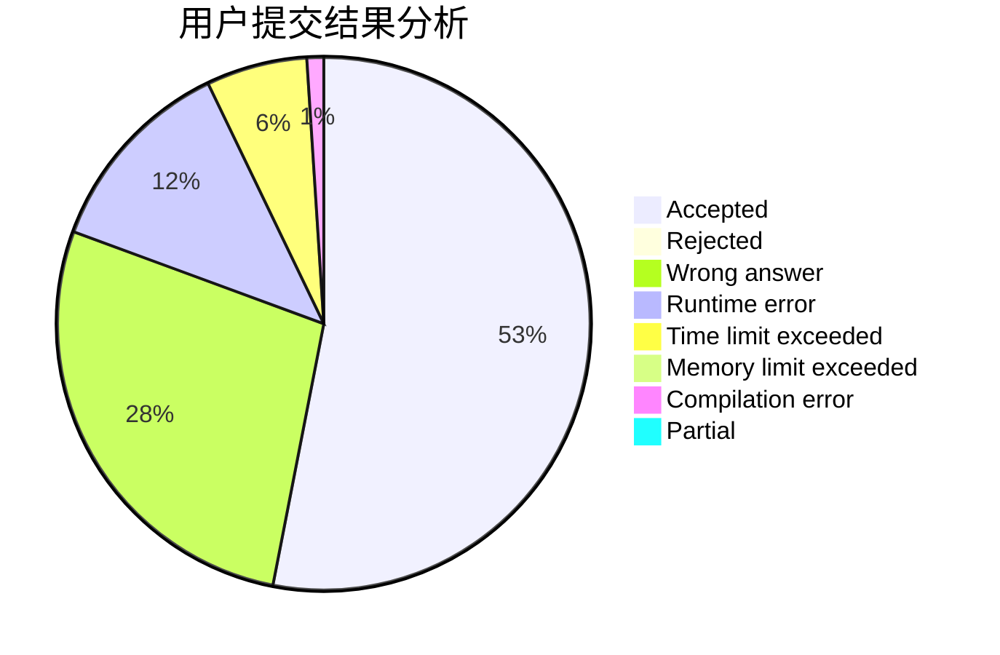
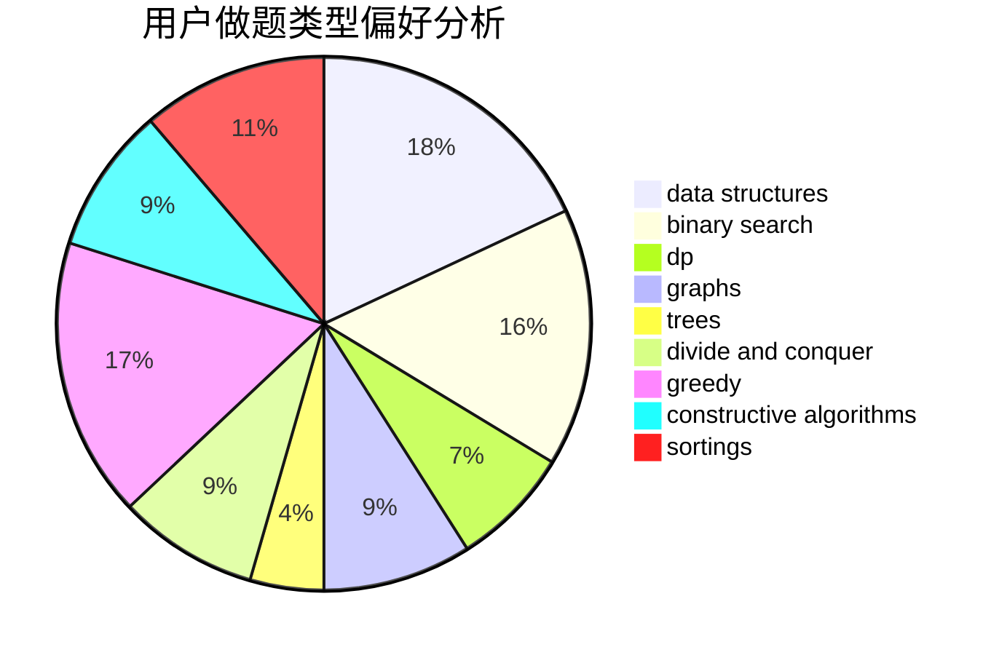
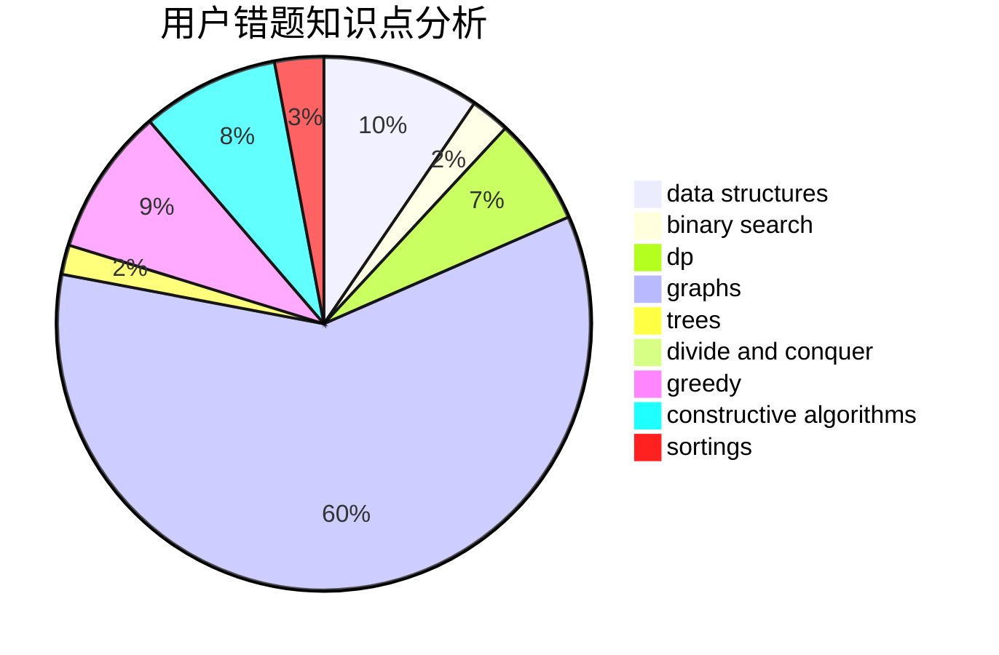

# Mivik
<!-- tabs:start -->
#### **用户提交结果分析**

#### **用户做题类型偏好分析**

#### **用户错题知识点分析**

<!-- tabs:end -->
# 推荐题目
[477D](http://codeforces.com/problemset/problem/477/D)		dp,
                        strings		  
[1322D](http://codeforces.com/problemset/problem/1322/D)		bitmasks,
                        dp		  
[1146B](http://codeforces.com/problemset/problem/1146/B)		implementation,
                        strings		  
[1003B](http://codeforces.com/problemset/problem/1003/B)		constructive algorithms		  
[870A](http://codeforces.com/problemset/problem/870/A)		brute force,
                        implementation		  
[691B](http://codeforces.com/problemset/problem/691/B)		implementation,
                        strings		  
[1206D](https://codeforces.com/contest/1206/problem/D)		bitmasks,
                        brute force,
                        graphs,
                        shortest paths		  
[606C](https://codeforces.com/contest/606/problem/C)		constructive algorithms,
                        greedy		  
[1355F](http://codeforces.com/problemset/problem/1355/F)		constructive algorithms,
                        interactive,
                        number theory		  
[229B](http://codeforces.com/problemset/problem/229/B)		binary search,
                        data structures,
                        graphs,
                        shortest paths		  
<!-- tabs:start -->
#### **data structures**
[229B](http://codeforces.com/problemset/problem/229/B)		binary search,
                        data structures,
                        graphs,
                        shortest paths		  
[1379F2](http://codeforces.com/problemset/problem/1379/F2)		data structures,
                        divide and conquer		  
[920E](http://codeforces.com/problemset/problem/920/E)		data structures,
                        dfs and similar,
                        dsu,
                        graphs		  
[91B](http://codeforces.com/problemset/problem/91/B)		binary search,
                        data structures		  
[1329C](http://codeforces.com/problemset/problem/1329/C)		constructive algorithms,
                        data structures,
                        greedy,
                        implementation		  
[1458F](http://codeforces.com/problemset/problem/1458/F)		data structures,
                        trees		  
[932F](http://codeforces.com/problemset/problem/932/F)		data structures,
                        dp,
                        geometry		  
[1358E](http://codeforces.com/problemset/problem/1358/E)		constructive algorithms,
                        data structures,
                        greedy,
                        implementation		  
[1492C](http://codeforces.com/problemset/problem/1492/C)		binary search,
                        data structures,
                        dp,
                        greedy,
                        two pointers		  
[1490G](http://codeforces.com/problemset/problem/1490/G)		binary search,
                        data structures,
                        math		  
#### **binary search**
[229B](http://codeforces.com/problemset/problem/229/B)		binary search,
                        data structures,
                        graphs,
                        shortest paths		  
[847E](http://codeforces.com/problemset/problem/847/E)		binary search,
                        dp		  
[961F](http://codeforces.com/problemset/problem/961/F)		binary search,
                        hashing,
                        string suffix structures		  
[1138A](http://codeforces.com/problemset/problem/1138/A)		binary search,
                        greedy,
                        implementation		  
[91B](http://codeforces.com/problemset/problem/91/B)		binary search,
                        data structures		  
[1492C](http://codeforces.com/problemset/problem/1492/C)		binary search,
                        data structures,
                        dp,
                        greedy,
                        two pointers		  
[1463D](http://codeforces.com/problemset/problem/1463/D)		binary search,
                        constructive algorithms,
                        greedy,
                        two pointers		  
[1490G](http://codeforces.com/problemset/problem/1490/G)		binary search,
                        data structures,
                        math		  
[1479D](http://codeforces.com/problemset/problem/1479/D)		binary search,
                        bitmasks,
                        brute force,
                        data structures,
                        probabilities,
                        trees		  
[1436E](http://codeforces.com/problemset/problem/1436/E)		binary search,
                        data structures,
                        two pointers		  
#### **dp**
[477D](http://codeforces.com/problemset/problem/477/D)		dp,
                        strings		  
[1322D](http://codeforces.com/problemset/problem/1322/D)		bitmasks,
                        dp		  
[747F](http://codeforces.com/problemset/problem/747/F)		brute force,
                        combinatorics,
                        dp,
                        math		  
[724E](http://codeforces.com/problemset/problem/724/E)		dp,
                        flows,
                        greedy		  
[1185G1](http://codeforces.com/problemset/problem/1185/G1)		bitmasks,
                        combinatorics,
                        dp		  
[1202B](http://codeforces.com/problemset/problem/1202/B)		brute force,
                        dp,
                        shortest paths		  
[847E](http://codeforces.com/problemset/problem/847/E)		binary search,
                        dp		  
[560E](https://codeforces.com/contest/560/problem/E)		combinatorics,
                        dp,
                        math,
                        number theory		  
[552C](http://codeforces.com/problemset/problem/552/C)		brute force,
                        dp,
                        greedy,
                        math,
                        meet-in-the-middle,
                        number theory		  
[480C](https://codeforces.com/contest/480/problem/C)		combinatorics,
                        dp		  
#### **graph**
[1206D](https://codeforces.com/contest/1206/problem/D)		bitmasks,
                        brute force,
                        graphs,
                        shortest paths		  
[229B](http://codeforces.com/problemset/problem/229/B)		binary search,
                        data structures,
                        graphs,
                        shortest paths		  
[939D](http://codeforces.com/problemset/problem/939/D)		dfs and similar,
                        dsu,
                        graphs,
                        greedy,
                        strings		  
[908F](http://codeforces.com/problemset/problem/908/F)		graphs,
                        greedy,
                        implementation		  
[920E](http://codeforces.com/problemset/problem/920/E)		data structures,
                        dfs and similar,
                        dsu,
                        graphs		  
[590E](http://codeforces.com/problemset/problem/590/E)		graph matchings,
                        strings		  
[1320B](http://codeforces.com/problemset/problem/1320/B)		dfs and similar,
                        graphs,
                        shortest paths		  
[845G](http://codeforces.com/problemset/problem/845/G)		dfs and similar,
                        graphs,
                        math		  
[545E](http://codeforces.com/problemset/problem/545/E)		graphs,
                        greedy,
                        shortest paths		  
[1487C](http://codeforces.com/problemset/problem/1487/C)		brute force,
                        constructive algorithms,
                        dfs and similar,
                        graphs,
                        greedy,
                        implementation,
                        math		  
#### **trees**
[1458F](http://codeforces.com/problemset/problem/1458/F)		data structures,
                        trees		  
[1479D](http://codeforces.com/problemset/problem/1479/D)		binary search,
                        bitmasks,
                        brute force,
                        data structures,
                        probabilities,
                        trees		  
[1511C](http://codeforces.com/problemset/problem/1511/C)		brute force,
                        data structures,
                        implementation,
                        trees		  
[1499F](http://codeforces.com/problemset/problem/1499/F)		combinatorics,
                        dfs and similar,
                        dp,
                        trees		  
[1491E](http://codeforces.com/problemset/problem/1491/E)		brute force,
                        dfs and similar,
                        divide and conquer,
                        number theory,
                        trees		  
[1466D](http://codeforces.com/problemset/problem/1466/D)		data structures,
                        greedy,
                        sortings,
                        trees		  
[1495D](http://codeforces.com/problemset/problem/1495/D)		combinatorics,
                        dfs and similar,
                        graphs,
                        math,
                        shortest paths,
                        trees		  
[1303G](http://codeforces.com/problemset/problem/1303/G)		data structures,
                        divide and conquer,
                        geometry,
                        trees		  
[1454E](http://codeforces.com/problemset/problem/1454/E)		combinatorics,
                        dfs and similar,
                        graphs,
                        trees		  
[1494D](http://codeforces.com/problemset/problem/1494/D)		constructive algorithms,
                        data structures,
                        dfs and similar,
                        divide and conquer,
                        dsu,
                        greedy,
                        sortings,
                        trees		  
#### **divide and conquer**
[1379F2](http://codeforces.com/problemset/problem/1379/F2)		data structures,
                        divide and conquer		  
[1461D](http://codeforces.com/problemset/problem/1461/D)		binary search,
                        brute force,
                        data structures,
                        divide and conquer,
                        implementation,
                        sortings		  
[1466G](http://codeforces.com/problemset/problem/1466/G)		combinatorics,
                        divide and conquer,
                        hashing,
                        math,
                        string suffix structures,
                        strings		  
[1490D](http://codeforces.com/problemset/problem/1490/D)		dfs and similar,
                        divide and conquer,
                        implementation		  
[1483C](https://codeforces.com/contest/1483/problem/C)		data structures,
                        divide and conquer,
                        dp		  
[1491E](http://codeforces.com/problemset/problem/1491/E)		brute force,
                        dfs and similar,
                        divide and conquer,
                        number theory,
                        trees		  
[1303G](http://codeforces.com/problemset/problem/1303/G)		data structures,
                        divide and conquer,
                        geometry,
                        trees		  
[1494D](http://codeforces.com/problemset/problem/1494/D)		constructive algorithms,
                        data structures,
                        dfs and similar,
                        divide and conquer,
                        dsu,
                        greedy,
                        sortings,
                        trees		  
[1482E](http://codeforces.com/problemset/problem/1482/E)		data structures,
                        divide and conquer,
                        dp		  
[566C](http://codeforces.com/problemset/problem/566/C)		dfs and similar,
                        divide and conquer,
                        trees		  
#### **greedy**
[606C](https://codeforces.com/contest/606/problem/C)		constructive algorithms,
                        greedy		  
[939D](http://codeforces.com/problemset/problem/939/D)		dfs and similar,
                        dsu,
                        graphs,
                        greedy,
                        strings		  
[724E](http://codeforces.com/problemset/problem/724/E)		dp,
                        flows,
                        greedy		  
[526B](http://codeforces.com/problemset/problem/526/B)		dfs and similar,
                        greedy,
                        implementation		  
[461A](http://codeforces.com/problemset/problem/461/A)		greedy,
                        sortings		  
[908F](http://codeforces.com/problemset/problem/908/F)		graphs,
                        greedy,
                        implementation		  
[1167D](http://codeforces.com/problemset/problem/1167/D)		constructive algorithms,
                        greedy		  
[486B](http://codeforces.com/problemset/problem/486/B)		greedy,
                        hashing,
                        implementation		  
[552C](http://codeforces.com/problemset/problem/552/C)		brute force,
                        dp,
                        greedy,
                        math,
                        meet-in-the-middle,
                        number theory		  
[1397E](https://codeforces.com/contest/1397/problem/E)		dp,
                        greedy,
                        implementation		  
#### **constructive algorithms**
[1003B](http://codeforces.com/problemset/problem/1003/B)		constructive algorithms		  
[606C](https://codeforces.com/contest/606/problem/C)		constructive algorithms,
                        greedy		  
[1355F](http://codeforces.com/problemset/problem/1355/F)		constructive algorithms,
                        interactive,
                        number theory		  
[1167D](http://codeforces.com/problemset/problem/1167/D)		constructive algorithms,
                        greedy		  
[798A](http://codeforces.com/problemset/problem/798/A)		brute force,
                        constructive algorithms,
                        strings		  
[1375E](http://codeforces.com/problemset/problem/1375/E)		constructive algorithms,
                        greedy,
                        sortings		  
[1329C](http://codeforces.com/problemset/problem/1329/C)		constructive algorithms,
                        data structures,
                        greedy,
                        implementation		  
[1091F](http://codeforces.com/problemset/problem/1091/F)		constructive algorithms,
                        greedy		  
[1513A](http://codeforces.com/problemset/problem/1513/A)		constructive algorithms,
                        implementation		  
[1305E](http://codeforces.com/problemset/problem/1305/E)		constructive algorithms,
                        greedy,
                        implementation,
                        math		  
#### **sortings**
[461A](http://codeforces.com/problemset/problem/461/A)		greedy,
                        sortings		  
[37A](http://codeforces.com/problemset/problem/37/A)		sortings		  
[1375E](http://codeforces.com/problemset/problem/1375/E)		constructive algorithms,
                        greedy,
                        sortings		  
[437D](http://codeforces.com/problemset/problem/437/D)		dsu,
                        sortings		  
[1496C](https://codeforces.com/contest/1496/problem/C)		geometry,
                        greedy,
                        math,
                        sortings		  
[1495A](http://codeforces.com/problemset/problem/1495/A)		geometry,
                        greedy,
                        math,
                        sortings		  
[1497A](http://codeforces.com/problemset/problem/1497/A)		brute force,
                        data structures,
                        greedy,
                        sortings		  
[1427A](http://codeforces.com/problemset/problem/1427/A)		math,
                        sortings		  
[1461D](http://codeforces.com/problemset/problem/1461/D)		binary search,
                        brute force,
                        data structures,
                        divide and conquer,
                        implementation,
                        sortings		  
[1437C](http://codeforces.com/problemset/problem/1437/C)		dp,
                        flows,
                        graph matchings,
                        greedy,
                        math,
                        sortings		  
<!-- tabs:end -->
