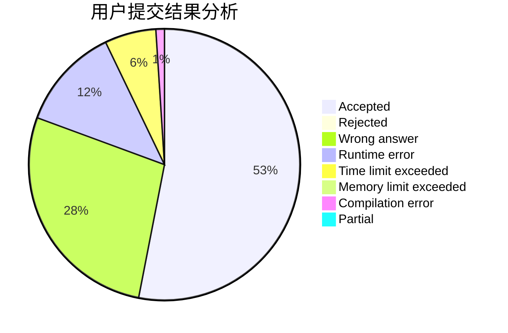
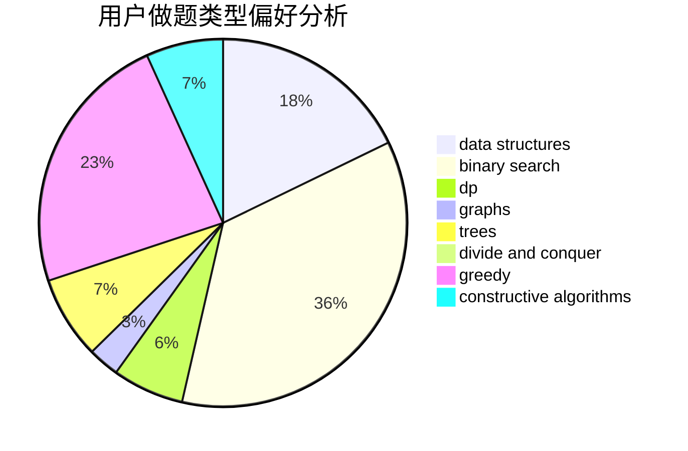
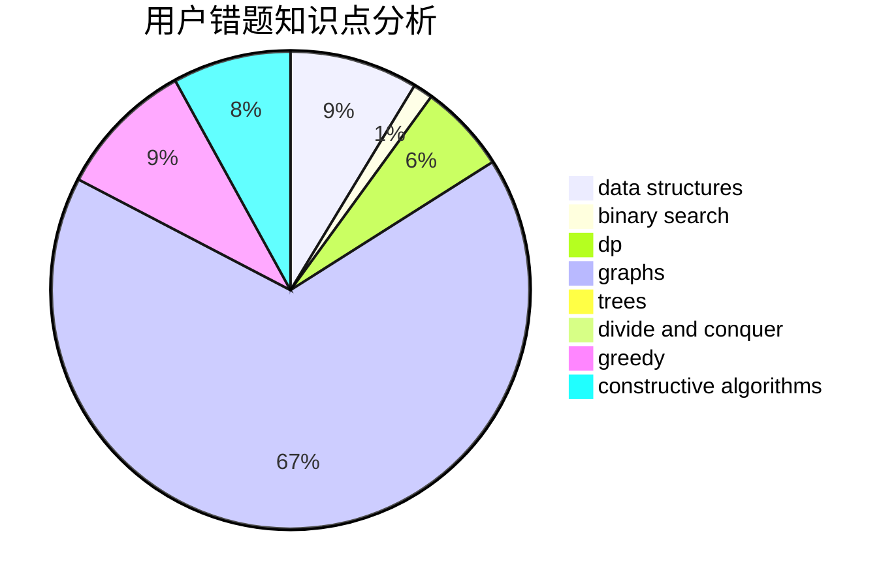

# Mivik

<!-- tabs:start -->

#### **用户提交结果分析**

#### **用户做题类型偏好分析**

#### **用户错题知识点分析**

<!-- tabs:end -->
# 推荐题目
[1329C](https://codeforces.com/contest/1329/problem/C)		constructive algorithms,
                        data structures,
                        greedy,
                        implementation		  
[1148B](https://codeforces.com/contest/1148/problem/B)		binary search,
                        brute force,
                        two pointers		  
[497D](https://codeforces.com/contest/497/problem/D)		brute force,
                        geometry,
                        math		  
[157B](https://codeforces.com/contest/157/problem/B)		geometry,
                        sortings		  
[1362E](https://codeforces.com/contest/1362/problem/E)		dsu,graphs,sortings,trees		  
[812A](https://codeforces.com/contest/812/problem/A)		implementation		  
[577E](https://codeforces.com/contest/577/problem/E)		dsu,graphs,sortings,trees		  
[550B](https://codeforces.com/contest/550/problem/B)		bitmasks,
                        brute force		  
[597B](https://codeforces.com/contest/597/problem/B)		dp,
                        greedy,
                        sortings		  
[1172A](https://codeforces.com/contest/1172/problem/A)		greedy,
                        implementation		  
