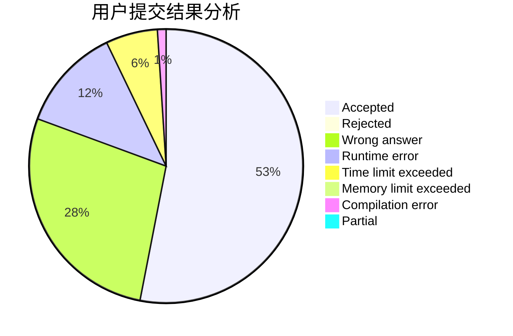
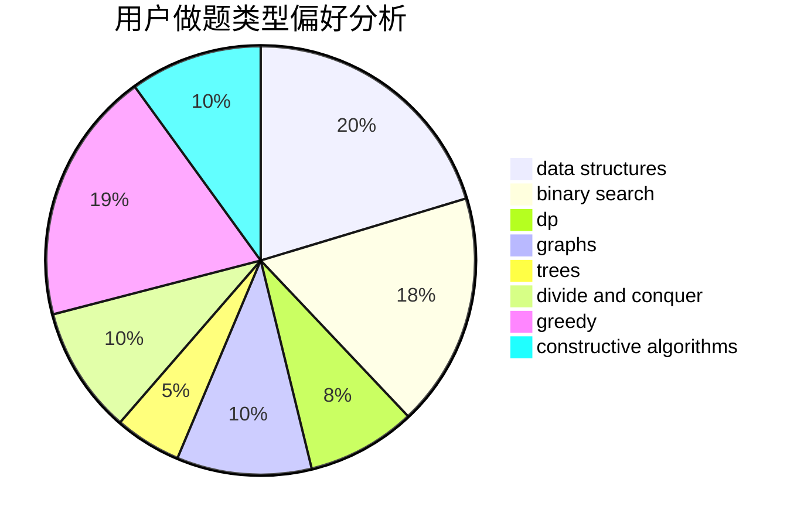
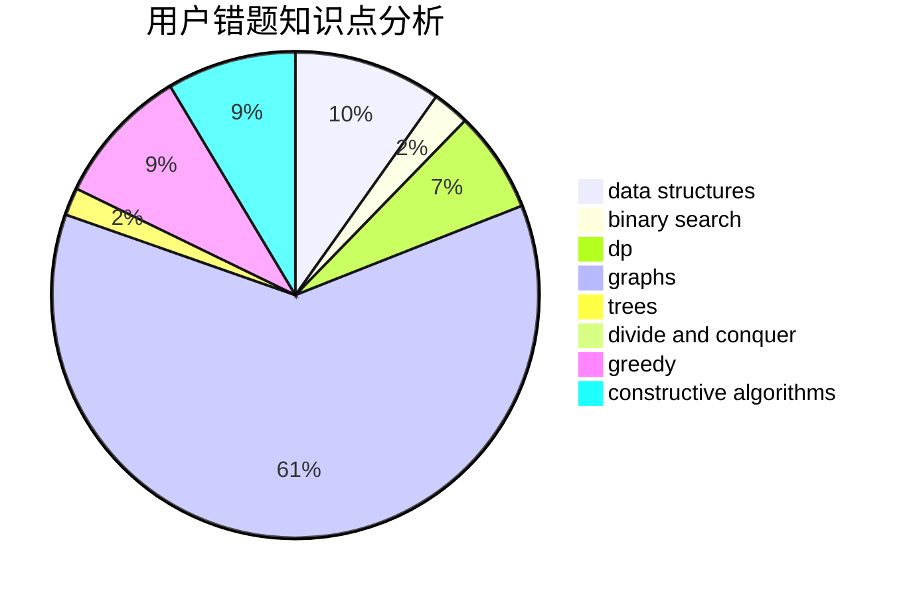

# Mivik

<!-- tabs:start -->

#### **用户提交结果分析**

#### **用户做题类型偏好分析**

#### **用户错题知识点分析**

<!-- tabs:end -->
# 推荐题目
[1322D](https://codeforces.com/contest/1322/problem/D)		bitmasks,
                        dp		  
[1146B](https://codeforces.com/contest/1146/problem/B)		implementation,
                        strings		  
[477D](https://codeforces.com/contest/477/problem/D)		dp,
                        strings		  
[1506A](https://codeforces.com/contest/1506/problem/A)		math		  
[1355F](https://codeforces.com/contest/1355/problem/F)		constructive algorithms,
                        interactive,
                        number theory		  
[798A](https://codeforces.com/contest/798/problem/A)		brute force,
                        constructive algorithms,
                        strings		  
[552C](https://codeforces.com/contest/552/problem/C)		brute force,
                        dp,
                        greedy,
                        math,
                        meet-in-the-middle,
                        number theory		  
[526B](https://codeforces.com/contest/526/problem/B)		dfs and similar,
                        greedy,
                        implementation		  
[575G](https://codeforces.com/contest/575/problem/G)		dfs and similar,
                        shortest paths		  
[1167D](https://codeforces.com/contest/1167/problem/D)		constructive algorithms,
                        greedy		  
